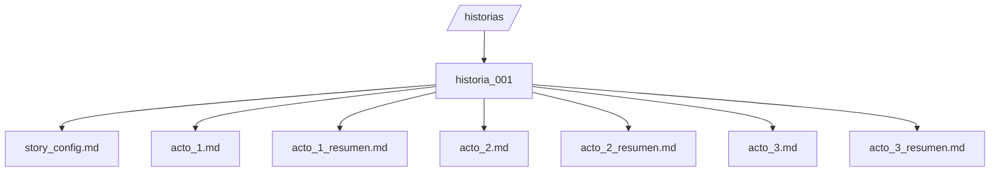
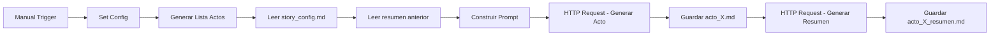
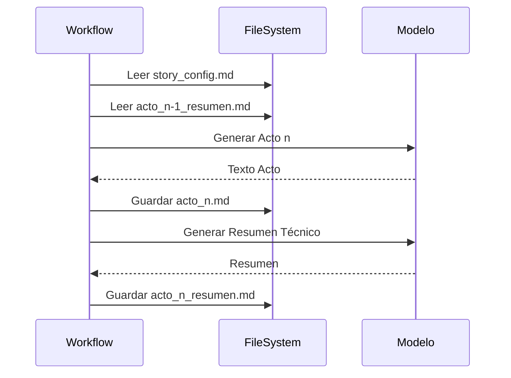
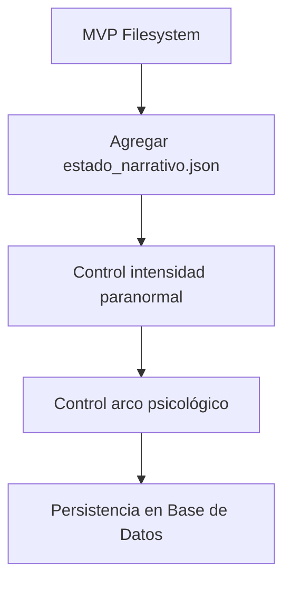

# 🎬 Motor Narrativo Multi‑Actos con n8n (Open Source)

Guía oficial para generar relatos de terror por actos utilizando **persistencia en archivos `.md`** como estado narrativo.

---

# 🧠 Concepto Central

En lugar de generar una historia completa en una sola llamada al modelo (limitación de contexto), el sistema funciona como una:

> ⚙️ Máquina de estado narrativo incremental

Cada acto:

* Se genera
* Se guarda en `.md`
* Se resume técnicamente
* El resumen se usa como contexto para el siguiente acto

---

# 📂 Estructura de Carpetas



---

# 📘 Archivos Necesarios

## 1️⃣ system_prompt.md

Define reglas de estilo obligatorias.

## 2️⃣ story_config.md

Contiene:

* Título
* Sinopsis completa
* Decisiones narrativas
* Tono
* Público

⚠ Este archivo se inyecta en todos los actos.

## 3️⃣ story_prompt_actoX.md

Define el objetivo específico de cada acto.

---

# 🔁 Arquitectura del Workflow



---

# 🔄 Lógica de Iteración



---

# 🧩 JSON BASE DEL WORKFLOW

Importar en n8n como nuevo workflow.

```json
{
  "name": "Creacion_de_historia_multi_actos",
  "nodes": [
    {
      "parameters": {},
      "id": "manual_trigger",
      "name": "Manual Trigger",
      "type": "n8n-nodes-base.manualTrigger",
      "typeVersion": 1,
      "position": [-800, 0]
    },
    {
      "parameters": {
        "values": {
          "string": [
            { "name": "story_id", "value": "historia_001" }
          ],
          "number": [
            { "name": "actos_totales", "value": 3 }
          ]
        }
      },
      "id": "set_config",
      "name": "Set Config",
      "type": "n8n-nodes-base.set",
      "typeVersion": 2,
      "position": [-600, 0]
    },
    {
      "parameters": {
        "jsCode": "const actos = $json.actos_totales; let items = []; for (let i = 1; i <= actos; i++) { items.push({ acto_numero: i, story_id: $json.story_id }); } return items;"
      },
      "id": "generate_act_list",
      "name": "Generar Lista Actos",
      "type": "n8n-nodes-base.code",
      "typeVersion": 2,
      "position": [-400, 0]
    }
  ]
}
```

---

# ⚠ Buenas Prácticas

✅ No concatenar actos anteriores completos
✅ Siempre usar resumen técnico estructurado
✅ Separar configuración global de objetivo por acto
✅ Escalar número de actos cambiando solo una variable

---

# 🚀 Resultado Final

🎭 Historias largas coherentes
📁 Persistencia en archivos
🔁 Flujo reutilizable
⚙️ Arquitectura escalable sin base de datos

---

# 📈 Escalabilidad Futura



Como MVP, este sistema es sólido, modular y profesional.
