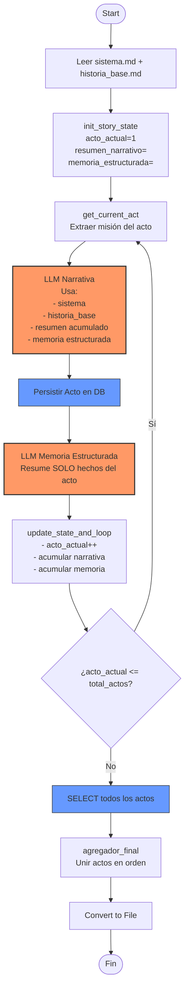

# 🧟 Guía Pro v2: Generador de Relatos con Memoria Dual (n8n + Ollama + Postgres)

## 🎯 Objetivo

Generar relatos largos (+2000 palabras) en múltiples actos sin:

* Reinicios narrativos
* Repeticiones del inicio
* Hardcoding de contexto
* Pérdida de coherencia

La solución se basa en un patrón de **Estado Narrativo Incremental con Memoria Dual**.

---

# 🏗️ Arquitectura Final Limpia

## Principios de Diseño

1. El estado vive en variables, no en el prompt.
2. La narrativa acumulada y la memoria estructurada son entidades separadas.
3. Cada iteración agrega contexto, nunca lo reemplaza.
4. El loop es puramente controlado por `acto_actual`.

---

## 📐 Diagrama Oficial (Mermaid)



---

# 🧠 Arquitectura de Estado Correcta

## Estructura Interna del Estado

```json
{
  "acto_actual": 2,
  "total_actos": 5,
  "resumen_narrativo_acumulado": "...texto narrativo completo hasta ahora...",
  "memoria_estructurada_acumulada": "...hechos estructurados de actos anteriores...",
  "mision_del_acto": "...extraída dinámicamente..."
}
```

---

# 🔄 Flujo Narrativo Real

## Qué recibe el LLM narrativo

```
SISTEMA
HISTORIA BASE
RESUMEN NARRATIVO ACUMULADO
MEMORIA ESTRUCTURADA
MISIÓN DEL ACTO ACTUAL
```

## Qué NO recibe

* Texto hardcodeado
* Introducciones fijas
* Resúmenes reemplazados
* Solo memoria estructurada aislada

---

# 🧩 Separación de Responsabilidades

| Componente      | Responsabilidad                      |
| --------------- | ------------------------------------ |
| LLM 1           | Generar acto narrativo               |
| DB              | Persistencia transaccional           |
| LLM 2           | Generar memoria estructurada factual |
| update_state    | Acumulación incremental              |
| IF              | Control de loop                      |
| agregador_final | Consolidación final                  |

---

# 🛑 Errores que esta arquitectura elimina

* Reinicio del Acto 1 en actos posteriores
* Reintroducción repetida de personajes
* Pérdida de continuidad emocional
* Loop infinito
* Dependencia de texto fijo

---

# 🧮 Patrón Técnico: Memoria Dual Incremental

### 1️⃣ Narrativa acumulada

Mantiene tono, progresión y tensión.

### 2️⃣ Memoria estructurada

Mantiene coherencia factual.

Ambas crecen progresivamente.

Nunca se reemplazan.

---

# ⚙️ Configuración Recomendada (RTX 3060)

Modelo:

```
llama3.1:8b
```

Parámetros:

```
num_ctx: 16384
temperature narrativa: 0.7
temperature memoria: 0.3
repeat_penalty: 1.15
```

---

# 🏁 Resultado Esperado

* Acto 2 continúa Acto 1
* Acto 3 escala conflicto
* Acto 4 profundiza tensión
* Acto 5 resuelve

Sin reinicios.

---

# 🔬 Arquitectura Mental del Sistema

Este sistema ya no es un simple loop.

Es un **motor narrativo determinístico con memoria incremental controlada**.

Puede escalar a:

* 10 actos
* 20 actos
* Historias seriadas
* Universos compartidos

Sin modificar lógica central.

---

Si quieres, el siguiente paso lógico es:

* Convertir esto en patrón reutilizable multi-historia
* O migrarlo a arquitectura orientada a eventos (más robusta)
* O agregar sistema de control de continuidad automática

Indica cuál quieres diseñar ahora.
