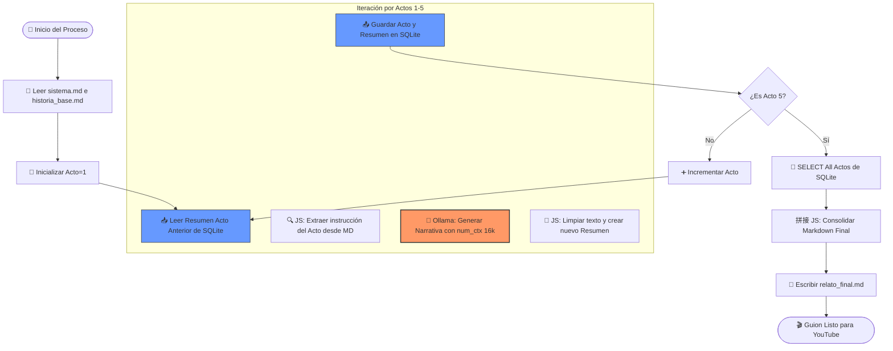

# 🧟 Guía Pro: Generador de Relatos de Terror (n8n + Ollama + SQLite)

Esta guía detalla la arquitectura para generar historias de +2000 palabras de forma coherente, utilizando una estrategia de **Memoria Segmentada** para no saturar la VRAM de la GPU (RTX 3060).

## 🏗️ Arquitectura del Flujo (End-to-End)



---

## 🛠️ Configuración de Componentes

### 1. 📂 Archivos Fuente (VS Code / Git)

Usa los volúmenes montados en tu Docker para que n8n lea estos archivos:

* `sistema.md`: Define que la IA es un escritor de terror en 1ª persona y pasado pretérito.
* `historia_base.md`: Contiene la escaleta con los 5 actos definidos.

### 2. 🗄️ Base de Datos (SQLite)

Como el nodo nativo de SQLite puede ser esquivo en la versión OSS, usaremos **Postgres** (recomendado por estabilidad) o el nodo **Execute Command** de SQLite.

* **Ruta de la DB:** `/home/node/.n8n/narrativa.db`
* **Misión:** Evitar que el flujo crezca visualmente y mantener la persistencia ante errores.

### 3. 🧠 Inteligencia Artificial (Ollama)

* **Modelo Sugerido:** `llama3.1:8b` (Excelente balance para tu RTX 3060).
* **Parámetros Críticos:**
* `num_ctx`: **16384** (Suficiente para ~12,000 palabras de contexto).
* `temperature`: **0.8** (Para mayor creatividad en terror).


---

## 📝 Snippets de Código Clave

### A. Extracción del Acto (Nodo JS)

Este script "lee" tu mente desde el archivo Markdown:

```javascript
const textoMD = items[0].json.historia_base;
const acto = items[0].json.acto_actual;
const regex = new RegExp(`\\*\\*Acto ${acto} \\(.*?\\)\\*\\*: (.*?)(?=\\n|$)`, 'i');
const match = textoMD.match(regex);
return [{ json: { mision: match ? match[1] : "Sigue el terror." } }];

```

### B. Consolidación Final (Nodo JS)

Para unir los trozos de la base de datos antes de guardar el archivo:

```javascript
const relatoCompleto = items.map(i => `## ${i.json.acto_num}\n${i.json.contenido}`).join('\n\n');
return [{ json: { final_text: relatoCompleto, fileName: "guion_terror.md" } }];

```

---

## 🚀 Pasos para Ejecutar el MVP

1. **Levantar Docker:** Ejecuta `docker-compose up -d`.
2. **Permisos:** Asegúrate de que `chown -R 1000:1000` esté aplicado a tu carpeta de proyecto.
3. **Configurar n8n:**
* Crea el loop con un nodo **Wait** o **Split in Batches**.
* Usa el nodo **HTTP Request** para hablar con Ollama (vía `host.docker.internal:11434`).


4. **Verificación:** Abre la base de datos con la extensión **SQLite Viewer** en VS Code para ver cómo la IA escribe mientras tú tomas café. ☕️

---

## 🎬 Próximo Nivel: Post-Procesamiento

Una vez tengas el `relato_final.md`, activa el **Segundo Flujo** para:

1. 🔍 **Corrección:** Revisar que todos los verbos estén en pasado.
2. 🎧 **Sound Design:** Insertar etiquetas `[SFX: Grito lejano]` automáticamente.
3. 🎤 **Voz:** Enviar el texto a una API de TTS (Text-to-Speech).

---

**Desarrollado para:** Rick | **Hardware:** RTX 3060 12GB + Ryzen 5700 + 64GB RAM.