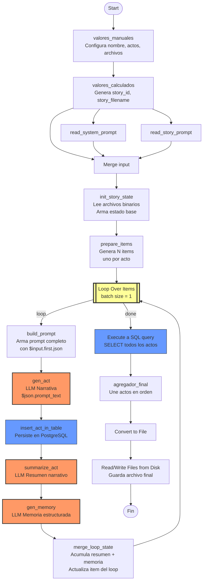

# 🧟 Guía Pro v3: Generador de Relatos con Memoria Dual (n8n + Ollama + Postgres)

## 🎯 Objetivo

Generar relatos largos (+2000 palabras) en múltiples actos sin:

* Reinicios narrativos
* Repeticiones del inicio
* Hardcoding de contexto
* Pérdida de coherencia entre actos

La solución se basa en un patrón de **Estado Narrativo Incremental con Memoria Dual**, usando el nodo nativo **Loop Over Items** de n8n para garantizar que el estado fluya correctamente entre iteraciones.

---

# 🏗️ Arquitectura Final Limpia

## Principios de Diseño

1. El estado vive en los items del loop, no en referencias entre nodos.
2. La narrativa acumulada y la memoria estructurada son entidades separadas.
3. Cada iteración agrega contexto, nunca lo reemplaza.
4. `build_prompt` construye el prompt en un nodo Code — nunca en expresiones de template de chainLlm.
5. El loop es controlado por **Loop Over Items**, no por nodos `If` + `update_state_and_loop` manuales.

---

## 📐 Diagrama Oficial (Mermaid)



---

# 🧩 Nodos del Flujo

## Nodos que se mantienen sin cambios

| Nodo | Tipo | Función |
|---|---|---|
| `valores_manuales` | Set | Configura story_name, total_actos, archivos |
| `valores_calculados` | Set | Genera story_id y story_filename dinámicos |
| `read_system_prompt` | Read File | Lee system_prompt.md del disco |
| `read_story_prompt` | Read File | Lee el archivo de historia base |
| `Merge` | Merge | Combina los 3 inputs para init_story_state |
| `summarize_act` | chainLlm | Resume el acto en 80-120 palabras |
| `gen_memory` | chainLlm | Genera memoria estructurada factual |
| `insert_act_in_table` | Postgres | Persiste cada acto en tabla `relatos_vivos` |
| `Execute a SQL query` | Postgres | SELECT final de todos los actos |
| `agregador_final` | Code | Une actos en orden para el archivo |
| `Convert to File` | Convert | Convierte texto a archivo |

## Nodos modificados

| Nodo | Cambio |
|---|---|
| `init_story_state` | **Sin cambios en su código.** Solo cambia su conexión de salida: ahora va a `prepare_items` en vez de a `gen_act` |
| `gen_act` | El campo `text` se simplifica a `={{ $json.prompt_text }}` y el system message a `={{ $json.sistema_text }}` |

## Nodos nuevos

| Nodo | Tipo | Función |
|---|---|---|
| `prepare_items` | Code | Genera N items (uno por acto) con estado base completo |
| `Loop Over Items` | Loop | Procesa un acto por vez, controla el loop |
| `build_prompt` | Code | Construye el prompt completo con el estado actual del item |
| `merge_loop_state` | Code | Acumula resumen y memoria al cerrar cada iteración |

## Nodos eliminados

| Nodo | Motivo |
|---|---|
| `If` | Reemplazado por el output `done` del Loop Over Items |
| `update_state_and_loop` | Reemplazado por `merge_loop_state` |
| `merge_act` | Su rol lo absorbe `merge_loop_state` |
| `merge_summarize` | Su rol lo absorbe `merge_loop_state` |

---

# 💻 Código de los Nodos Nuevos

## `prepare_items`

Recibe el output de `init_story_state` y genera un item por acto:

```javascript
const base = $input.first().json;

const actos = [];
for (let i = 1; i <= base.total_actos; i++) {
  actos.push({
    json: {
      acto_numero: i,
      total_actos: base.total_actos,
      sistema_text: base.sistema_text,
      historia_base_text: base.historia_base_text,
      story_id: base.story_id,
      mision_del_acto: base.mision_del_acto,
      resumen_narrativo_acumulado: "",
      memoria_estructurada_acumulada: ""
    }
  });
}
return actos;
```

## `build_prompt`

Construye el prompt completo usando `$input.first().json` — fuente única y confiable:

```javascript
const state = $input.first().json;

const resumen = (state.resumen_narrativo_acumulado || "").trim();
const memoria = (state.memoria_estructurada_acumulada || "").trim();
const esPrimerActo = !resumen && !memoria;

const prompt = `
CONTEXTO FIJO DE LA HISTORIA:
${state.historia_base_text}

---

ESTADO NARRATIVO ACUMULADO:

RESUMEN CLAVE:
${esPrimerActo ? "SIN ACTOS PREVIOS." : resumen}

MEMORIA ESTRUCTURADA:
${esPrimerActo ? "SIN MEMORIA PREVIA." : memoria}

---

ACTO ACTUAL: ${state.acto_numero}

MISIÓN ESPECÍFICA DEL ACTO:
${state.mision_del_acto}

---

INSTRUCCIÓN DE CONTINUIDAD:
${esPrimerActo ? "Este es el inicio absoluto del relato." : "Continúa orgánicamente desde el estado acumulado."}
`.trim();

return [{
  json: {
    ...state,
    prompt_text: prompt
  }
}];
```

## `merge_loop_state`

Acumula resumen y memoria al final de cada iteración y actualiza el item del loop:

```javascript
const memory = $input.first().json;       // viene de gen_memory: { text: "memoria" }
const previous = $node["summarize_act"].json; // tiene .text con el resumen
const inserted = $node["insert_act_in_table"].json; // tiene acto_numero y estado completo

// Resumen: reemplaza con el del acto actual (es narrativo, no acumulativo)
const resumenNuevo = (previous.text || "").trim();

// Memoria: acumula concatenando con la anterior
const memoriaAnterior = (inserted.memoria_estructurada_acumulada || "").trim();
const memoriaActual = "ACTO " + inserted.acto_numero + ":\n" + (memory.text || "").trim();
const memoriaAcumulada = memoriaAnterior
  ? memoriaAnterior + "\n\n" + memoriaActual
  : memoriaActual;

return [{
  json: {
    ...inserted,
    resumen_narrativo_acumulado: resumenNuevo,
    memoria_estructurada_acumulada: memoriaAcumulada
  }
}];
```

---

# ⚙️ Configuración del Loop Over Items

| Parámetro | Valor |
|---|---|
| **Items to loop over** | `{{ $json }}` (default) |
| **Batch size** | `1` |

**Conexiones del nodo Loop Over Items:**

- **Input:** `prepare_items`
- **Output `loop` [0]:** `build_prompt`
- **Output `done` [1]:** `Execute a SQL query`
- **Loop back:** `merge_loop_state` → `Loop Over Items` (input)

---

# 🧠 Arquitectura de Estado Correcta

## Estructura interna del item en cada iteración

```json
{
  "acto_numero": 3,
  "total_actos": 5,
  "sistema_text": "...",
  "historia_base_text": "...",
  "story_id": "el_otro_barrio_1234567890",
  "mision_del_acto": "",
  "resumen_narrativo_acumulado": "...resumen del acto 2...",
  "memoria_estructurada_acumulada": "ACTO 1:\n...\n\nACTO 2:\n...",
  "prompt_text": "...prompt completo construido por build_prompt..."
}
```

---

# 🛑 Por qué falló la arquitectura anterior con `If`

| Problema | Causa | Solución aplicada |
|---|---|---|
| `$json` siempre vacío en `gen_act` | `chainLlm` no expone `$input` en expresiones de template | Nodo `build_prompt` en Code construye el prompt antes |
| `merge_act` siempre leía `init_story_state` | Referencia hardcodeada al nodo inicial | Eliminado, reemplazado por `merge_loop_state` |
| Dos fuentes compitiendo en `build_prompt` | n8n toma siempre la primera conexión registrada cuando hay múltiples inputs | Loop Over Items garantiza una sola fuente por iteración |
| Memoria no acumulaba, reemplazaba | Bug en concatenación de `update_state_and_loop` | `merge_loop_state` concatena correctamente con `\n\n` |

---

# ⚙️ Configuración Recomendada (RTX 3060)

```
Modelo: llama3.1:8b
num_ctx: 16384
temperature narrativa: 0.7
temperature memoria: 0.3
repeat_penalty: 1.15
```

---

# 🏁 Resultado Esperado

* Acto 1 — inicio absoluto del relato
* Acto 2 — continúa con resumen del acto 1 + memoria estructurada del acto 1
* Acto 3 — escala conflicto con contexto acumulado de actos 1 y 2
* Acto 4 — profundiza tensión con memoria dual completa
* Acto 5 — resuelve con todo el contexto disponible

Sin reinicios. Sin pérdida de estado. Sin dependencias frágiles entre nodos.

---

# 🔬 Arquitectura Mental del Sistema

Este sistema es un **motor narrativo determinístico con memoria incremental controlada**.

Puede escalar a:

* 10 actos
* 20 actos
* Historias seriadas
* Universos compartidos

Sin modificar la lógica central — solo cambia `total_actos` en `valores_manuales`.

---

## Próximos pasos posibles

* Extraer `mision_del_acto` dinámicamente desde `historia_base_text` según `acto_numero`
* Convertir en patrón reutilizable multi-historia
* Agregar control de continuidad automática entre actos
* Migrar a arquitectura orientada a eventos para mayor robustez