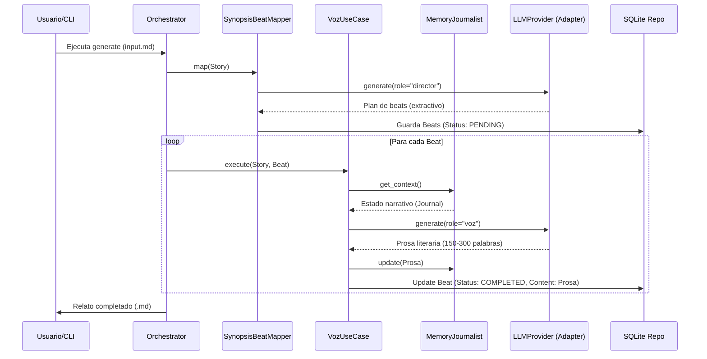
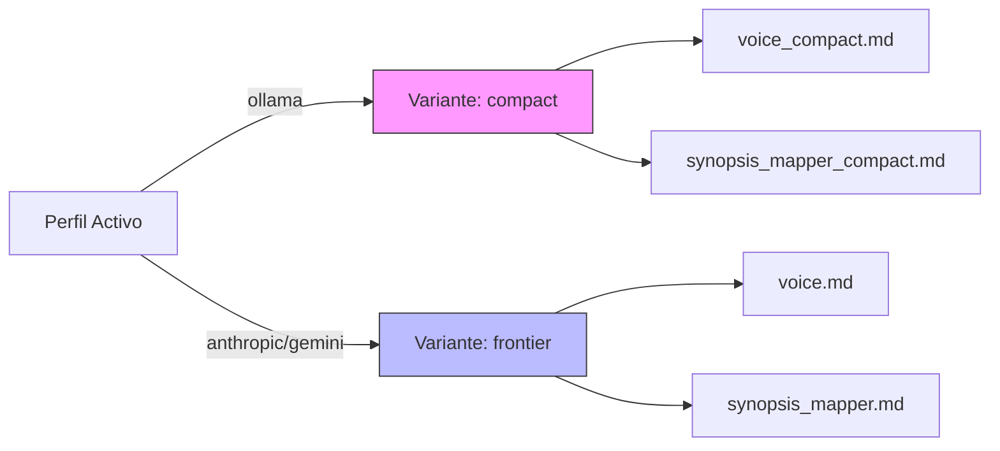
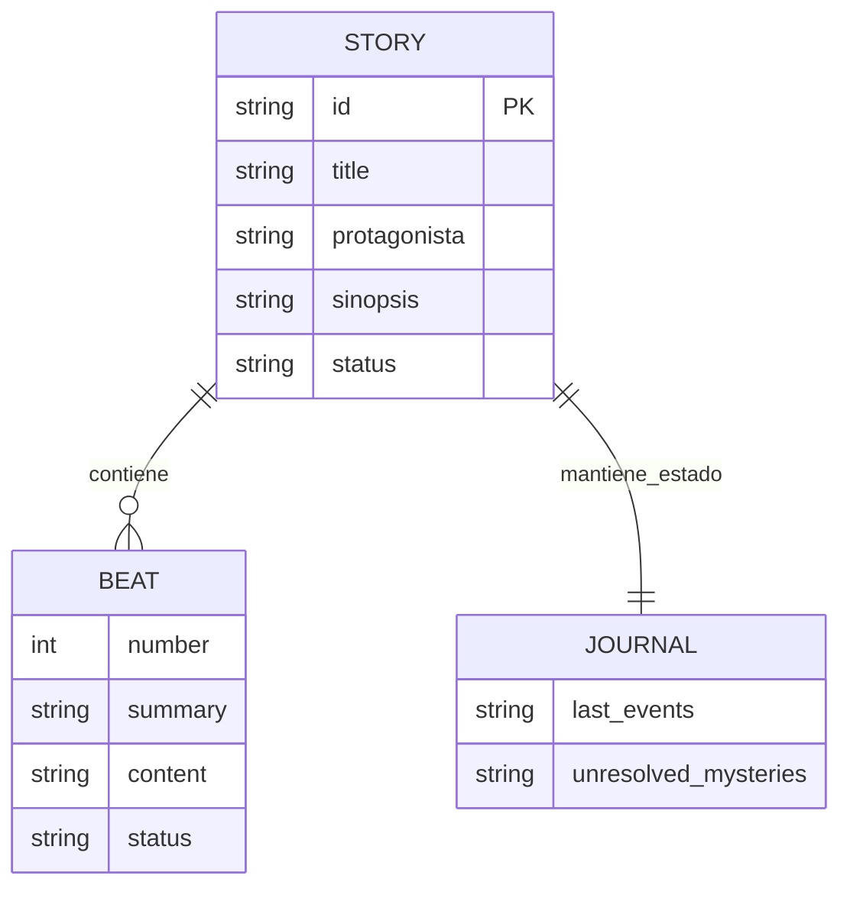

# NarrativeForge

> Sistema de generación granular de relatos de terror con IA (Ollama, Anthropic, Gemini).

NarrativeForge es un ecosistema de generación literaria que utiliza una estrategia **granular basada en beats** para construir relatos de terror cohesivos, atmosféricos y estructuralmente impecables. El sistema se rige por los principios de **Spec-Driven Development (SDD)** y **Clean Architecture**.

---

## 📖 Conceptos Fundamentales

### ¿Qué es un Beat?
Un **beat** es la unidad mínima de narración (aprox. 150-300 palabras). El sistema no genera la historia de un solo golpe; la construye secuencialmente siguiendo una escaleta de **10 actos estructurales**.

### 🔄 Flujo de Colaboración (Clean Architecture)


```mermaid
sequenceDiagram
    participant U as Usuario/CLI
    participant O as Orchestrator
    participant M as SynopsisBeatMapper
    participant V as VozUseCase
    participant J as MemoryJournalist
    participant L as LLMProvider (Adapter)
    participant DB as SQLite Repo

    U->>O: Ejecuta generate (input.md)
    O->>M: map(Story)
    M->>L: generate(role="director")
    L-->>M: Plan de beats (extractivo)
    M->>DB: Guarda Beats (Status: PENDING)
    
    loop Para cada Beat
        O->>V: execute(Story, Beat)
        V->>J: get_context()
        J-->>V: Estado narrativo (Journal)
        V->>L: generate(role="voz")
        L-->>V: Prosa literaria (150-300 palabras)
        V->>J: update(Prosa)
        V->>DB: Update Beat (Status: COMPLETED, Content: Prosa)
    end
    
    O->>U: Relato completado (.md)
```

---

## 🧠 Arquitectura de IA: Perfiles y Roles

### Estrategia de Prompts por Variante
A partir del **Spec 031**, el sistema diferencia la complejidad del prompt según el modelo:


```mermaid
flowchart LR
    P[Perfil Activo] -->|ollama| C[Variante: compact]
    P -->|anthropic/gemini| F[Variante: frontier]
    
    C --> C1[voice_compact.md]
    C --> C2[synopsis_mapper_compact.md]
    
    F --> F1[voice.md]
    F --> F2[synopsis_mapper.md]
    
    style C fill:#f9f,stroke:#333
    style F fill:#bbf,stroke:#333
```

### Roles Especializados (Config/llm_core_definitions.yaml)
| Rol | Función | Temperatura | Propósito |
|-----|---------|--------------|-----------|
| **Director/Mapper** | Planificación | 0.3 | Analiza la sinopsis y extrae los 10 actos. |
| **Voz** | Narración | 0.7 | Genera prosa en 1ª persona y tiempo pasado. |
| **Journalist** | Memoria | 0.2 | Extrae hechos clave para evitar alucinaciones. |

---

## 🚀 Inicio Rápido

### Requisitos
- **Python 3.12+**
- **[uv](https://github.com/astral-sh/uv)** (Gestión de entorno)
- **Ollama** (Para ejecución local)

### Instalación
```bash
make install
cp .env.sample .env
make db
```

---

## 🔧 Uso del CLI

### Generar Historia
```bash
# Uso estándar
uv run python -m src generate --input input_stories/idea.md

# Con diagnóstico profundo (Spec 032)
uv run python -m src generate --input idea.md --debug
```

### Comandos de Utilidad
| Comando | Descripción |
|---------|-------------|
| `make test` | Ejecuta tests unitarios e integración (Pytest). |
| `make list` | Muestra historias generadas en DB. |
| `make db-clean` | Resetea la base de datos completa. |
| `uv run pytest -k "mapper"` | Ejecuta solo tests del Mapper. |

---

## 📊 Modelo de Datos (ERD)


```mermaid
erDiagram
    STORY ||--o{ BEAT : contiene
    STORY ||--|| JOURNAL : mantiene_estado

    STORY {
        string id PK
        string title
        string protagonista
        string sinopsis
        string status
    }

    BEAT {
        int number
        string summary
        string content
        string status
    }

    JOURNAL {
        string last_events
        string unresolved_mysteries
    }
```

---

## 📋 Metodología SDD (Últimos Specs)
- **030:** Transición a Mapeo Extractivo (`SynopsisBeatMapper`).
- **031:** Prompts de Voz orientados a Relato Literario (1ª persona).
- **032:** Sistema de Trace/Debug para auditoría de LLM.

---

## 📄 Licencia
MIT
