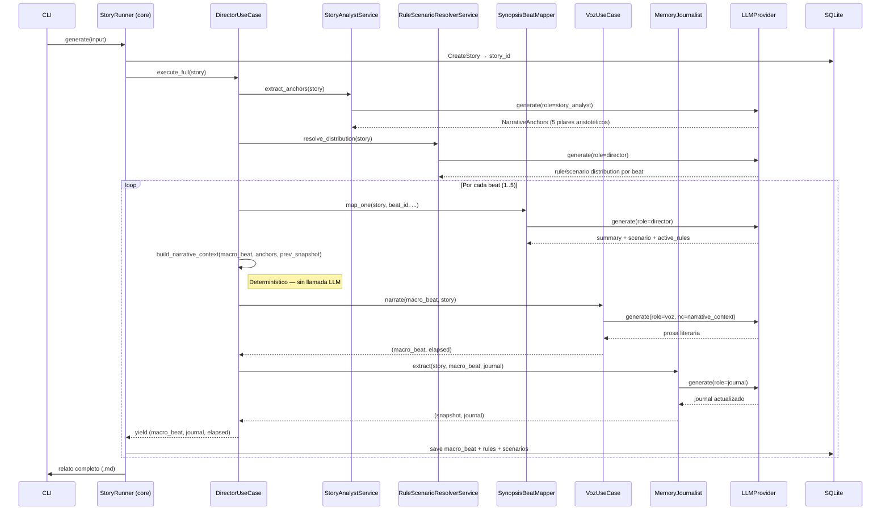
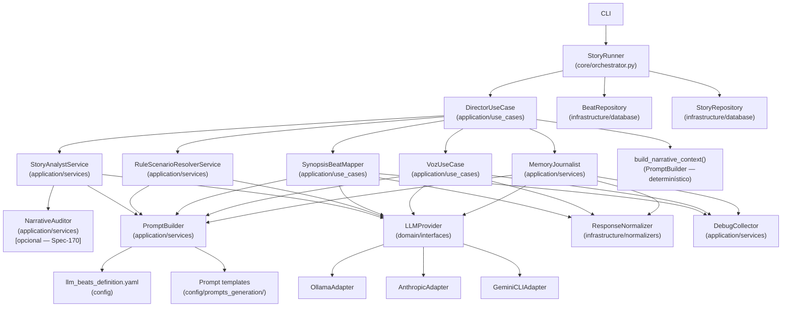
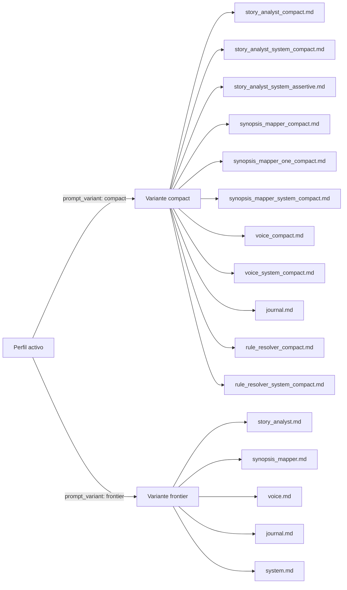
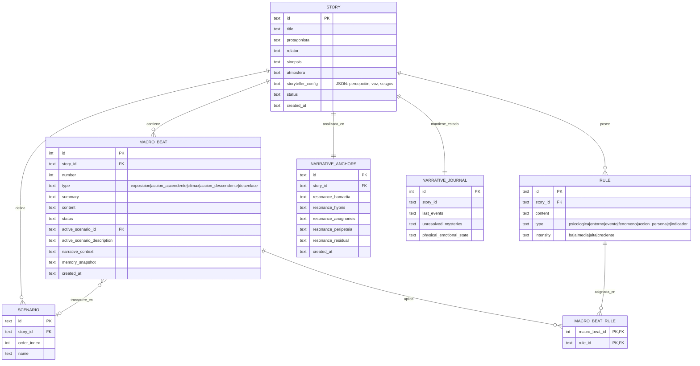

# NarrativeForge

> Sistema de generación granular de relatos de terror con IA (Ollama, Anthropic, Gemini).

NarrativeForge construye relatos de terror cohesivos y atmosféricos usando una estrategia **beat-by-beat**: la historia se divide en 5 actos estructurales, cada uno narrado secuencialmente por un conjunto de agentes LLM especializados. El sistema sigue **Spec-Driven Development (SDD)** y **Clean Architecture**.

---

## Conceptos fundamentales

### ¿Qué es un Beat?

Un **beat** es la unidad mínima de narración (~300-500 palabras). La historia no se genera de un golpe; se construye beat a beat siguiendo una escaleta de **5 actos** definida en `config/llm_beats_definition.yaml`. Ese YAML es la única fuente de verdad para la estructura narrativa — nunca se hardcodea el número de beats.

### Los cinco roles LLM

| Rol | Componente | Llamadas (full) | Llamadas (plan) | Responsabilidad |
|-----|-----------|-----------------|-----------------|-----------------|
| **Analyst** | `StoryAnalystService` | 1 | 1 | Extrae los **5 Pilares de Resonancia** de la sinopsis (Freytag/Aristotélico) |
| **Resolver** | `RuleScenarioResolverService` | 1 | 1 | Distribuye reglas y escenarios a cada beat |
| **Mapper** | `SynopsisBeatMapper` | 5 | 5 | Extrae evento + escenario activo para cada beat |
| **Voz** | `VozUseCase` | 5 | 0 | Expande `narrative_context` a prosa literaria |
| **Journal** | `MemoryJournalist` | 5 | 0 | Mantiene memoria cross-beat (eventos, misterios, estado) |

**Total: 17 llamadas LLM** en `execute_full` (plan + narración).

El orquestador es `DirectorUseCase` (`application/use_cases/director_use_case.py`). No hace llamadas LLM directamente — coordina los 5 roles. `StoryRunner` (CLI) persiste en BD y reporta progreso.

---

## Flujo de generación

### Diagrama de secuencia


```mermaid
sequenceDiagram
    participant CLI
    participant Runner as StoryRunner (core)
    participant Dir as DirectorUseCase
    participant Ana as StoryAnalystService
    participant Res as RuleScenarioResolverService
    participant Map as SynopsisBeatMapper
    participant Voz as VozUseCase
    participant Jrn as MemoryJournalist
    participant LLM as LLMProvider
    participant DB as SQLite

    CLI->>Runner: generate(input)
    Runner->>DB: CreateStory → story_id

    Runner->>Dir: execute_full(story)

    Dir->>Ana: extract_anchors(story)
    Ana->>LLM: generate(role=story_analyst)
    LLM-->>Ana: NarrativeAnchors (5 pilares aristotélicos)

    Dir->>Res: resolve_distribution(story)
    Res->>LLM: generate(role=director)
    LLM-->>Res: rule/scenario distribution por beat

    loop Por cada beat (1..5)
        Dir->>Map: map_one(story, beat_id, ...)
        Map->>LLM: generate(role=director)
        LLM-->>Map: summary + scenario + active_rules

        Dir->>Dir: build_narrative_context(macro_beat, anchors, prev_snapshot)
        Note right of Dir: Determinístico — sin llamada LLM

        Dir->>Voz: narrate(macro_beat, story)
        Voz->>LLM: generate(role=voz, nc=narrative_context)
        LLM-->>Voz: prosa literaria
        Voz-->>Dir: (macro_beat, elapsed)

        Dir->>Jrn: extract(story, macro_beat, journal)
        Jrn->>LLM: generate(role=journal)
        LLM-->>Jrn: journal actualizado
        Jrn-->>Dir: (snapshot, journal)

        Dir-->>Runner: yield (macro_beat, journal, elapsed)
        Runner->>DB: save macro_beat + rules + scenarios
    end

    Runner->>CLI: relato completo (.md)
```

### Diagrama de colaboración entre clases


```mermaid
flowchart TD
    CLI --> Runner["StoryRunner\n(core/orchestrator.py)"]
    Runner --> Dir["DirectorUseCase\n(application/use_cases)"]

    Dir --> Ana["StoryAnalystService\n(application/services)"]
    Dir --> Res["RuleScenarioResolverService\n(application/services)"]
    Dir --> Map["SynopsisBeatMapper\n(application/use_cases)"]
    Dir --> Voz["VozUseCase\n(application/use_cases)"]
    Dir --> Jrn["MemoryJournalist\n(application/services)"]

    Dir --> NC["build_narrative_context()\n(PromptBuilder — determinístico)"]

    Ana --> Aud["NarrativeAuditor\n(application/services)\n[opcional — Spec-170]"]
    Ana --> PB["PromptBuilder\n(application/services)"]
    Res --> PB
    Map --> PB
    Voz --> PB
    Jrn --> PB

    Ana --> LLM["LLMProvider\n(domain/interfaces)"]
    Res --> LLM
    Map --> LLM
    Voz --> LLM
    Jrn --> LLM

    Map --> Norm["ResponseNormalizer\n(infrastructure/normalizers)"]
    Voz --> Norm
    Jrn --> Norm

    Map --> DC["DebugCollector\n(application/services)"]
    Voz --> DC
    Jrn --> DC

    PB --> YAML["llm_beats_definition.yaml\n(config)"]
    PB --> Tmpl["Prompt templates\n(config/prompts_generation/)"]

    LLM --> Ollama["OllamaAdapter"]
    LLM --> Anthropic["AnthropicAdapter"]
    LLM --> Gemini["GeminiCLIAdapter"]

    Runner --> BeatRepo["BeatRepository\n(infrastructure/database)"]
    Runner --> StoryRepo["StoryRepository\n(infrastructure/database)"]
```

---

## Arquitectura de prompts

Los templates viven en `config/prompts_generation/`. La variante activa se determina con `prompt_variant` del perfil en `llm_core_definitions.yaml`.

### Sistema de variantes (compact / frontier)


```mermaid
flowchart LR
    P[Perfil activo] -->|prompt_variant: compact| C[Variante compact]
    P -->|prompt_variant: frontier| F[Variante frontier]

    C --> CS1[story_analyst_compact.md]
    C --> CS2[story_analyst_system_compact.md]
    C --> CS3[story_analyst_system_assertive.md]
    C --> CSM[synopsis_mapper_compact.md]
    C --> CSM1[synopsis_mapper_one_compact.md]
    C --> CSM_SYS[synopsis_mapper_system_compact.md]
    C --> CV[voice_compact.md]
    C --> CV_SYS[voice_system_compact.md]
    C --> CJ[journal.md]
    C --> CR[rule_resolver_compact.md]
    C --> CR_SYS[rule_resolver_system_compact.md]

    F --> F1[story_analyst.md]
    F --> F2[synopsis_mapper.md]
    F --> F3[voice.md]
    F --> F4[journal.md]
    F --> F5[system.md]
```

### Templates por rol y variante

| Rol | Variante | Archivo | Propósito |
|-----|----------|---------|-----------|
| **story_analyst** | compact / assertive | `story_analyst_compact.md` | User prompt: extracción de 5 pilares |
| **story_analyst** | compact (descriptive) | `story_analyst_system_compact.md` | System prompt con definiciones completas |
| **story_analyst** | compact (assertive) | `story_analyst_system_assertive.md` | System prompt corto sin definiciones — activa esquemas preentrenados |
| **story_analyst** | frontier | `story_analyst.md` | Expansión rica en contexto |
| **director** (mapper) | compact | `synopsis_mapper_compact.md` | Mapeo global sinopsis→beats (5 en 1 llamada) |
| **director** (mapper) | compact | `synopsis_mapper_one_compact.md` | Mapeo unitario por beat |
| **director** (mapper) | compact | `synopsis_mapper_system_compact.md` | System prompt del mapper |
| **director** (mapper) | frontier | `synopsis_mapper.md` | Mapeo global rico |
| **director** (resolver) | compact | `rule_resolver_compact.md` | Distribución reglas/escenarios por beat |
| **director** (resolver) | compact | `rule_resolver_system_compact.md` | System prompt del resolver |
| **voz** | compact | `voice_compact.md` | Narración beat-by-beat compacta |
| **voz** | compact | `voice_system_compact.md` | System prompt para voz |
| **voz** | frontier | `voice.md` | Narración rica con restricciones dramáticas |
| **journal** | compact + frontier | `journal.md` | Actualización de memoria cross-beat |
| **system** | frontier | `system.md` | System prompt transversal (fallback) |

### Decisión de variante por perfil

| Variante | Perfiles | Característica |
|----------|----------|----------------|
| **compact** | `ollama-*` (llama31, mistral, qwen25, qwen3, gemma3, mistral-nemo, hybrid) | Prompts cortos, directivos, sin secciones anidadas |
| **frontier** | `anthropic-*`, `gemini-*` | Prompts ricos con contexto completo y restricciones dramáticas |

---

## Estrategia de Prompting (Spec-170)

El sistema soporta tres modos de prompting para el rol `story_analyst`, controlados por `PROMPTING_STRATEGY`:

| Modo | System prompt usado | Comportamiento | Cuándo usar |
|------|---------------------|----------------|-------------|
| `assertive` | `story_analyst_system_assertive.md` | Términos técnicos puros. Falla con `NarrativeLiteracyError` si el LLM explica en vez de aplicar. | Modelos frontier con entrenamiento literario sólido |
| `auto` | `story_analyst_system_assertive.md` → fallback a compact | Intenta assertive; si el auditor detecta boilerplate, reintenta con descriptive. | Producción general — recomendado |
| `descriptive` | `story_analyst_system_compact.md` | Prompt con definiciones completas, sin auditoría. Comportamiento legacy. | Modelos sin conocimiento narrativo previo |

### Configuración

```yaml
# config/llm_core_definitions.yaml — por perfil
profiles:
  anthropic-sonnet:
    prompting_strategy: assertive   # modelos frontier: modo estricto
  ollama-qwen3-8b:
    prompting_strategy: auto        # modelos locales: fallback inteligente
```

```bash
# Variable de entorno (prioridad máxima)
PROMPTING_STRATEGY=assertive python -m src generate --input input.md
```

### NarrativeAuditor — tres heurísticas

El `NarrativeAuditor` (`application/services/narrative_auditor.py`) evalúa la respuesta antes de aceptarla:

| Heurística | Qué detecta | Penalización |
|------------|-------------|--------------|
| **Boilerplate** | El modelo explica el concepto en lugar de aplicarlo a la historia | Total (−1.0) |
| **Sensoriality** | Densidad de imágenes concretas insuficiente (< 4% de palabras sensoriales) | Parcial (−0.2) |
| **Entropy** | El texto es un calco literal de la sinopsis (solapamiento > 80%) | Parcial (−0.2) |

---

## Configuración LLM

Toda la configuración LLM vive en **`config/llm_core_definitions.yaml`**. El `.env` se reserva para secretos (`ANTHROPIC_API_KEY`) y paths del sistema.

### Perfiles disponibles

| Perfil | Provider | Modelos | prompt_variant |
|--------|----------|---------|----------------|
| `ollama-llama31` | Ollama local | llama3.1:8b | compact |
| `ollama-mistral` | Ollama local | mistral:latest | compact |
| `ollama-qwen25-14b` | Ollama local | qwen2.5:14b | compact |
| `ollama-qwen3-8b` | Ollama local | qwen3:8b | compact |
| `ollama-mistral-nemo` | Ollama local | mistral-nemo:12b-instruct-2407-q4_0 | compact |
| `ollama-gemma3-12b` | Ollama local | gemma3:12b | compact |
| `ollama-hybrid-voz-qwen3` | Ollama local | qwen2.5:14b (analyst/director/journal) + qwen3:8b (voz) | compact |
| `anthropic-sonnet` | Anthropic API | claude-sonnet-4-6 | frontier |
| `gemini-cli` | Gemini CLI | gemini-2.5-flash | frontier |

El perfil activo se configura en `llm_core_definitions.yaml` (campo `active_profile`) o se sobreescribe con la variable de entorno `LLM_PROFILE`.

### Roles por perfil

Cada perfil define 4 roles con sus parámetros LLM propios.

| Rol | Temperatura | Propósito |
|-----|-------------|-----------|
| `story_analyst` | 0.3 | Extracción de los 5 Pilares de Resonancia desde la sinopsis |
| `director` | 0.3–0.4 | Planificación: distribución de reglas y mapeo sinopsis→beats |
| `voz` | 0.6–0.7 | Narración literaria — creatividad controlada |
| `journal` | 0.3 | Extracción de hechos narrativos — máxima precisión |

### Variables de entorno relevantes

```bash
ANTHROPIC_API_KEY=...          # solo si el perfil activo usa AnthropicAdapter
LLM_PROFILE=anthropic-sonnet   # override del perfil activo
PROMPTING_STRATEGY=assertive   # override de la estrategia de prompting (Spec-170)
DATABASE_URL=sqlite+aiosqlite:///stories.db
PROMPTS_DIR=./config/prompts_generation
OUTPUT_DIR=./output_stories
```

---

## Los 5 Pilares de Resonancia Narrativa

Definidos en `config/llm_narrative_definition.yaml`. Mapeo 1:1: Beat N recibe el Pilar N.

| Beat | Pilar | Estadio Freytag | Qué captura |
|------|-------|-----------------|-------------|
| 1 | `resonance_hamartia` | Exposición | La grieta psicológica del narrador — vulnerabilidad preexistente |
| 2 | `resonance_hybris` | Acción Ascendente | La Transgresión — lógica que permite cruzar la frontera |
| 3 | `resonance_anagnorisis` | Clímax | La Violación de lo Sagrado — detalle sensorial insoportable |
| 4 | `resonance_peripeteia` | Acción Descendente | La Trampa Espacial — el entorno como antagonista |
| 5 | `resonance_residual` | Desenlace | La Mancha Residual — el daño observable que permanece |

---

## Modelo de datos (ERD)

Esquema normalizado. `macro_beat` es la unidad narrativa; `rule` y `scenario` son fuentes de verdad independientes. **Principio: YAML inicializa — DB gobierna.**


```mermaid
erDiagram
    STORY ||--o{ MACRO_BEAT : contiene
    STORY ||--o{ SCENARIO : define
    STORY ||--o{ RULE : posee
    STORY ||--|| NARRATIVE_ANCHORS : analizado_en
    STORY ||--|| NARRATIVE_JOURNAL : mantiene_estado

    MACRO_BEAT }o--o| SCENARIO : transcurre_en
    MACRO_BEAT ||--o{ MACRO_BEAT_RULE : aplica
    RULE ||--o{ MACRO_BEAT_RULE : asignada_en

    STORY {
        text id PK
        text title
        text protagonista
        text relator
        text sinopsis
        text atmosfera
        text storyteller_config "JSON: percepción, voz, sesgos"
        text status
        text created_at
    }

    RULE {
        text id PK
        text story_id FK
        text content
        text type "psicologica|entorno|evento|fenomeno|accion_personaje|indicador"
        text intensity "baja|media|alta|creciente"
    }

    SCENARIO {
        text id PK
        text story_id FK
        int order_index
        text name
    }

    NARRATIVE_ANCHORS {
        text id PK
        text story_id FK
        text resonance_hamartia
        text resonance_hybris
        text resonance_anagnorisis
        text resonance_peripeteia
        text resonance_residual
        text created_at
    }

    MACRO_BEAT {
        int id PK
        text story_id FK
        int number
        text type "exposicion|accion_ascendente|climax|accion_descendente|desenlace"
        text summary
        text content
        text status
        text active_scenario_id FK
        text active_scenario_description
        text narrative_context
        text memory_snapshot
        text created_at
    }

    MACRO_BEAT_RULE {
        int macro_beat_id PK, FK
        text rule_id PK, FK
    }

    NARRATIVE_JOURNAL {
        int id PK
        text story_id
        text last_events
        text unresolved_mysteries
        text physical_emotional_state
    }
```

---

## Inicio rápido

### Requisitos

- Python 3.12+
- [uv](https://github.com/astral-sh/uv)
- Ollama (para ejecución local)

### Instalación

```bash
uv sync
cp .env.sample .env
bash scripts/bash/init_db.sh
```

### Generar una historia

```bash
# Desde archivo de input (recomendado)
python -m src generate --input input_stories/mi_historia.md

# Con diagnóstico completo de prompts y respuestas LLM
python -m src generate --input input_stories/mi_historia.md --debug

# Con perfil específico
LLM_PROFILE=anthropic-sonnet python -m src generate --input input_stories/mi_historia.md

# Con estrategia de prompting asertiva
PROMPTING_STRATEGY=assertive python -m src generate --input input_stories/mi_historia.md
```

### Otros comandos

```bash
python -m src plan <story_id>      # solo fase de planificación (analyst + resolver + mapper)
python -m src narrate <story_id>   # solo fase de narración (voz + journal) sobre plan existente
python -m src export <story_id>    # exportar relato a Markdown
```

### Comandos de desarrollo

```bash
uv sync                             # instalar dependencias
uv run pytest tests/unit/ -v        # tests unitarios
uv run pytest tests -v --cov=src    # suite completa con cobertura
ruff check . && ruff format .       # lint + formato
bash scripts/bash/init_db.sh        # recrear BD (borra y reinicia)
```

---

## Control de pipeline con `--hasta`

El parámetro `--hasta` permite detener el pipeline en un checkpoint específico para depuración o re-generación parcial.

### Valores disponibles

| Checkpoint | Ordinal | Descripción |
|------------|--------|-------------|
| `analyst` | 1 | Extrae anclajes narrativos (5 pilares) |
| `resolver` | 2 | Distribuye reglas y escenarios por beat |
| `mapper:1` | 3 | Mapea beat 1 |
| `voz:1` | 4 | Narra beat 1 |
| `journal:1` | 5 | Registra memoria beat 1 |
| `mapper:2` | 6 | Mapea beat 2 |
| `voz:2` | 7 | Narra beat 2 |
| `journal:2` | 8 | Registra memoria beat 2 |
| `mapper:3` | 9 | Mapea beat 3 |
| `voz:3` | 10 | Narra beat 3 |
| `journal:3` | 11 | Registra memoria beat 3 |
| `mapper:4` | 12 | Mapea beat 4 |
| `voz:4` | 13 | Narra beat 4 |
| `journal:4` | 14 | Registra memoria beat 4 |
| `mapper:5` | 15 | Mapea beat 5 |
| `voz:5` | 16 | Narra beat 5 |
| `journal:5` | 17 | Registra memoria beat 5 (completo) |

**Total: 17 llamadas LLM en `execute_full`** (1 analyst + 1 resolver + 5×mapper + 5×voz + 5×journal).

### Uso

```bash
# Detener después de extraer anclajes (solo analyst)
python -m src generate --input input.md --hasta analyst

# Generar hasta beat 2 completo (incluye mapper:2, voz:2, journal:2)
python -m src generate --input input.md --hasta voz:2

# Re-generar desde beat 3: detener en mapper:3
python -m src generate --input input.md --hasta mapper:3
```

---

## Especificaciones activas

Los siguientes specs definen la arquitectura y el comportamiento actual del sistema:

| Spec | Qué define |
|------|------------|
| [010 — Marco SDD](specs/010_marco_sdd.md) | Convenciones, naming, layering, principios de ingeniería |
| [040 — Progress Reporter](specs/040_progress_reporter_cli.md) | Contrato de `ProgressReporter` y salida de terminal |
| [050 — Anthropic Provider](specs/050_anthropic_provider.md) | Config del adapter Anthropic y env vars |
| [060 — LLM Core Definitions](specs/060_llm_core_definitions_spec.md) | YAML como fuente de verdad única para config LLM |
| [070 — LLM Profiles](specs/070_llm_profiles_spec.md) | Perfiles pre-configurados y precedencia de resolución |
| [080 — Response Normalizer](specs/080_response_normalizer_scope.md) | Definición canónica: elimina ruido LLM sin alterar Markdown válido |
| [090 — Dead Code Audit](specs/090_dead_code_audit.md) | Eliminación de código sin uso en el pipeline |
| [100 — Debug Prompts PDF](specs/100_debug_prompts_pdf_spec.md) | Exportación de debug info a Markdown/PDF |
| [110 — Critical Debt Refactor](specs/110_critical_debt_refactor_spec.md) | Refactorización de deuda técnica crítica |
| [120 — CLI Service Container](specs/120_cli_service_container_spec.md) | DI container para CLI |
| [130 — Persistencia Narrativa](specs/130_persistencia_campos_narrativa_spec.md) | Persistencia de campos narrativos en DB |
| [140 — Dominio Anémico](specs/140_dominio_anemico_spec.md) | Evitar entidades sin comportamiento de dominio |
| [150 — Story God Object](specs/150_story_god_object_spec.md) | Descomposición del agregado Story |
| [160 — Freytag Resonance](specs/160_freytag_resonance_spec.md) | 5 Pilares: unificación Freytag + aristotélico |
| [170 — Prompting Asertivo](specs/170_prompting_asertivo_spec.md) | NarrativeAuditor, prompt multinivel, ciclo de reintento |
| [180 — Saneamiento Arquitectónico](specs/180_saneamiento_architectural_narrativo.md) | Limpieza de deuda arquitectónica |

---

## Licencia

MIT
