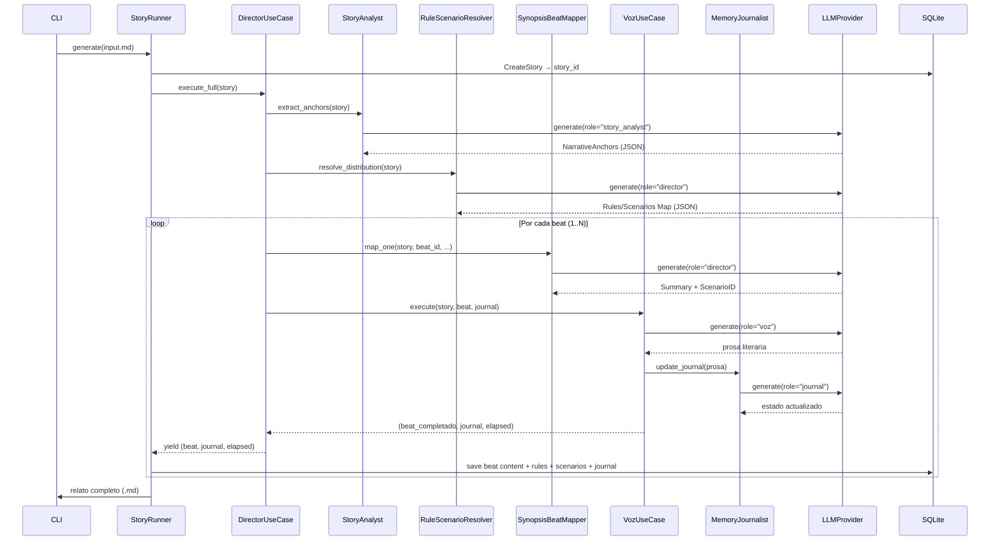
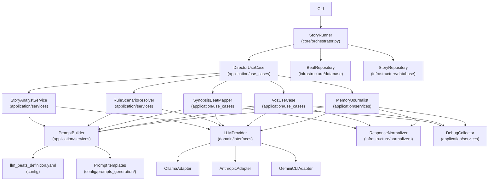
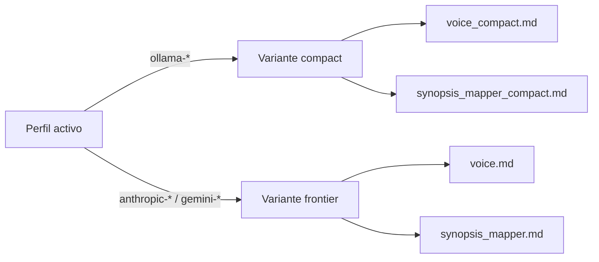
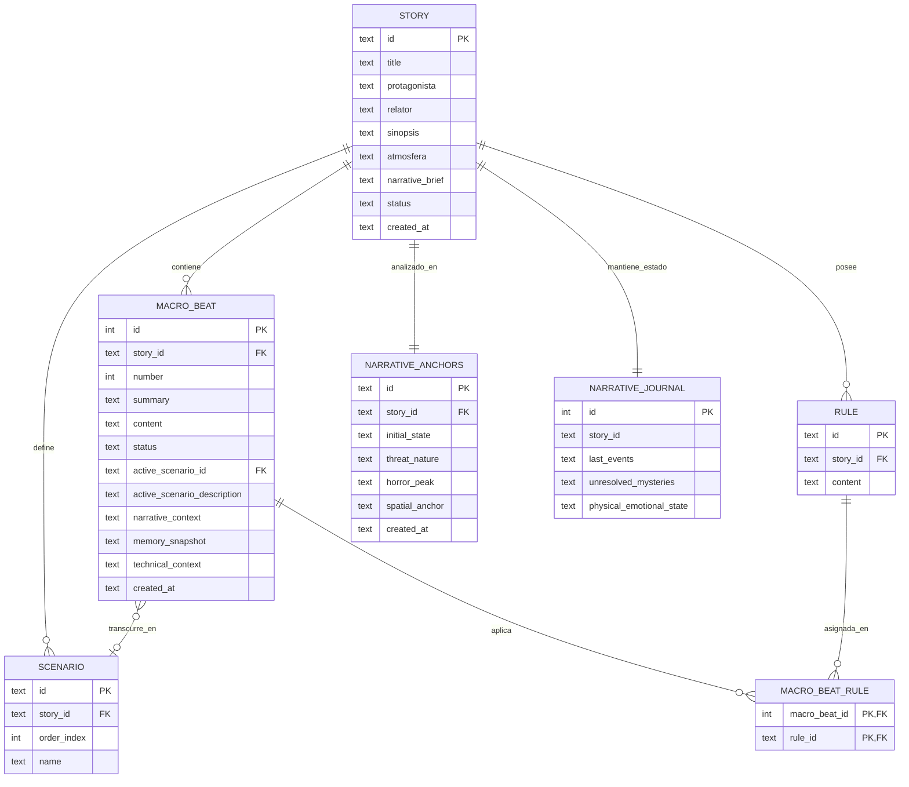

# NarrativeForge

> Sistema de generación granular de relatos de terror con IA (Ollama, Anthropic, Gemini).

NarrativeForge construye relatos de terror cohesivos y atmosféricos usando una estrategia **beat-by-beat**: la historia se divide en 5 actos estructurales, cada uno narrado secuencialmente por un conjunto de agentes LLM especializados. El sistema sigue **Spec-Driven Development (SDD)** y **Clean Architecture**.

---

## Conceptos fundamentales

### ¿Qué es un Beat?

Un **beat** es la unidad mínima de narración (~300-500 palabras). La historia no se genera de un golpe; se construye beat a beat siguiendo una escaleta de **5 actos** definida en `config/llm_beats_definition.yaml`. Ese YAML es la única fuente de verdad para la estructura narrativa — nunca se hardcodea el número de beats.

### Los cinco roles LLM

| Rol | Clase | Llamadas | Responsabilidad |
|-----|-------|----------|-----------------|
| **Analyst** | `StoryAnalystService` | 1 (global) | Extrae los 4 `NarrativeAnchors` de la sinopsis |
| **Resolver** | `RuleScenarioResolverService` | 1 (global) | Distribuye reglas y escenarios a cada beat |
| **Mapper** | `SynopsisBeatMapper` | 5 (una por beat) | Extrae qué ocurre en el beat N + escenario activo |
| **Voz** | `VozUseCase` | 5 (una por beat) | Expande `narrative_context` a prosa literaria |
| **Journal** | `MemoryJournalist` | 5 (una por beat) | Mantiene memoria cross-beat (eventos, misterios, estado) |

**Total: 17 llamadas LLM por historia** (1 analyst + 1 resolver + 5×3).

El orquestador es `DirectorUseCase` (no hace llamadas LLM directamente, coordina los 5 roles). `StoryRunner` persiste en BD y reporta progreso.

---

## Flujo de generación

### Diagrama de secuencia


```mermaid
sequenceDiagram
    participant CLI
    participant Runner as StoryRunner
    participant Dir as DirectorUseCase
    participant Ana as StoryAnalyst
    participant Res as RuleScenarioResolver
    participant Map as SynopsisBeatMapper
    participant Voz as VozUseCase
    participant Jrn as MemoryJournalist
    participant LLM as LLMProvider
    participant DB as SQLite

    CLI->>Runner: generate(input.md)
    Runner->>DB: CreateStory → story_id

    Runner->>Dir: execute_full(story)

    Dir->>Ana: extract_anchors(story)
    Ana->>LLM: generate(role="story_analyst")
    LLM-->>Ana: NarrativeAnchors (JSON)

    Dir->>Res: resolve_distribution(story)
    Res->>LLM: generate(role="director")
    LLM-->>Res: Rules/Scenarios Map (JSON)

    loop Por cada beat (1..N)
        Dir->>Map: map_one(story, beat_id, ...)
        Map->>LLM: generate(role="director")
        LLM-->>Map: Summary + ScenarioID
        
        Dir->>Voz: execute(story, beat, journal)
        Voz->>LLM: generate(role="voz")
        LLM-->>Voz: prosa literaria
        Voz->>Jrn: update_journal(prosa)
        Jrn->>LLM: generate(role="journal")
        LLM-->>Jrn: estado actualizado
        Voz-->>Dir: (beat_completado, journal, elapsed)
        Dir-->>Runner: yield (beat, journal, elapsed)
        Runner->>DB: save beat content + rules + scenarios + journal
    end

    Runner->>CLI: relato completo (.md)
```

### Diagrama de colaboración entre clases


```mermaid
flowchart TD
    CLI --> Runner["StoryRunner\n(core/orchestrator.py)"]
    Runner --> Dir["DirectorUseCase\n(application/use_cases)"]

    Dir --> Ana["StoryAnalystService\n(application/services)"]
    Dir --> Res["RuleScenarioResolver\n(application/services)"]
    Dir --> Map["SynopsisBeatMapper\n(application/use_cases)"]
    Dir --> Voz["VozUseCase\n(application/use_cases)"]
    Dir --> Jrn["MemoryJournalist\n(application/services)"]

    Ana --> PB["PromptBuilder\n(application/services)"]
    Res --> PB
    Map --> PB
    Voz --> PB
    Jrn --> PB

    Ana --> LLM["LLMProvider\n(domain/interfaces)"]
    Res --> LLM
    Map --> LLM
    Voz --> LLM
    Jrn --> LLM

    Map --> Norm["ResponseNormalizer\n(infrastructure/normalizers)"]
    Voz --> Norm
    Jrn --> Norm

    Map --> DC["DebugCollector\n(application/services)"]
    Voz --> DC
    Jrn --> DC

    PB --> YAML["llm_beats_definition.yaml\n(config)"]
    PB --> Tmpl["Prompt templates\n(config/prompts_generation/)"]

    LLM --> Ollama["OllamaAdapter"]
    LLM --> Anthropic["AnthropicAdapter"]
    LLM --> Gemini["GeminiCLIAdapter"]

    Runner --> BeatRepo["BeatRepository\n(infrastructure/database)"]
    Runner --> StoryRepo["StoryRepository\n(infrastructure/database)"]
```

---

## Arquitectura de prompts

El sistema diferencia la complejidad del prompt según el modelo activo:


```mermaid
flowchart LR
    P[Perfil activo] -->|ollama-*| C[Variante compact]
    P -->|anthropic-* / gemini-*| F[Variante frontier]

    C --> C1[voice_compact.md]
    C --> C2[synopsis_mapper_compact.md]

    F --> F1[voice.md]
    F --> F2[synopsis_mapper.md]
```

| Variante | Modelos | Característica |
|----------|---------|----------------|
| **compact** | Ollama local (Mistral, Llama, Natsumura) | Prompts cortos, directivos, sin secciones anidadas |
| **frontier** | Anthropic, Gemini | Prompts ricos con contexto completo y restricciones dramáticas |

Los templates viven en `config/prompts_generation/`. La variante activa se determina con el campo `prompt_variant` del perfil en `config/llm_core_definitions.yaml`.

---

## Configuración LLM

Toda la configuración LLM vive en **`config/llm_core_definitions.yaml`**. El `.env` se reserva para secretos (`ANTHROPIC_API_KEY`) y paths del sistema.

### Perfiles disponibles

| Perfil | Provider | Uso recomendado |
|--------|----------|-----------------|
| `ollama-natsumura` | Ollama local | Modelo fine-tuneado para narrativa de terror |
| `ollama-llama31` | Ollama local | Más rápido, calidad aceptable |
| `ollama-mistral` | Ollama local | Balance velocidad/calidad |
| `anthropic-sonnet` | Anthropic API | Máxima calidad narrativa |
| `gemini-pro` | Gemini CLI | Alta calidad, sin costo de API |
| `gemini-mixto` | Gemini CLI | Pro para narrativa, Flash para journal |

Activar un perfil: `active_profile: <nombre>` en el YAML o `LLM_PROFILE=<nombre>` como variable de entorno.

### Roles por perfil

Cada perfil define tres roles con sus parámetros LLM propios:

| Rol | Temperatura típica | Propósito |
|-----|--------------------|-----------|
| `director` | 0.3 | Planificación extractiva — fidelidad a la sinopsis |
| `voz` | 0.7 | Narración literaria — creatividad controlada |
| `journal` | 0.2 | Extracción de hechos — máxima precisión |

---

## Modelo de datos (ERD)

Esquema normalizado (Spec-041). `macro_beat` es la unidad narrativa; `rule` y `scenario` son fuentes de verdad independientes.


```mermaid
erDiagram
    STORY ||--o{ MACRO_BEAT : contiene
    STORY ||--o{ SCENARIO : define
    STORY ||--o{ RULE : posee
    STORY ||--|| NARRATIVE_ANCHORS : analizado_en
    STORY ||--|| NARRATIVE_JOURNAL : mantiene_estado
    
    MACRO_BEAT }o--o| SCENARIO : transcurre_en
    MACRO_BEAT ||--o{ MACRO_BEAT_RULE : aplica
    RULE ||--o{ MACRO_BEAT_RULE : asignada_en

    STORY {
        text id PK
        text title
        text protagonista
        text relator
        text sinopsis
        text atmosfera
        text narrative_brief
        text status
        text created_at
    }

    RULE {
        text id PK
        text story_id FK
        text content
    }

    SCENARIO {
        text id PK
        text story_id FK
        int order_index
        text name
    }

    NARRATIVE_ANCHORS {
        text id PK
        text story_id FK
        text initial_state
        text threat_nature
        text horror_peak
        text spatial_anchor
        text created_at
    }

    MACRO_BEAT {
        int id PK
        text story_id FK
        int number
        text summary
        text content
        text status
        text active_scenario_id FK
        text active_scenario_description
        text narrative_context
        text memory_snapshot
        text technical_context
        text created_at
    }

    MACRO_BEAT_RULE {
        int macro_beat_id PK, FK
        text rule_id PK, FK
    }

    NARRATIVE_JOURNAL {
        int id PK
        text story_id
        text last_events
        text unresolved_mysteries
        text physical_emotional_state
    }
```

---

## Inicio rápido

### Requisitos

- Python 3.12+
- [uv](https://github.com/astral-sh/uv)
- Ollama (para ejecución local)

### Instalación

```bash
uv sync
cp .env.sample .env
bash scripts/bash/init_db.sh
```

### Generar una historia

```bash
# Desde archivo de input (recomendado)
python -m src generate --input input_stories/mi_historia.md

# Con diagnóstico completo de prompts y respuestas LLM
python -m src generate --input input_stories/mi_historia.md --debug
```

### Otros comandos

```bash
python -m src plan <story_id>      # solo fase de planificación
python -m src narrate <story_id>   # solo fase de narración (sobre plan existente)
python -m src export <story_id>    # exportar relato a Markdown
```

### Comandos de desarrollo

```bash
uv run pytest tests/unit/ -v       # tests unitarios
ruff check . && ruff format .      # lint + formato
```

---

## Especificaciones activas

Los siguientes specs definen la arquitectura y el comportamiento actual del sistema:

| Spec | Qué define |
|------|------------|
| [001 — Marco SDD](specs/001_marco_sdd.md) | Convenciones, naming, layering, principios de ingeniería |
| [019 — Progress Reporter](specs/019_progress_reporter_cli.md) | Contrato de `ProgressReporter` y salida de terminal |
| [020 — Anthropic Provider](specs/020_anthropic_provider.md) | Config del adapter Anthropic y env vars |
| [026 — LLM Core Definitions](specs/026_llm_core_definitions_spec.md) | YAML como fuente de verdad única para config LLM |
| [027 — LLM Profiles](specs/027_llm_profiles_spec.md) | Perfiles pre-configurados y precedencia de resolución |
| [029 — Prompt Variants](specs/029_prompt_variants_spec.md) | Sistema compact/frontier de templates |
| [030 — SynopsisBeatMapper](specs/030_synopsis_beat_mapper_spec.md) | Mapeo extractivo de sinopsis a beats estructurales |
| [031 — Prompts Compact](specs/031_prompts_relato_compact.md) | Decisiones de diseño de los templates de relato |
| [034 — Beat #1 sin contexto vacío](specs/034_suprimir_secciones_vacias_beat1.md) | Por qué Beat #1 no recibe secciones de contexto anterior |
| [035 — Director Orquestador](specs/035_director_orquestador_punta_a_punta.md) | Contrato de `execute_full()` / `execute_narration()` |
| [036 — Beat Spec solo en VOZ](specs/036_beat_spec_solo_en_voz.md) | Por qué el mapper no recibe constraints dramáticas |
| [037 — Analyst System](specs/037_analyst_system_y_beats_enriquecidos.md) | System prompts para el analista y beats enriquecidos |
| [038 — Anclajes Narrativos](specs/038_anclajes_narrativos.md) | Arquitectura de anclajes estáticos y flujo secuencial |
| [039 — Mantenimiento scripts](specs/039_mantenimiento_scripts_tests_uml.md) | Actualización de scripts de DB y diagramas |
| [040 — Checkpoint Hasta](specs/040_checkpoint_hasta.md) | Sistema de re-generación parcial desde un beat específico |
| [041 — Reglas y Escenarios Dinámicos](specs/041_mapeo_dinamico_reglas_escenarios.md) | Mapeo de reglas de usuario y descripciones sensoriales por beat |
| [042 — Revisión Global de Arquitectura](specs/042_revision_global_arquitectura.md) | Deuda técnica: DI, excepciones, logs AM/PM, spinner, debug prompts, saneamiento |

---

## Control de pipeline con `--hasta`

El parámetro `--hasta` permite detener el pipeline en un checkpoint específico para depuración, re-generación parcial, o testing incremental.

### Valores disponibles

| Checkpoint | Ordinal | Descripción |
|------------|--------|-------------|
| `analyst` | 1 | Solo extrae anclajes narrativos |
| `resolver` | 2 | Distribuye reglas y escenarios por beat |
| `mapper:1` | 3 | Mapea beat 1 |
| `voz:1` | 4 | Narra beat 1 |
| `journal:1` | 5 | Registra memoria beat 1 |
| `mapper:2` | 6 | Mapea beat 2 |
| `voz:2` | 7 | Narra beat 2 |
| `journal:2` | 8 | Registra memoria beat 2 |
| `mapper:3` | 9 | Mapea beat 3 |
| `voz:3` | 10 | Narra beat 3 |
| `journal:3` | 11 | Registra memoria beat 3 |
| `mapper:4` | 12 | Mapea beat 4 |
| `voz:4` | 13 | Narra beat 4 |
| `journal:4` | 14 | Registra memoria beat 4 |
| `mapper:5` | 15 | Mapea beat 5 |
| `voz:5` | 16 | Narra beat 5 |
| `journal:5` | 17 | Registra memoria beat 5 (completo) |

### Uso

```bash
# Detener después de extraer anclajes (solo analyst)
python -m src generate --input input.md --hasta analyst

# Generar hasta beat 2 completo (incluye mapper:2, voz:2, journal:2)
python -m src generate --input input.md --until voz:2

# Re-generar desde beat 3: detener en mapper:3
python -m src generate --input input.md --until mapper:3
```

### Re-generación parcial

Si detienes en `mapper:N` o `voz:N`, los beats anteriores ya completados se preservan en DB. Puedes re-ejecutar con un checkpoint diferente para regenerar solo los beats restantes.

---

## Licencia

MIT
