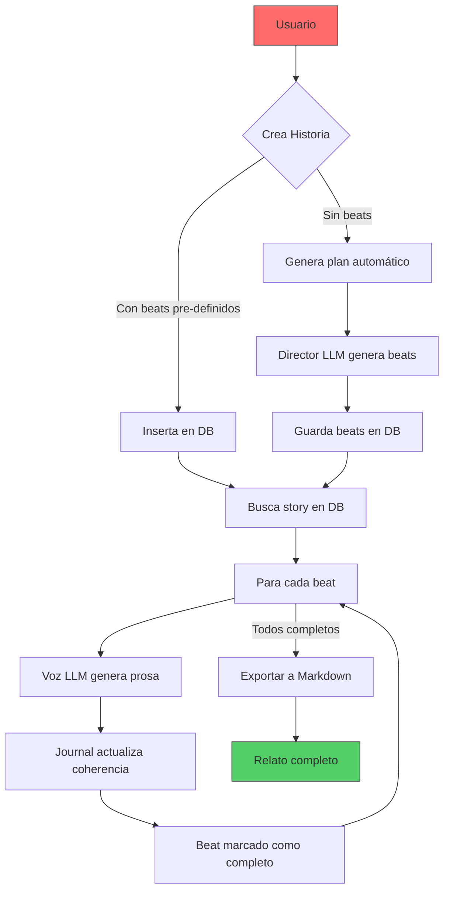
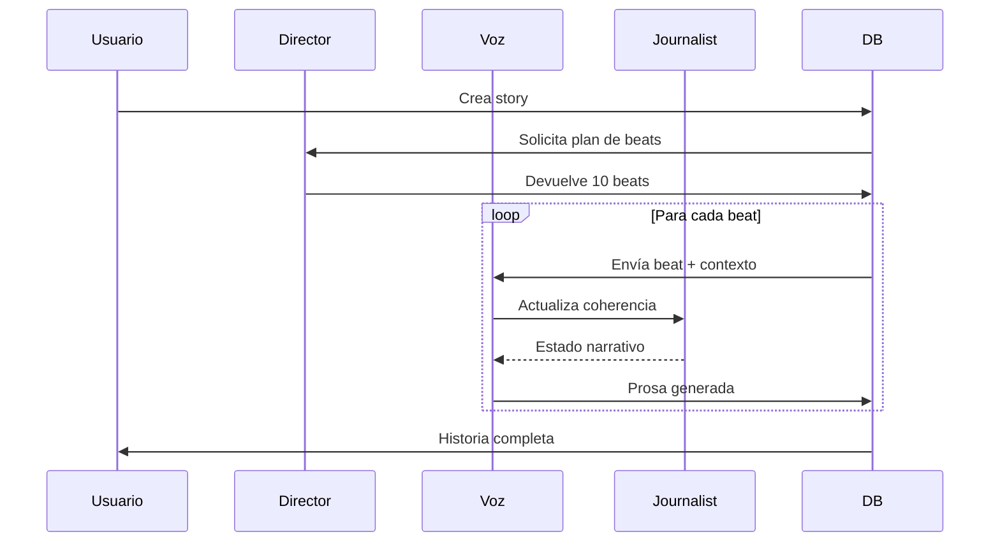
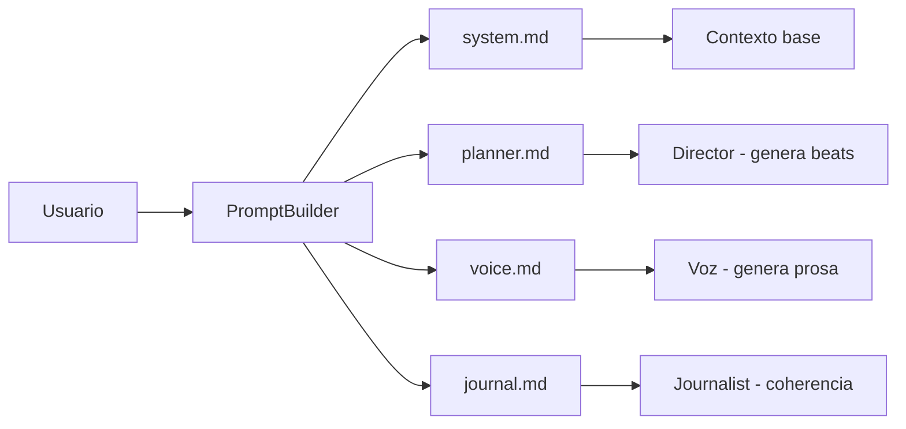
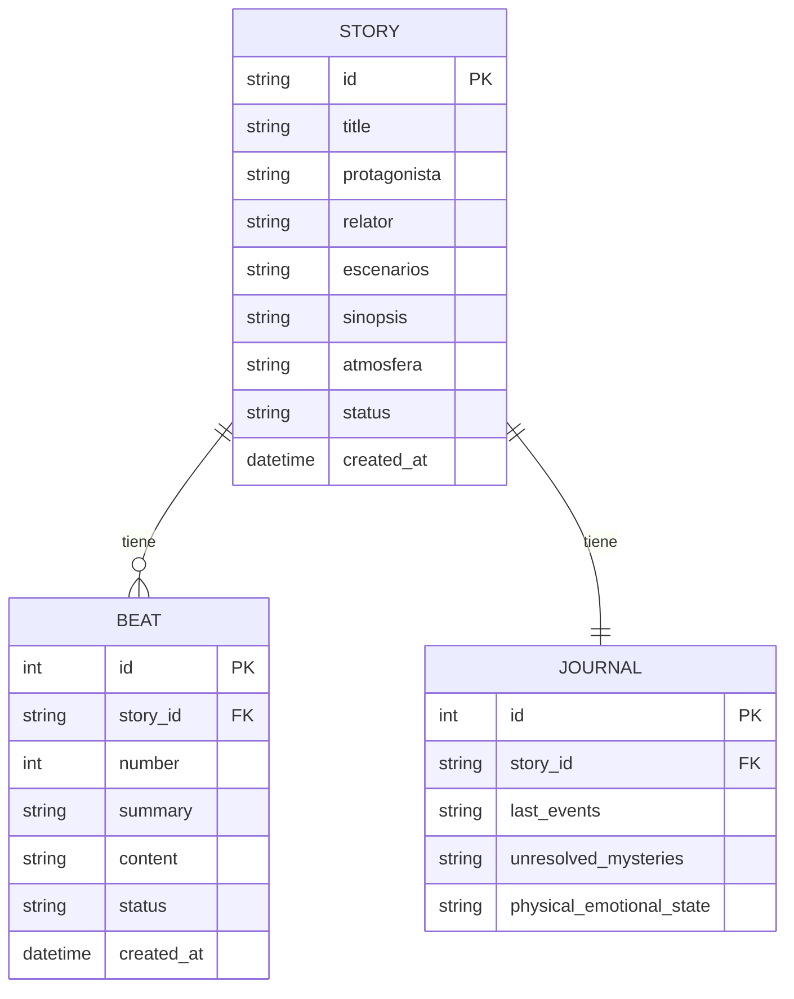

# NarrativeForge

> Sistema de generación granular de relatos de terror con IA local (Ollama).

---

## 📖 Conceptos Fundamentales

### ¿Qué es NarrativeForge?

NarrativeForge es un sistema de generación de relatos de terror que utiliza **IA local** (Ollama) para crear historias cohesivas y atmosféricas mediante una estrategia **granular basada en beats**.

---

### 🔄 Flujo de Generación


```mermaid
flowchart TD
    A[Usuario] --> B{Crea Historia}
    B -->|Con beats pre-definidos| C[Inserta en DB]
    B -->|Sin beats| D[Genera plan automático]
    
    C --> E[Busca story en DB]
    D --> F[Director LLM genera beats]
    F --> G[Guarda beats en DB]
    G --> E
    
    E --> H[Para cada beat]
    H --> I[Voz LLM genera prosa]
    I --> J[Journal actualiza coherencia]
    J --> K[Beat marcado como completo]
    K --> H
    
    H -->|Todos completos| L[Exportar a Markdown]
    L --> M[Relato completo]
    
    style A fill:#ff6b6b,stroke:#333
    style M fill:#51cf66,stroke:#333
```

---

### 🎯 Granularidad por Beats

#### ¿Qué es un Beat?

Un **beat** es la unidad mínima de narración. Es un punto de inflexión, una acción o un momento clave en la historia. Piensa en él como un "capítulo pequeño" que el sistema expande en prosa detallada.

```
Beat (resumen) → LLM → Prosa expandida (150-300 palabras)
```

#### ¿Por qué granular?

| Enfoque | Descripción |
|---------|-------------|
| **Tradicional** | Generar toda la historia de una vez → pierde coherencia |
| **Granular** | Cada beat se genera secuencialmente → mantiene narrativa coherente |

---

### 📋 Los 10 Beats del Proyecto

Cada historia se estructura en 10 beats que siguen una estructura clásica de terror:

| # | Beat | Propósito |
|---|------|-----------|
| **1** | **Setup / Introducción** | Presentar personajes, escenario y situación inicial. Establecer las "reglas del mundo". |
| **2** | **Incidente Incitante** | El evento que打破 la normalidad. Primer momento de tensión. |
| **3** | **Rising Action 1** | El protagonista investiga o se enfrenta a la primera señal del horror. |
| **4** | **Punto de no retorno** | Cruce del umbral - ya no hay vuelta atrás. |
| **5** | **Complicaciones** | Obstáculos, misterio que se profundiza, miedo crece. |
| **6** | **Clímax falso** | aparente resolución que falla o revela que el problema es mayor. |
| **7** | **Revelación** | La verdad se descubre - backstory, conexión con el mal. |
| **8** | **Crisis** | Momento de mayor tensión - el protagonista se enfrenta al mal. |
| **9** | **Clímax** | Punto de máxima intensidad - la confrontación final. |
| **10** | **Resolución** | Conclusión - el final que queda después del horror. |

#### Cómo actúa cada beat:

1. **Beat 1-2**: El LLM establece el mundo y plantó la semilla del terror
2. **Beat 3-5**: El LLM construye tensión progresivamente
3. **Beat 6-7**: El LLM revela información clave (el "por qué")
4. **Beat 8-9**: El LLM desarrolla la confrontación
5. **Beat 10**: El LLM cierra con impacto emocional

---

### 🧠 Roles del LLM

NarrativeForge utiliza **3 roles de IA** especializados:

| Rol | Función | Cuándo actúa |
|-----|---------|--------------|
| **Director** | Genera la escaleta de beats (plan) | Al crear historia sin beats |
| **Voz** | Expande cada beat en prosa narrativa | Para cada beat |
| **Journalist** | Mantiene coherencia narrativa | Entre beats |


```mermaid
sequenceDiagram
    participant U as Usuario
    participant D as Director
    participant V as Voz
    participant J as Journalist
    participant DB as DB

    U->>DB: Crea story
    DB->>D: Solicita plan de beats
    D->>DB: Devuelve 10 beats
    
    loop Para cada beat
        DB->>V: Envía beat + contexto
        V->>J: Actualiza coherencia
        J-->>V: Estado narrativo
        V->>DB: Prosa generada
    end
    
    DB->>U: Historia completa
```

---

### 📝 Prompts del Sistema

NarrativeForge utiliza **4 prompts clave** que son la base del sistema. Cada prompt tiene una responsabilidad específica en el flujo de generación.


```mermaid
flowchart LR
    A[Usuario] --> B[PromptBuilder]
    
    B --> C[system.md]
    B --> D[planner.md]
    B --> E[voice.md]
    B --> F[journal.md]
    
    C --> G[Contexto base]
    D --> H[Director - genera beats]
    E --> I[Voz - genera prosa]
    F --> J[Journalist - coherencia]
```

#### 1. `system.md` - Contexto Base

| Aspecto | Detalle |
|---------|---------|
| **Archivo** | `config/prompts_gen/system.md` |
| **Cuándo** | Se carga en cada llamada al LLM |
| **Input** | atmosfera, relator, reglas, personajes, escenario, sinopsis |
| **Output** | Contexto base que define el estilo y tono |
| **Responsabilidad** | Establecer el "quién" y el "cómo" del sistema |

#### 2. `planner.md` - Director (Genera Beats)

| Aspecto | Detalle |
|---------|---------|
| **Archivo** | `config/prompts_gen/planner.md` |
| **Cuándo** | Al crear historia sin beats pre-definidos |
| **Input** | title, protagonistas, escenarios, sinopsis, atmosfera, num_beats |
| **Output** | Lista de 8-10 beats (escaleta) |
| **Responsabilidad** | Planificar la estructura narrativa |

#### 3. `voice.md` - Voz (Genera Prosa)

| Aspecto | Detalle |
|---------|---------|
| **Archivo** | `config/prompts_gen/voice.md` |
| **Cuándo** | Al narrar cada beat |
| **Input** | beat.summary, contexto anterior, journal |
| **Output** | Prosa narrativa de 150-400 palabras |
| **Responsabilidad** | Expandir cada beat en prosa inmersiva |
| **Clave** | Este prompt determina la calidad de escritura |

#### 4. `journal.md` - Coherencia Narrativa

| Aspecto | Detalle |
|---------|---------|
| **Archivo** | `config/prompts_gen/journal.md` |
| **Cuándo** | Entre beats (actualizar estado) |
| **Input** | beat.content, journal anterior |
| **Output** | JSON con last_events, unresolved_mysteries, physical_emotional_state |
| **Responsabilidad** | Mantener coherencia entre actos |

#### Ubicación de los Prompts

```
config/prompts_gen/
├── system.md    ✅ ACTIVO - Contexto base
├── planner.md   ✅ ACTIVO - Director genera beats
├── voice.md     ✅ ACTIVO - Voz genera prosa
├── journal.md   ✅ ACTIVO - Coherencia narrativa
```

#### Editar un Prompt

Los prompts son archivos de texto plano. Para modificarlos:

```bash
# Editar el prompt de la Voz
vim config/prompts_gen/voice.md

# Los cambios se reflejan automáticamente en la siguiente generación
```

---

### 📊 ERD de la Base de Datos


```mermaid
erDiagram
    STORY ||--o{ BEAT : tiene
    STORY ||--|| JOURNAL : tiene

    STORY {
        string id PK
        string title
        string protagonista
        string relator
        string escenarios
        string sinopsis
        string atmosfera
        string status
        datetime created_at
    }

    BEAT {
        int id PK
        string story_id FK
        int number
        string summary
        string content
        string status
        datetime created_at
    }

    JOURNAL {
        int id PK
        string story_id FK
        string last_events
        string unresolved_mysteries
        string physical_emotional_state
    }
```

---

## 🚀 Inicio Rápido

### Requisitos

- Python 3.12+
- [uv](https://github.com/astral-sh/uv) (gestor de paquetes)
- [Ollama](https://ollama.com) ejecutándose con modelo `qwen3.5:9b` (opcional para desarrollo)

### Instalar

```bash
# Instalar dependencias (aisla con uv virtual env)
make install
```

---

## 🧪 Validación del Sistema (Mi Machete)

```bash
# 1. Lint + Tests
make lint && make test

# 2. Inicializar DB
make db
# o
./scripts/bash/init_db.sh
```

---

## 🔧 Comandos CLI (Core Python - Sin API)

```bash
# Generar historia completa (Mock - desarrollo)
./scripts/bash/run_generate.sh \
  --title "La Casa Abandonada" \
  --protagonist "María" \
  --escenarios "Casa embrujada" \
  --sinopsis "Una historia de terror" \
  --atmosfera terror \
  --beats 8

# Generar historia (Ollama real - producción)
./scripts/bash/run_generate.sh \
  --title "La Casa" --protagonist "María" \
  --escenarios "Casa" --sinopsis "Historia" \
  --atmosfera terror --real

# Generar historia desde DB (pre-cargada con beats)
python -m src generate --story-id "el_monte_prohibido_1744742400" --real

# Generar solo plan (beats)
./scripts/bash/run_plan.sh "Mi Historia" 8

# Listar historias
./scripts/bash/list_stories.sh

# Exportar a Markdown
./scripts/bash/run_export.sh <story-id> [output-dir]

# Narrar beats específicos
./scripts/bash/run_narrate.sh <story-id> 1,2,3
```

### Alternativa: make commands

| Comando | Descripción |
|---------|-----------|
| `make test` | Ejecuta tests con coverage |
| `make lint` | Lint + formato con ruff |
| `make db` | Inicializa la base de datos |
| `make list` | Lista todas las historias |
| `make clean` | Limpia cache |
| `make dev` | Levanta API (requiere Ollama) |
| `make install` | Instala dependencias con `uv sync` |

---

## 🏗️ Arquitectura (Clean Architecture)

```
src/
├── __main__.py                 # Entry point: python -m src
├── main.py                    # FastAPI entrypoint
├── config.py                  # Settings (pydantic-settings)
├── cli/                       # CLI (Core Python - sin API)
│   ├── commands.py           # generate, plan, narrate, export
│   ├── exceptions.py         # CLIError, ValidationError, etc.
│   ├── logger.py             # Logging robusto (logs/)
│   └── runner.py             # CLI runner (argparse)
├── core/                      # Orchestrator (flujo completo)
│   └── orchestrator.py
├── domain/
│   ├── models.py            # Story, Beat, StoryPlan, NarrativeJournal
│   ├── interfaces.py       # Protocols (LLMProvider, Repository)
│   └── exceptions.py       # Domain exceptions
├── application/
│   ├── dto/               # Data Transfer Objects
│   ├── use_cases/          # CreateStory, NarrateBeat, etc.
│   └── services/           # PromptBuilder, MemoryJournalist
├── infrastructure/
│   ├── adapters/         # OllamaAdapter, MockLLMAdapter
│   ├── database/          # SQLite repositories
│   └── renderers/         # MarkdownRenderer
└── presentation/
    └── routers/           # REST endpoints
```

### Flujo de Generación (8 Beats)

```
1. Usuario crea historia → POST /api/v1/stories
2. Director genera escaleta (8 beats) → POST /api/v1/stories/{id}/plan
3. Para cada beat:
   a. Voz genera prosa (150-300 palabras)
   b. Journal actualiza coherencia
4. Exportar a Markdown → GET /api/v1/stories/{id}/export
```

---

## 🔌 API Endpoints

| Método | Ruta | Descripción |
|--------|------|-------------|
| `POST` | `/api/v1/stories` | Crear historia |
| `GET` | `/api/v1/stories` | Listar historias |
| `GET` | `/api/v1/stories/{id}` | Ver historia |
| `POST` | `/api/v1/stories/{id}/plan` | Generar escaleta (8 beats) |
| `GET` | `/api/v1/stories/{id}/beats` | Listar beats |
| `POST` | `/api/v1/stories/{id}/beats/{n}` | Generar beat específico |
| `GET` | `/api/v1/stories/{id}/export` | Exportar Markdown |

---

## 📥 Insertar Historia en DB (Seed Data)

Para generar una historia desde datos pre-definidos en la base de datos:

### 1. Insertar datos con SQL

```bash
# Insertar story + beats en la DB
sqlite3 stories.db < scripts/sql/insert_story.sql
```

El script SQL insertará:
- Una historia con título, sinopsis, atmósfera, etc.
- 10 beats pre-definidos (el LLM expandirá cada summary)

### 2. Formato del ID de historia

```
<title_snake_case>_<timestamp_unix>
```

Ejemplo: `el_monte_prohibido_1744742400`

### 3. Generar desde DB

```bash
# Con Mock (desarrollo)
python -m src generate --story-id "el_monte_prohibido_1744742400"

# Con Ollama real (producción)
python -m src generate --story-id "el_monte_prohibido_1744742400" --real
```

El sistema buscará la historia en la DB, usará los beats existentes y narrará cada uno expandiéndolos como prosa.

---

## 📋 Roles del LLM

| Rol | Función | Temperatura |
|-----|---------|--------------|
| **Director** | Generar escaleta de beats | 0.4 |
| **Voz** | Generar prosa de cada beat | 0.6 |
| **Journalist** | Mantener coherencia narrativa | 0.3 |

---

## 📂 Estructura de Proyecto

```
narrative-forge/
├── src/                    # Backend Python
├── tests/                  # Tests pytest
├── config/
│   └── prompts/           # Plantillas de prompts
├── scripts/              # Scripts auxiliares
├── specs/                 # Documentación técnica
│   ├── granular_beat_spec.md   # Spec principal (Backend)
│   ├── ui_granular_spec.md     # Spec Frontend
│   └── marco_sdd.md          # Marco SDD
│   └── cli_robust_spec.md    # Spec para el CLI
├── .env                   # Variables locales
├── .env.example           # Template
├── pyproject.toml        # Dependencias
└── Makefile              # Comandos
```

---

## 🧪 Tests

```bash
# Ejecutar todos los tests
make test

# Test específico
pytest tests/unit/domain/test_models.py -v

# Con coverage
pytest tests -v --cov=src --cov-report=html
```

---

## ⚙️ Variables de Entorno

| Variable | Default | Descripción |
|----------|---------|-------------|
| `API_HOST` | `0.0.0.0:8010` | Host de la API |
| `OLLAMA_HOST` | `http://localhost:11434` | URL de Ollama |
| `LLM_MODEL` | `qwen3.5:9b` | Modelo principal |
| `DATABASE_URL` | `sqlite+aiosqlite:///stories.db` | SQLite |

---

## 📚 Specs

| Spec | Descripción |
|------|-------------|
| [`specs/granular_beat_spec.md`](specs/granular_beat_spec.md) | Spec principal (Backend) |
| [`specs/ui_granular_spec.md`](specs/ui_granular_spec.md) | Spec Frontend |
| [`specs/marco_sdd.md`](specs/marco_sdd.md) | Marco SDD |
| [`AGENTS.md`](AGENTS.md) | Configuración del agente |

---

## 🐛 debugging

```bash
# Ver errores en desarrollo
uv run uvicorn src.main:app --reload --log-level debug
```

## 📄 Licencia

MIT