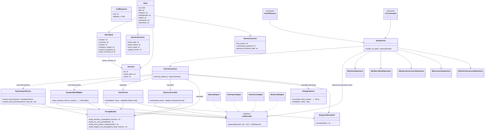

# Diagrama de Colaboración de Clases

Arquitectura Clean Architecture — Spec-038. Generado: 2026-04-21.

```mermaid
classDiagram
  %% ── Domain ─────────────────────────────────────────────────────
  class LLMProvider {
    <<interface>>
    +generate(prompt, role, **kw) LLMResponse
  }
  class LLMResponse {
    +text: str
    +elapsed_s: float
  }
  class Story {
    +id: UUID
    +title: str
    +sinopsis: str
    +protagonista: str
    +relator: str
    +escenarios: str
    +atmosfera: str
  }
  class MacroBeat {
    +number: int
    +summary: str
    +content: str
    +narrative_context: str
    +memory_snapshot: str
    +active_scenario_id: str
  }
  class NarrativeAnchors {
    +initial_state: str
    +threat_nature: str
    +horror_peak: str
    +spatial_anchor: str
  }
  class Scenario {
    +id: str
    +order_index: int
    +name: str
  }
  class NarrativeJournal {
    +last_events: str
    +unresolved_mysteries: str
    +physical_emotional_state: str
  }

  Story "1" --> "*" MacroBeat
  Story "1" --> "1" NarrativeAnchors
  Story "1" --> "*" Scenario
  Story "1" --> "1" NarrativeJournal
  MacroBeat --> Scenario : active_scenario_id

  %% ── Application ────────────────────────────────────────────────
  class PromptBuilder {
    +build_narrative_context(beat, anchors) str
    +build_voz_user_prompt(beat) str
    +build_voice_system_compact(story) str
    +build_mapper_one_prompt(story, beat, anchors) str
  }
  class StoryAnalystService {
    +extract_anchors(story) NarrativeAnchors
    +resolve_beat_anchors(anchors, beat_id) dict
  }
  class SynopsisBeatMapper {
    +map_one(story, beat_id, anchors, ...) MacroBeat
  }
  class VozUseCase {
    +narrate(beat, story) tuple[MacroBeat, float]
  }
  class MemoryJournalist {
    +extract(story, beat) tuple[str, NarrativeJournal]
  }
  class DirectorUseCase {
    +execute_full(story) AsyncGenerator
  }
  class DebugCollector {
    +record(role, beat_number, ...) None
    +write(path, meta) Path
  }

  DirectorUseCase --> StoryAnalystService : crea internamente
  DirectorUseCase --> SynopsisBeatMapper : crea internamente
  DirectorUseCase --> VozUseCase : inyectado
  DirectorUseCase --> MemoryJournalist : inyectado
  DirectorUseCase --> PromptBuilder : inyectado
  DirectorUseCase --> DebugCollector : inyectado (opcional)

  StoryAnalystService --> LLMProvider
  StoryAnalystService --> PromptBuilder

  SynopsisBeatMapper --> LLMProvider
  SynopsisBeatMapper --> PromptBuilder

  VozUseCase --> LLMProvider
  VozUseCase --> PromptBuilder

  MemoryJournalist --> LLMProvider
  MemoryJournalist --> PromptBuilder

  %% ── Infrastructure — Adapters ───────────────────────────────────
  class OllamaAdapter
  class AnthropicAdapter
  class GeminiCLIAdapter
  class MockLLMAdapter
  class ResponseNormalizer {
    +normalize(text) str
  }

  OllamaAdapter ..|> LLMProvider
  AnthropicAdapter ..|> LLMProvider
  GeminiCLIAdapter ..|> LLMProvider
  MockLLMAdapter ..|> LLMProvider

  DirectorUseCase --> ResponseNormalizer
  VozUseCase --> ResponseNormalizer

  %% ── Infrastructure — Repositories ──────────────────────────────
  class SQLStoryRepository
  class SQLMacroBeatRepository
  class SQLNarrativeAnchorsRepository
  class SQLScenarioRepository
  class SQLNarrativeJournalRepository

  %% ── Core ────────────────────────────────────────────────────────
  class StoryRunner {
    +run(dto, on_beat) AsyncGenerator
  }

  StoryRunner --> DirectorUseCase
  StoryRunner --> LLMProvider : selecciona proveedor activo
  StoryRunner --> SQLStoryRepository
  StoryRunner --> SQLMacroBeatRepository
  StoryRunner --> SQLNarrativeAnchorsRepository
  StoryRunner --> SQLScenarioRepository
  StoryRunner --> SQLNarrativeJournalRepository

  %% ── Entrypoints ─────────────────────────────────────────────────
  class FastAPIRouters {
    <<entrypoint>>
  }
  class CLICommands {
    <<entrypoint>>
  }

  FastAPIRouters --> StoryRunner
  CLICommands --> StoryRunner
```
