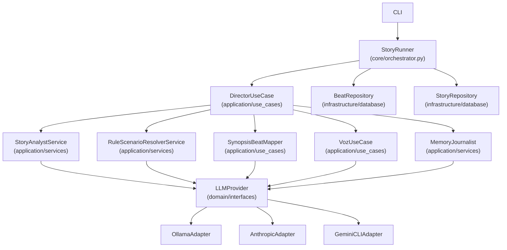
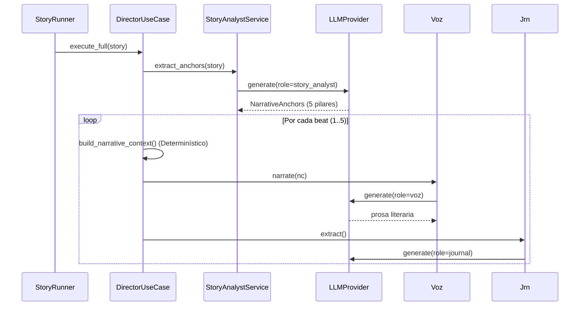
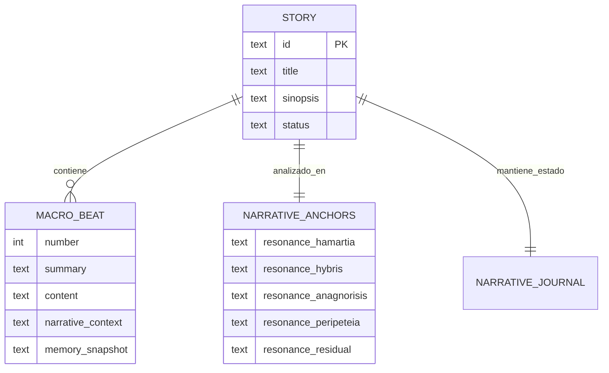

# Estándar de Diseño Arquitectural (EDA)

> **Enfoque:** Spec-Driven Development (SDD) — La especificación es la fuente de verdad.

## 1. Metodología de Desarrollo (SDD)
NarrativeForge opera bajo el ciclo obligatorio: **Spec → Plan → Task → Implementation**.

### Niveles de Rigor SDD
| Nivel | Rol de la Spec | Rol del Código | Cuándo Usar |
|-------|----------------|----------------|-------------|
| **Spec-First** | Guía y restringe output de IA | Entregable primario | Desarrollo de nuevas features |
| **Spec-Anchored** | Gobierna con checkpoints | Entregable validado | Refactorización o deuda técnica |

### Ciclo de Vida del Hito
Cada cambio se organiza en **Hitos** que agrupan **Tasks** atómicas.
- **Qué:** Resultado esperado.
- **Cómo:** Enfoque arquitectónico (Obligatorio antes de codificar).

## 2. Arquitectura del Sistema (Clean Architecture)

### Diagrama de Colaboración entre Clases

### Capas y Responsabilidades
1. **Domain:** Entidades puras y contratos (`interfaces.py`).
2. **Application:** Casos de uso que orquestan el flujo narrativo.
3. **Infrastructure:** Implementación de adapters, repositorios y normalizadores.
4. **Presentation:** CLI y API (FastAPI).

## 3. Pipeline de Inteligencia y Secuencia LLM

### Diagrama de Secuencia del Pipeline (17 llamadas LLM)

## 4. Modelo de Datos (ERD)

## 5. Estándares de Calidad
- **Normalización:** `ResponseNormalizer` elimina ruidos del LLM (ej. tags `<think>`).
- **Auditoría (Spec-170):** El `NarrativeAuditor` valida sensorialidad y boilerplate antes de aceptar una respuesta.
- **Testing:** Cobertura obligatoria > 80% con `pytest-asyncio`.

---
*Este documento es la fuente de verdad técnica del proyecto.*
