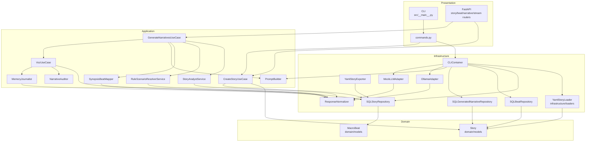
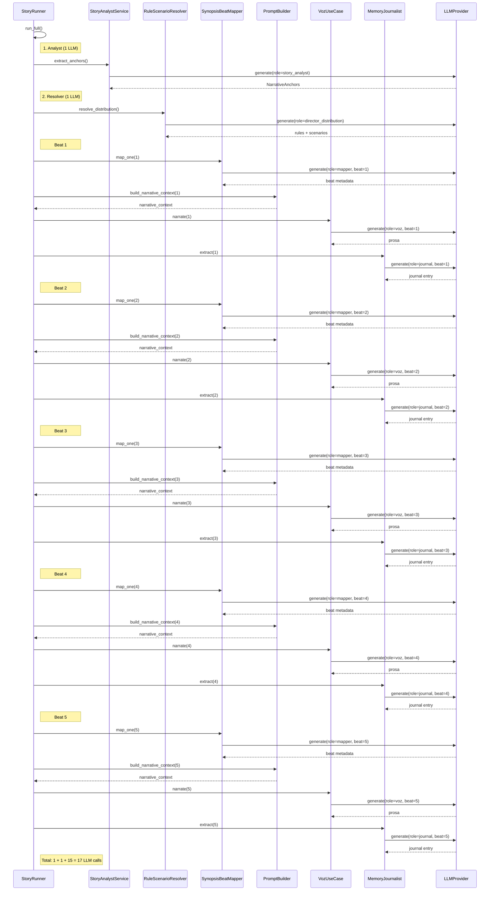
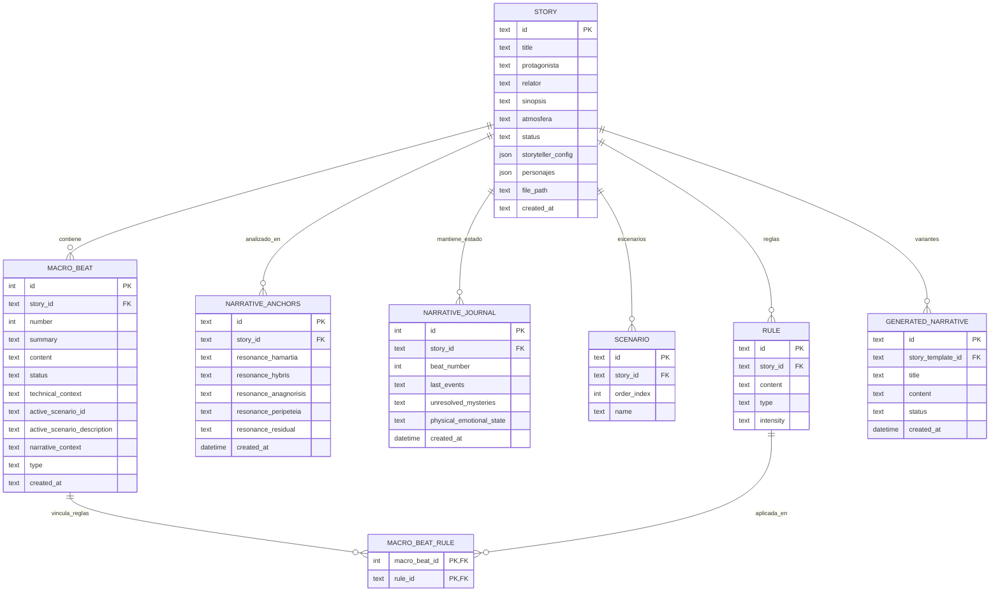

# Estándar de Diseño Arquitectural (EDA)

> **Enfoque:** Spec-Driven Development (SDD) — La especificación es la fuente de verdad.

## 1. Metodología de Desarrollo (SDD)
NarrativeForge opera bajo el ciclo obligatorio: **Spec → Plan → Task → Implementation**.
- **Trazabilidad:** Cada cambio en el código debe rastrear a un Hito y una Task definida en un Spec en `specs/`.
- **Validación Humana:** No se cierra un hito sin ejecución de tests y checklist de calidad.
- **Documentación de Decisiones:** Las decisiones arquitecturales se registran en Specs antes de codificar.

### Niveles de Rigor SDD
| Nivel | Rol de la Spec | Rol del Código | Cuándo Usar |
|-------|----------------|----------------|-------------|
| **Spec-First** | Guía y restringe output de IA | Entregable primario | Desarrollo de nuevas features |
| **Spec-Anchored** | Gobierna con checkpoints | Entregable validado | Refactorización o deuda técnica |

### Ciclo de Vida del Hito
Cada cambio se organiza en **Hitos** que agrupan **Tasks** atómicas.
- **Qué:** Resultado esperado.
- **Cómo:** Enfoque arquitectónico (Obligatorio antes de codificar).

## 2. Arquitectura del Sistema (Clean Architecture)
El código se organiza en capas concéntricas donde las dependencias solo fluyen hacia adentro:

1. **Domain:** Entidades (`Story`, `MacroBeat`, `NarrativeAnchors`), interfaces y excepciones.
2. **Application:** Casos de uso (`CreateStoryUseCase`, `VozUseCase`, `GenerateNarrativesUseCase`) y servicios (`PromptBuilder`, `NarrativeAuditor`, `MemoryJournalist`).
3. **Infrastructure:** Adapters LLM, loaders YAML, repositorios SQLite, normalizadores y exporters.
4. **Presentation/CLI:** Entrada de usuario vía CLI y API FastAPI.

### Inyección de Dependencias (Spec-250)
La CLI usa `CLIContainer` para resolver dependencias de infraestructura (`LLMProvider`, repositorios, loaders, exporters, `PromptBuilder`, reporter y debug collector). Esto elimina instanciación directa en comandos y permite tests unitarios con doubles.

### Diagrama de Colaboración entre Clases (capas Clean Architecture)

## 3. Pipeline de Inteligencia y Secuencia LLM
- **Fuente de Verdad:** `config/llm_core_definitions.yaml` gobierna perfiles, modelos y parámetros por rol.
- **Variantes de Prompting:** `compact` usa prompts directivos para modelos locales; `frontier` admite prompts más ricos para modelos de mayor rendimiento.
- **Prompting Asertivo (Spec-170):** `NarrativeAuditor` detecta boilerplate, baja sensorialidad y calcos de la sinopsis, disparando reintentos cuando corresponde.
- **Normalización:** `ResponseNormalizer` limpia tags de razonamiento (`<think>`, `<thought>`, `<reasoning>`) y relleno conversacional sin alterar Markdown válido.

### Diagrama de Secuencia del Pipeline (17 llamadas LLM total)

**Conteo:** 1 (analyst) + 1 (resolver) + 15 (5 beats × 3) = **17 llamadas LLM**

## 4. Modelo de Datos (ERD)

### Entidades y Cardinalidades (verificadas contra DB)

`macro_beat.active_scenario_id` es una referencia lógica al escenario activo, pero no tiene FK declarada en SQLite. `narrative_anchors` se gestiona como un registro activo por historia desde el repositorio, aunque el esquema actual no declara `UNIQUE(story_id)`.

## 5. Estándares de Calidad
- **Python:** 3.12+, tipado explícito y `pydantic` para validación de entrada y dominio.
- **Naming:** `PascalCase` para clases, `snake_case` para funciones/variables y `MAYUSCULAS_SNAKE` para constantes.
- **Testing:** Cobertura obligatoria > 80% con `pytest-asyncio`; cada task de lógica requiere test unitario.
- **Persistencia:** SQLite asíncrono (`aiosqlite`). YAML inicializa la estructura; la DB gobierna el estado de la historia.
- **Errores:** Jerarquía tipada basada en excepciones de dominio e infraestructura, con mensajes de usuario en español.

## 6. Workflow del Desarrollador
- `make install`: Sincroniza dependencias Python con `uv` y dependencias del frontend.
- `make test`: Ejecuta la suite completa de pruebas.
- `make lint`: Ejecuta `ruff check` y formato.
- `bash scripts/bash/init_db.sh`: Recrea la base de datos desde cero.

---
*Este documento es la fuente de verdad técnica del proyecto.*
