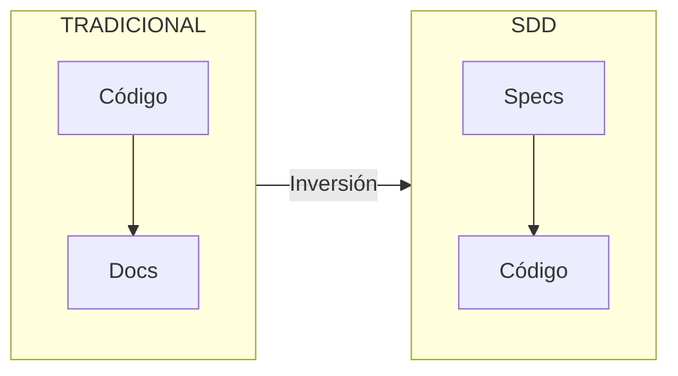
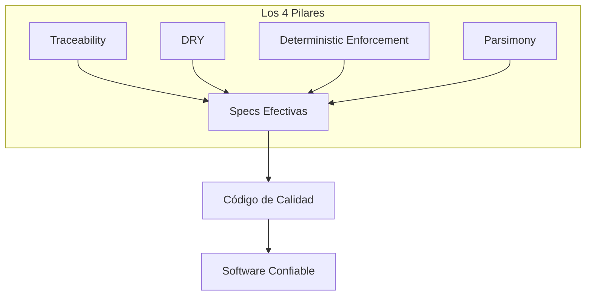
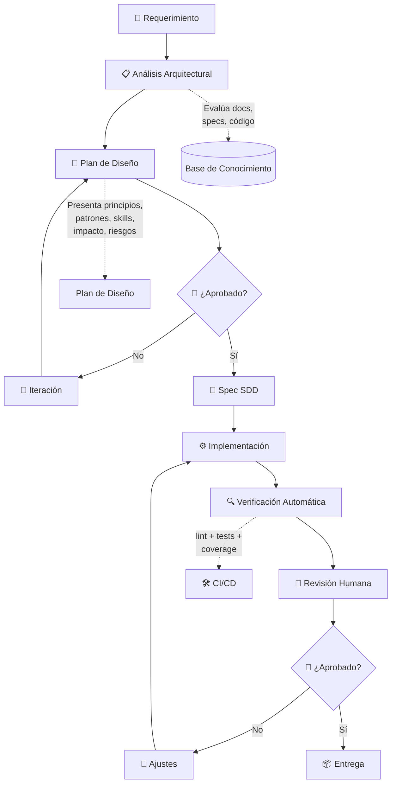
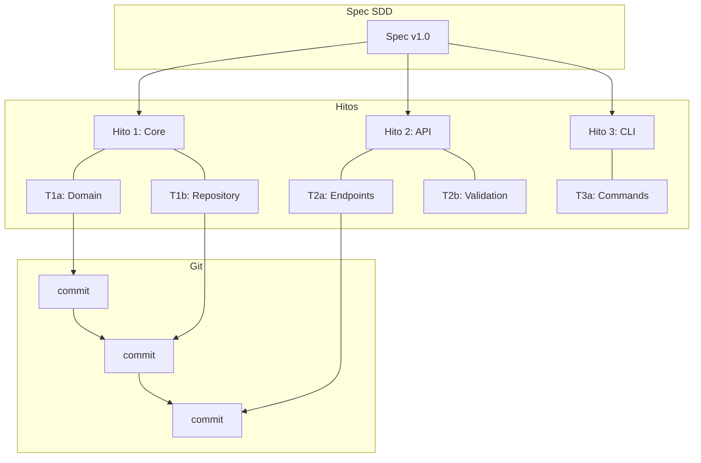

# Estándar de Diseño Arquitectural (EDA)

> **Enfoque:** Spec-Driven Development (SDD) — La especificación es la fuente de verdad

## 1. Introducción

**Spec-Driven Development (SDD)** es una metodología que invierte la relación tradicional entre especificaciones y código. En lugar de que el código sea la fuente de verdad con documentación como afterthought, SDD establece que **la especificación es el contrato primario** y el código es su expresión derivada.

El flujo descrito define un proceso obligatorio donde todo requerimiento pasa por una fase de análisis y planificación arquitectural antes de ser documentado como Spec (SDD) e implementado. SDD no es documentación por documentación — es un marco que proporciona las restricciones necesarias para que los agentes de IA operen de manera confiable.

> **Nota:** El marco de trabajo establece el flujo para crear specs, cambios y evolutivos efectivos en el código.



---

## 2. Los Cuatro Pilares de SDD

SDD se fundamenta en cuatro principios no negociables que garantizan especificaciones efectivas:

| Pilar | Descripción | Aplicación Práctica |
|-------|-------------|---------------------|
| **Traceability** | Trazabilidad bidireccional | Cada cambio en código tracea a un requerimiento y viceversa |
| **DRY** | Don't Repeat Yourself | Cada hecho se describe una sola vez |
| **Deterministic Enforcement** | Validación automatizada | Linting, tests, CI validan contra specs |
| **Parsimony** | Representación mínima | Máxima señal con mínima tokens |



---

## 3. Niveles de Rigor SDD

| Nivel | Rol de la Spec | Rol del Código | Cuándo Usar |
|-------|----------------|----------------|-------------|
| **Spec-First** | Guía y restringe output de IA | Entregable primario | Equipos iniciando en SDD |
| **Spec-Anchored** | Gobierna con checkpoints | Entregable validado | Equipos enterprise |
| **Spec-as-Source** | Fuente literal de código | Artefacto generado | Dominios API-first |

---

## 4. Principios Fundamentales

> **¿Cuándo aplicarlos?** Al recibir una nueva tarea o spec, el LLM debe revisar estos principios y seleccionar los más relevantes para la solución propuesta. El auditor (usuario) los usa para validar las decisiones arquitecturales durante la revisión.

### 4.1 Principios de Diseño

| Principio | Descripción |
|-----------|-------------|
| **KISS** | Mantener las soluciones simples y directas |
| **SOLID** | Single Responsibility, Open/Closed, Liskov Substitution, Interface Segregation, Dependency Inversion |
| **DRY** | Avoid Repeating Yourself — no duplicar lógica |
| **ISP** | Interface Segregation — interfaces pequeñas y específicas |
| **RSP** | Release Stabilization Principle — cada release debe ser estable |
| **YAGNI** | You Aren't Gonna Need It — no implementar características anticipadas |
| **LoD** | Law of Demeter — mínimo acoplamiento, máxima cohesión |
| **CoC** | Convention over Configuration — convenciones sobre configuración |

### 4.2 Principios de Arquitectura

| Principio | Descripción |
|-----------|-------------|
| **BDUF** | Big Design Up Front — diseñar antes de codificar |
| **APO** | Abstraction Principle — no redundar en abstracciones |
| **CCP** | Common Closure Principle — clases que cambian juntas, stay together |
| **CRP** | Common Reuse Principle — clases reutilizadas juntas, stay together |
| **SAP** | Stable Abstractions Principle — abstracciones estables |
| **PEP** | Stable Dependencies Principle — depender de lo estable |
| **Acyclic Dependencies** | No ciclos en el grafo de dependencias |

### 4.3 Principios de Código

| Principio | Descripción |
|-----------|-------------|
| **GRASP** | General Responsibility Assignment Software Patterns |
| **Fail Fast** | Fallar rápido y temprano |
| **Immutability** | Preferir objetos inmutables cuando sea posible |
| **Tell Don't Ask** | Decir qué hacer, no preguntar estado |
| **Rule of Least Surprise** | Comportamiento predecible, sin sorpresas |
| **Single Source of Truth** | Una sola fuente de verdad para cada dato |

---

## 5. Patrones de Diseño

### 5.1 Patrones Creacionales

| Patrón | Propósito | Cuándo Usar |
|--------|-----------|-------------|
| **Factory Method** | Crear objetos sin especificar clase exacta | Subclases来决定 creación |
| **Abstract Factory** | Familias de objetos relacionados | Sistemas con múltiples familias de productos |
| **Builder** | Construir objetos complejos paso a paso | Objetos con muchos parámetros/opciones |
| **Singleton** | Una sola instancia global | Recursos compartidos (config, logger) |
| **Prototype** | Clonar objetos existentes | Creación costosa vs clonación |

### 5.2 Patrones Estructurales

| Patrón | Propósito | Cuándo Usar |
|--------|-----------|-------------|
| **Adapter** | Interfaz incompatible → compatible | Integración con sistemas legacy |
| **Bridge** | Abstraer implementación de abstracción | Evitar explosión de clases |
| **Composite** | Árbol de objetos uniformemente | Estructuras jerárquicas |
| **Decorator** | Añadir comportamiento dinámicamente | Extensiones sin herencia |
| **Facade** | Interfaz unificada para subsistemas | Simplificar API compleja |
| **Proxy** | Sustituto controlado de otro objeto | Lazy loading, acceso remoto |

### 5.3 Patrones de Comportamiento

| Patrón | Propósito | Cuándo Usar |
|--------|-----------|-------------|
| **Chain of Responsibility** | Múltiles manejadores | Logging, auth, validación |
| **Command** | Solicitud como objeto | Undo/redo, colas, transacciones |
| **Iterator** | Recorrer colección sin exponer | Colecciones heterogéneas |
| **Observer** | Suscripción y notificaciones | Eventos, pub/sub |
| **State** | Comportamiento según estado | Máquinas de estado |
| **Strategy** | Intercambiar algoritmo en runtime | Múltiples algoritmos interchangeables |
| **Template Method** | Esqueleto de algoritmo | Pasos fijos, pasos configurables |

### 5.4 Patrones de Arquitectura

| Patrón | Propósito | Cuándo Usar |
|--------|-----------|-------------|
| **Repository** | Abstraer acceso a datos | Acceso a DB limpio |
| **Unit of Work** | Transacciones atómicas | Operaciones compuestas |
| **Service Layer** | Lógica de negocio encapsulada | Separación UI/lógica |
| **CQRS** | Separar lectura/escritura | Sistemas con patrones de uso distintos |
| **Domain Model** | Modelo rico de dominio | Lógica de negocio compleja |
| **Event Sourcing** | Eventos como fuente de verdad | Audit trail, rebuild state |
| **Event-Driven** | Comunicación por eventos | Sistemas distribuidos |

---

## 6. Convenciones de Código

### 6.1 Naming Conventions

| Lenguaje | Variables/Funciones | Clases/Componentes | Archivos/Recursos |
|----------|---------------------|--------------------|--------------------|
| **Python** | `snake_case` | `PascalCase` | `snake_case` |
| **JavaScript** | `camelCase` | `PascalCase` | `kebab-case` |
| **TypeScript** | `camelCase` | `PascalCase` | `kebab-case` |
| **SQL** | `snake_case` | — | — |
| **CSS** | — | — | `kebab-case` |

### 6.2 Reglas de Nomenclatura

| Elemento | Regla | Ejemplo |
|----------|-------|---------|
| **Clases** | Nombre significativo + sustantivo | `StoryRepository`, `BeatNarrator` |
| **Funciones** | Verbo + objeto descriptivo | `create_story()`, `narrate_beat()` |
| **Constantes** | MAYÚSCULAS_SNAKE | `MAX_BEATS = 50` |
| **Interfaces/Protocols** | Nombre descriptivo con sufijo | `LLMProvider`, `StoryRepository` |
| **Excepciones** | Nombre terminado en `Error` | `ValidationError`, `OllamaConnectionError` |
| **Tests** | `test_<método>_<escenario>` | `test_create_story_with_title` |

### 6.3 Estructura de Archivos

> La estructura sigue los principios de **Clean Architecture** (Uncle Bob). Las capas externas dependen de las internas, nunca al revés.

```
src/
├── domain/           # Entidades y reglas de negocio
├── application/      # Casos de uso y servicios
├── infrastructure/   # Implementaciones externas
├── presentation/     # API y controladores
└── cli/              # Interfaces de línea
```

| Capa | Responsabilidad | Depende de |
|------|-----------------|-------------|
| **domain** | Entidades, value objects, reglas de negocio | Ninguna |
| **application** | Casos de uso, servicios de aplicación | domain |
| **infrastructure** | Adapters, repositories, servicios externos | domain, application |
| **presentation** | API, CLI, controladores | application |
| **cli** | Interfaces de línea | application |

---

## 6. Estándares Transversales

> **¿Cuándo aplicarlos?** En todo momento. Estos estándares aseguran consistencia across layers y deben aplicarse en cada implementación.

### 6.4.1 Excepciones

| Estándar | Descripción |
|----------|-------------|
| **Jerarquía** | Heredar de `DomainException` o `InfrastructureException` |
| **Naming** | Sufijo `Error` + contexto: `ValidationError`, `OllamaConnectionError` |
| **Mensajes** | Claros, accionables, sin info sensible |
| **Propagación** | Capturar en frontera de capa, no ocultar |

```python
# Ejemplo
class StoryNotFoundError(DomainException):
    def __init__(self, story_id: str):
        super().__init__(f"Story with id '{story_id}' not found")
        self.story_id = story_id
```

### 6.4.2 Logging

| Estándar | Descripción |
|----------|-------------|
| **Niveles** | DEBUG: debug, INFO: operación, WARNING: recoverable, ERROR: fallo |
| **Estructura** | JSON estructurado para máquina, legible para humano |
| **Contexto** | Incluir `request_id`, `user_id`, `component` |
| **Secretos** | Nunca loguear passwords, tokens, keys |

```python
logger.info("Beat narrated", extra={"beat_id": beat_id, "story_id": story_id})
```

### 6.4.3 Variables de Entorno

| Estándar | Descripción |
|----------|-------------|
| **Fuente** | `pydantic-settings` leyendo de `.env` |
| **Naming** | `SNAKE_CASE`, prefijos por componente: `OLLAMA_`, `DB_` |
| **Defaults** | Valores por defecto seguros para dev |
| **Tipado** | Type hints en settings class |

```python
from pydantic_settings import BaseSettings

class Settings(BaseSettings):
    ollama_base_url: str = "http://localhost:11434"
    db_path: str = "stories.db"
    
    class Config:
        env_file = ".env"
```

### 6.4.4 Secrets

| Estándar | Descripción |
|----------|-------------|
| **Exclusión** | Nunca commitear secrets en repo |
| **Fuentes** | Env vars > secrets managers > hardcoded |
| **Rotación** | Diseño que permita rotar sin código |
| **Máscaras** | Loguear solo últimos 4 caracteres si es necesario |

### 6.4.5 Validación

| Estándar | Descripción |
|----------|-------------|
| **Input** | Validar en Presentation (API/CLI) |
| **Output** | Validar en Domain |
| **Librería** | Pydantic para schemas, FastAPI dependencies |
| **Errores** | Devolver 400 con detalle en API |

### 6.4.6 Documentación de Código

| Estándar | Descripción |
|----------|-------------|
| **Docstrings** | Google style o NumPy style |
| **Type Hints** | Siempre usar, except `Any` cuando sea necesario |
| **Comments** | Por qué, no qué (el código dice el qué) |
| **TODOs** | Formato: `TODO(username): description` |

---

## 7. Flujo de Trabajo SDD



### Hitos y Tasks

Cada spec se organiza en **hitos** que agrupan **tareas** específicas. Esta estructura proporciona:

| Beneficio | Descripción |
|-----------|-------------|
| **Trazabilidad completa** | Cada task tracea a un hito, que tracea al spec |
| **Cambios incrementales** | Entregas pequeñas y verificables |
| **Commits atómicos** | Cada task = un commit con mensaje descriptivo |
| **PRs controlados** | Un hito por PR, facilitando review |
| **Seguimiento visual** | Ruta clara del progreso del spec |
| **Auditoría efectiva** | El "Cómo" del objetivo permite validar enfoque antes de implementación |

> **Dinámica Estándar:** El Agente (IA/LLM) propone el "Qué" y el "Cómo" en cada hito. El Usuario (auditor) revisa y valida el enfoque arquitectónico antes de que el Agente implemente. Esto asegura que el desarrollo va por el camino correcto desde el inicio.



### Estructura de un Hito

```markdown
## Hito N: [Nombre del Hito]

**Objetivo:**
- **Qué:** [Qué resuelve este hito - resultado esperado]
- **Cómo:** [Enfoque arquitectónico - cómo se logra, patrón/es, capas afectadas]
```

> **Nota:** El campo "Cómo" es obligatorio. Define el enfoque arquitectónico para que el auditor pueda validar la propuesta antes de implementación.

### Tasks

| Task | Descripción | Archivos | Status |
|------|-------------|----------|--------|
| T.N.1 | [Descripción corta] | `src/x.py`, `tests/test_x.py` | [ ] |
| T.N.2 | [Descripción corta] | `src/y.py` | [ ] |

### Criteria de Éxito
- [ ] Criterio 1 verificable
- [ ] Criterio 2 verificable
```

### Uso para Commits y PRs

| Nivel | Acción | Formato |
|-------|--------|----------|
| **Task** | Commit | `feat(hito-n): implement task description` |
| **Hito** | PR | `feat(scope): implement hito objective` |

Ejemplo:
```bash
# Commit por task
git commit -m "feat(core): add story entity model"

# PR por hito (agrupa varias tasks)
# Título: feat(domain): implement story core module
```

### Fases del Flujo

| Fase | Descripción | Responsable |
|------|-------------|-------------|
| **1. Requerimiento** | El usuario plantea una necesidad o feature | Usuario |
| **2. Análisis Arquitectural** | Evaluación del proyecto, documentación y specs existentes | Agente (IA) + Skills |
| **3. Plan de Diseño** | Propuesta con principios, patrones, skills, impacto y riesgos | Agente (IA) + Skills |
| **4. Revisión** | El usuario aprueba o solicita iteraciones | Usuario |
| **5. Spec SDD** | Documento formal de diseño (fuente de verdad) | Agente (IA) |
| **6. Implementación** | Código siguiendo el spec aprobado | Agente (IA) |
| **7. Verificación Automática** | Linting, tests, coverage | Agente (IA) |
| **8. Revisión Humana** | Validación ejecución + preguntas al LLM | Usuario |
| **9. Ajustes** | Correcciones si aplica | Agente (IA) |
| **10. Entrega** | Hito completado | — |

---

## 8. Revisión Humana (Validación de Hito)

Esta fase es **obligatoria** antes de cerrar cualquier hito. La validación se divide en:

### 8.1 Ejecución de Tests por el Desarrollador

> **⚠️ Importante:** El desarrollador (usuario) debe ejecutar los tests localmente. No se cierra ningún hito sin esta validación.

```bash
# Ejecutar todos los tests
make test

# Tests unitarios específicos
pytest tests/unit/test_x.py -v

# Coverage
pytest --cov=src --cov-report=term-missing
```

### 8.2 Planificación de Tests

El Agente debe incluir tareas de test en cada hito. La dinámica es:

| Fase | Responsable | Acción |
|------|-------------|--------|
| **Planificación** | Agente | Incluye T.N.* en cada hito con tests asociados |
| **Implementación** | Agente | Implementa código + tests en paralelo |
| **Validación** | Usuario | Ejecuta tests y valida resultados |

> **TDD implícito:** Cada task de código debe tener una task de testing. El Agente planifica: `T.1.1: crear entidad` → `T.1.2: crear test unitario`.

### 8.3 Preguntas de Comprensión

Antes de aprobar, el usuario puede (y debe) hacer preguntas al agente como:

- ¿Qué cambios específicos se introdujeron en [componente]?
- ¿Por qué se eligió este patrón sobre [alternativa]?
- ¿Cómo afecta este cambio a [componente existente]?
- ¿Hay algún punto que no quedó cubierto?
- ¿Qué escenarios podrían fallar?
- ¿El código generado tracea correctamente al spec?

### 8.3 Checklist de Cierre

| Ítem | Validado |
|------|----------|
| ✅ Tests pasan | [ ] |
| ✅ Linting pasa | [ ] |
| ✅ Coverage > 80% | [ ] |
| ✅ Cambios entendidos | [ ] |
| ✅ No hay breaking changes sin documentar | [ ] |
| ✅ Spec actualizado si aplica | [ ] |
| ✅ Trazabilidad: spec → código → tests | [ ] |

---

## 9. Herramientas

### 9.1 Entorno de Desarrollo

| Herramienta | Genérica | Específica del Proyecto |
|-------------|----------|-------------------------|
| **IDE** | Editor de código | VSCode |
| **Shell** | Terminal | zsh |
| **Python** | Runtime | 3.12 |
| **Entorno virtual** | Gestor de entornos | uv |

### 9.2 Agente de IA

| Herramienta | Genérica | Específica del Proyecto |
|-------------|----------|-------------------------|
| **Agente** | Asistente de IA para análisis y código | Opencode (modelo minimax-m2.5-free) |
| **Skills** | Capacidades especializadas del agente | Skills en `.opencode/skills/` |
| **Contexto** | Documentos del proyecto | Specs, README, AGENTS.md |

> **Nota:** `AGENTS.md` define *qué es el proyecto* (stack, arquitectura, specs). Los Skills definen *cómo hacer el trabajo* (workflows especializados como spec-driven-development, planning-and-task-breakdown, etc.).

### 9.3 Construcción y Calidad

| Herramienta | Genérica | Específica del Proyecto |
|-------------|----------|-------------------------|
| **Gestor de dependencias** | Package manager | uv |
| **Linter** | Análisis estático | ruff (ignora E501, ARG002, B008, B904) |
| **Formateador** | Formateo de código | ruff |
| **Test** | Framework de pruebas | pytest + pytest-asyncio |
| **Coverage** | Cobertura de código | coverage.py |
| **API** | Framework web | FastAPI |
| **DB** | Base de datos | SQLite (aiosqlite) |
| **LLM** | Modelo de lenguaje | Ollama (local) |

---

## 10. Scripts del Desarrollador

### 10.1 Comandos de Desarrollo

```bash
# Instalar dependencias
make install      # uv sync

# Desarrollo con hot-reload
make dev         # uvicorn con hot-reload

# Verificación
make lint        # ruff check . && ruff format .
make test        # pytest -v --cov=src
make clean       # remove __pycache__, .pytest_cache, .ruff_cache
```

### 10.2 Comandos de Utilidad

```bash
# Ver logs (últimas 100 líneas del más reciente)
tail -n 100 $(ls -t logs/narrative-*.log | head -1)

# Follow en tiempo real del log más reciente
tail -f $(ls -t logs/narrative-*.log | head -1)

# Base de datos
sqlite3 stories.db

# Ollama
ollama list
ollama run <modelo>
```

---

## 11. Análisis Arquitectural

Cuando se recibe un requerimiento, el agente debe realizar:

### 11.1 Evaluación de Contexto

- **Specs existentes:** Revisar `specs/*.md` para decisiones previas
- **Código actual:** Analizar estructura, patrones usados, convenciones
- **Documentación:** Consultar `README.md`, `AGENTS.md`
- **Arquitectura:** Entender el modelo de capas y dependencias

### 11.2 Elementos del Plan de Diseño

| Elemento | Descripción |
|----------|-------------|
| **Principios aplicables** | KISS, SOLID, DRY, ISP, RSP, etc. |
| **Patrón(es) de arquitectura** | Repository, Adapter, Factory, CQRS, etc. |
| **Skills requeridos** | Qué skills cargar para esta tarea |
| **Impacto** | Efecto en componentes existentes |
| **Riesgos** | Posibles breaking changes, deuda técnica |
| **Alternativas consideradas** | Opciones descartadas y por qué |

---

## 12. Reglas del Proceso

### 12.1 Obligaciones del Agente

- ✅ **Siempre** analizar antes de implementar
- ✅ **Siempre** revisar specs existentes antes de proponer
- ✅ **Siempre** presentar plan antes del spec
- ✅ **Siempre** aplicar principios KISS, SOLID, DRY, ISP
- ✅ **Siempre** seguir naming conventions del proyecto
- ✅ **Siempre** verificar con linting y tests
- ✅ **Siempre** documentar decisiones en specs
- ✅ **Siempre** mantener trazabilidad: requerimiento → spec → código → tests

### 12.2 Obligaciones del Usuario

- ✅ **Revisar** el plan de diseño antes de aprobar
- ✅ **Solicitar iteraciones** si algo no concuerda
- ✅ **Confirmar** antes de generar el spec
- ✅ **Ejecutar** tests antes de aprobar entrega
- ✅ **Hacer preguntas** para comprender cambios

### 12.3 Prohibiciones

- ❌ **No implementar** sin plan de diseño aprobado
- ❌ **No generar spec** sin pasar por análisis arquitectural
- ❌ **No saltar** la fase de verificación (lint + tests)
- ❌ **No ignorar** decisiones de specs anteriores
- ❌ **No cerrar hito** sin validación humana
- ❌ **No permitir** drift entre spec y código sin actualizar el spec

---

## 13. Plantilla del Plan de Diseño

```markdown
# Plan de Diseño: [Nombre del Requerimiento]

## 1. Análisis de Contexto
- Specs relacionados: [lista]
- Componentes afectados: [lista]
- Decisiones previas relevantes: [resumen]

## 2. Propuesta de Solución
- Enfoque: [descripción]
- Principios aplicados: [KISS, SOLID, DRY, ISP, etc.]
- Patrón(es) de arquitectura: [nombre]
- Patrones de diseño: [Factory, Adapter, etc.]

## 3. Impacto
- Componentes nuevos: [lista]
- Componentes modificados: [lista]
- Breaking changes: [sí/no y cuáles]

## 4. Riesgos
- [Riesgo 1] → Mitigación: [cómo]
- [Riesgo 2] → Mitigación: [cómo]

## 5. Skills a Utilizar
- [skill-name]: [propósito]

## 6. Alternativas Consideradas
- [Alternativa 1]: Descartada porque [razón]
- [Alternativa 2]: Descartada porque [razón]

## 7. Próximo Paso
[Tu decisión: aprobar / iterar]
```

---

## 14. metadata

| Campo | Valor |
|-------|-------|
| **Versión** | 1.2.0 |
| **Fecha de creación** | 2026-04-16 |
| **Última actualización** | 2026-04-16 |
| **Enfoque** | Spec-Driven Development (SDD) |
| **Aplicabilidad** | Este proyecto y futuros proyectos |

---

*Documento generado para estandarizar el flujo de trabajo arquitectural basado en Spec-Driven Development.*
