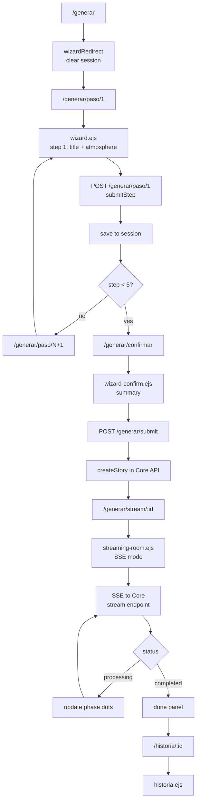
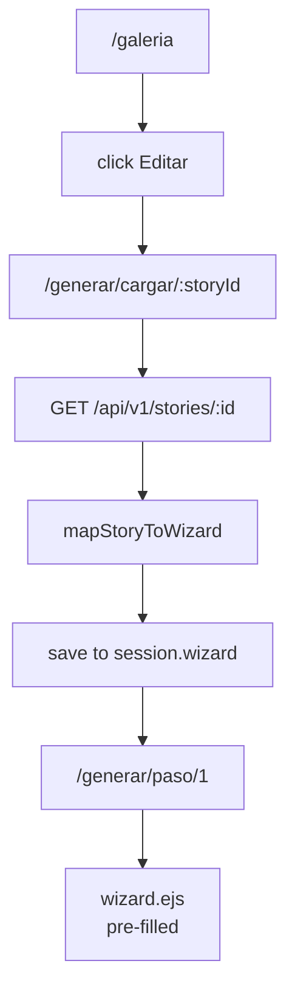
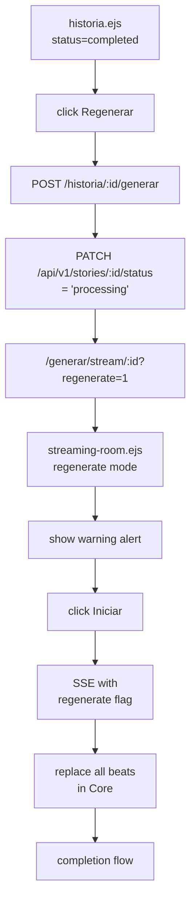
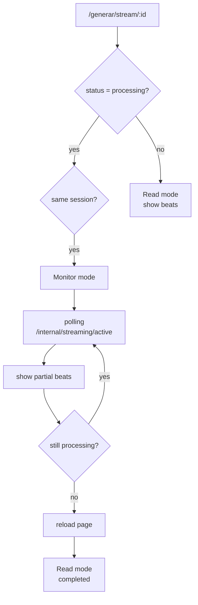
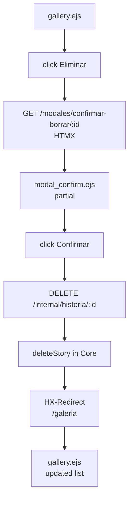
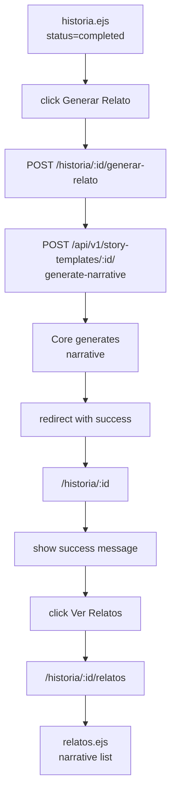
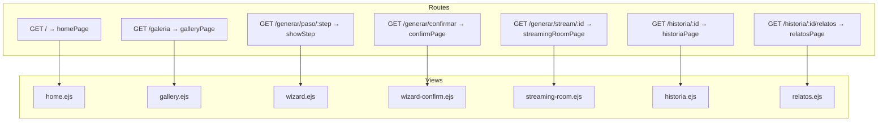

# Frontend Architecture Map

> **Purpose:** Site map and component reference for LLM agents developing or debugging the frontend.
> **Stack:** Express + TypeScript + EJS + Tailwind CSS + HTMX + SSE
> **Backend Communication:** Proxies to Core API (port 8020 dev / 8010 prod)

## Table of Contents

- [Site Map Overview](#site-map-overview)
- [Views Reference](#views-reference)
- [Services Reference](#services-reference)
- [Controllers Reference](#controllers-reference)
- [Middleware Reference](#middleware-reference)
- [Routes Reference](#routes-reference)
- [Flow Charts](#flow-charts)

---

## Site Map Overview

```
/
├── /generar → /generar/paso/1 (Wizard redirect)
├── /generar/paso/:step         → wizard.ejs (Pasos 1-5)
├── /generar/confirmar          → wizard-confirm.ejs (Resumen + acción)
├── /generar/stream/:storyId    → streaming-room.ejs (SSE active/monitor/read)
├── /generar/cargar/:storyId     → Carga historia existente en wizard
├── /galeria                   → gallery.ejs (Lista de historias)
├── /historia/:storyId         → historia.ejs (Detalle + acciones)
├── /historia/:storyId/relatos → relatos.ejs (Narrativas generadas)
├── /debug                    → debug.ejs (Estado del sistema)
├── /theme                    → POST: cambia tema
└── /modales/*                → HTMX partials (confirm delete, etc.)
```

---

## Views Reference

### 1. home.ejs

| Aspect | Detail |
|--------|--------|
| **Route** | `GET /` |
| **Controller** | `home.controller.ts` → `homePage()` |
| **Purpose** | Landing page con concepto, reglas de escritura, estructura de 5 actos |
| **Dependencies** | No API calls. Solo render estático |
| **Components** | Header, Roles cards, Anatomy section, 5-Act structure grid, CTA button |
| **Communication** | → `/generar` (botón CTA) |

### 2. gallery.ejs

| Aspect | Detail |
|--------|--------|
| **Route** | `GET /galeria` |
| **Controller** | `gallery.controller.ts` → `galleryPage()` |
| **Purpose** | Listar todas las historias con estado, acciones por estado |
| **API Calls** | `GET /api/v1/stories` |
| **Dependencies** | `core_api.service.ts` → `checkCoreHealth()` |
| **Components** | Story cards, status badges, action buttons (edit/regenerate/delete) |
| **States** | empty, loading, error, list |
| **Communication** | → `/historia/:id`, → `/generar/cargar/:id`, → `/modales/*` (HTMX) |

### 3. wizard.ejs

| Aspect | Detail |
|--------|--------|
| **Route** | `GET /generar/paso/:step` |
| **Controller** | `wizard.controller.ts` → `showStep()` |
| **Purpose** | Formulario multipaso (5 pasos) para configurar historia |
| **Session** | `req.session.wizard` → WizardData (step-by-step) |
| **Step Config** | `form_renderer.service.ts` → carga desde `ui_definitions.yaml` |
| **Steps** | 1: Title/Atmosphere, 2: Characters, 3: Narrator Voice, 4: World (scenarios+rules), 5: Plot (5 acts) |
| **Components** | Stepper header, form fields, card lists (characters, scenarios, rules), delete confirmation modal |
| **Communication** | → `/generar/paso/:step` (POST), → `/generar/paso/:step/guardar` (PATCH autosave) |
| **JavaScript** | `wizard.js` → card management, autosave, delete modal |

### 4. wizard-confirm.ejs

| Aspect | Detail |
|--------|--------|
| **Route** | `GET /generar/confirmar` |
| **Controller** | `wizard.controller.ts` → `confirmPage()` |
| **Purpose** | Resumen de configuración antes de generar |
| **Session** | `req.session.wizard`, `req.session.wizard_story_id` |
| **Components** | Summary cards per step, action buttons (save/generate) |
| **Communication** | → `/generar/submit` (POST → backend para crear+generar) |

### 5. streaming-room.ejs

| Aspect | Detail |
|--------|--------|
| **Route** | `GET /generar/stream/:storyId` |
| **Controller** | `stream.controller.ts` → `streamingRoomPage()` |
| **Purpose** | Sala de generación en tiempo real con SSE |
| **Modes** | `SSE` (generando), `Monitor` (otra pestaña), `Read` (completada/error) |
| **API Calls** | `GET /api/v1/stories/:id`, `GET /api/v1/stories/:id/beats` |
| **SSE Endpoint** | `/api/v1/stories/:storyId/stream` (proxied a Core) |
| **Components** | Phase dots, start panel, log container, spinner, error panel, done panel |
| **Communication** | SSE connection, → `/historia/:id`, → `/galeria` |
| **JavaScript** | `streaming-room.js` (SSE mode) or `streaming-monitor.js` (monitor mode) |

### 6. historia.ejs

| Aspect | Detail |
|--------|--------|
| **Route** | `GET /historia/:storyId` |
| **Controller** | `historia.controller.ts` → `historiaPage()` |
| **Purpose** | Ver detalle de historia generada |
| **API Calls** | `GET /api/v1/stories/:id` |
| **Components** | Header, sections (atmosphere, narrator, characters, scenarios, rules, plot), action bar |
| **States** | draft, processing, completed, failed |
| **Communication** | → `/galeria`, → `/generar/cargar/:id`, → `/historia/:id/generar`, → `/historia/:id/relatos` |

### 7. relatos.ejs

| Aspect | Detail |
|--------|--------|
| **Route** | `GET /historia/:storyId/relatos` |
| **Controller** | `relatos.controller.ts` → `relatosPage()` |
| **Purpose** | Ver lista de narrativas generadas desde template |
| **API Calls** | `GET /api/v1/story-templates/:id/narratives` (via `story.service.ts`) |
| **Components** | Narrative list, detail view |
| **Actions** | Generate new narrative, view text |

### 8. debug.ejs

| Aspect | Detail |
|--------|--------|
| **Route** | `GET /debug` |
| **Controller** | `debug.controller.ts` → `debugPage()` |
| **Purpose** | Diagnosticar estado del sistema (Core health, proxy, etc.) |
| **Data** | `checkCoreHealth()`, system events |

---

## Services Reference

### core_api.service.ts

| Function | Purpose | API Endpoint |
|----------|---------|--------------|
| `checkCoreHealth()` | Verificar si Core está reachable | `GET /api/v1/health` |
| `createStory(payload, action)` | Crear historia | `POST /api/v1/stories?action=` |
| `updateStory(id, payload)` | Actualizar historia | `PATCH /api/v1/stories/:id` |
| `deleteStory(id)` | Eliminar historia | `DELETE /api/v1/stories/:id` |
| `updateFilePath(id, path)` | Actualizar file path | `PATCH /api/v1/stories/:id/file-path` |
| `generateNarrative(id, title)` | Generar narrativa desde template | `POST /api/v1/story-templates/:id/generate-narrative` |
| `listNarratives(id)` | Listar narrativas | `GET /api/v1/story-templates/:id/narratives` |
| `getNarrativeText(id)` | Obtener texto de narrativa | `GET /api/v1/generated-narratives/:id/text` |
| `deleteNarrative(id)` | Eliminar narrativa | `DELETE /api/v1/generated-narratives/:id` |

**Environment:** `CORE_API_URL` (dev: `http://localhost:8020`; prod/Docker: `http://backend:8010`)

### wizard.service.ts

| Function | Purpose |
|----------|---------|
| `STEPS` | WizardStep[] cargado desde `ui_definitions.yaml` |
| `getStep(number)` | Obtener paso por número |
| `getStepById(id)` | Obtener paso por ID |
| `saveStepData(session, stepId, data)` | Guardar datos en sesión |
| `getStepData(session, stepId)` | Leer datos de sesión |
| `mapStoryToWizard(story)` | Convertir respuesta API a formato wizard |

### mapper.service.ts

| Function | Purpose |
|----------|---------|
| `mapWizardToCore(wizard)` | Convertir wizard session → DTO para Core API |

### story.service.ts

| Function | Purpose |
|----------|---------|
| `getStoryById(id)` | Obtener historia vía API |
| `getRelatosForStory(id)` | Obtener relatos para historia |

### form_renderer.service.ts

| Function | Purpose |
|----------|---------|
| `loadSteps()` | Cargar steps desde `ui_definitions.yaml` |

---

## Controllers Reference

| Controller | File | Key Functions |
|------------|------|---------------|
| **home** | `home.controller.ts` | `homePage()` |
| **gallery** | `gallery.controller.ts` | `galleryPage()` |
| **generate** | `generate.controller.ts` | `generatePage()` (legacy, now wizard) |
| **wizard** | `wizard.controller.ts` | `wizardRedirect`, `showStep`, `submitStep`, `confirmPage`, `loadWizardData`, `autoSaveField` |
| **stream** | `stream.controller.ts` | `submitGeneration`, `streamingRoomPage`, `getActiveStreamApi` |
| **historia** | `historia.controller.ts` | `historiaPage`, `generarDesdeHistoria`, `generateNarrativeHandler`, `deleteStoryHandler`, `confirmDeleteModal`, `updateFilePathHandler` |
| **relatos** | `relatos.controller.ts` | `relatosPage` |
| **theme** | `theme.controller.ts` | `setTheme` |
| **debug** | `debug.controller.ts` | `debugPage` |

---

## Middleware Reference

| Middleware | File | Purpose |
|-----------|------|---------|
| **api_proxy** | `middleware/api_proxy.ts` | Proxy requests to Core API (`/api/*` → `CORE_API_URL/api/*`) |
| **session** | `middleware/session.middleware.ts` | Session config (Express Session with store) |
| **theme** | `middleware/theme.middleware.ts` | Theme loading and injection (light/dark via cookies) |

---

## Routes Reference

```typescript
// Static
GET  /                     → homePage
GET  /galeria              → galleryPage
GET  /debug               → debugPage

// Theme
POST /theme               → setTheme

// Wizard
GET  /generar             → wizardRedirect (→ /generar/paso/1)
GET  /generar/paso/:step  → showStep
POST /generar/paso/:step → submitStep
PATCH /generar/paso/:step/guardar → autoSaveField
GET  /generar/confirmar   → confirmPage
GET  /generar/cargar/:storyId → loadWizardData (load story → session → wizard)

// Stream
POST /generar/submit       → submitGeneration (create story in Core)
GET  /generar/stream/:storyId → streamingRoomPage
GET  /internal/streaming/active → getActiveStreamApi

// Historia
GET  /historia/:storyId            → historiaPage
POST /historia/:storyId/generar → generarDesdeHistoria
POST /historia/:storyId/generar-relato → generateNarrativeHandler
DELETE /internal/historia/:storyId → deleteStoryHandler
PATCH /internal/historia/:storyId/file-path → updateFilePathHandler

// Modals (HTMX)
GET  /modales/confirmar-borrar/:storyId → confirmDeleteModal

// Relatos (Spec-235)
GET  /historia/:storyId/relatos → relatosPage
```

---

## Flow Charts (Mermaid JS)

### Flow: Create New Story



### Flow: Edit Existing Story



### Flow: Regenerate Story



### Flow: Monitor Another Tab



### Flow: Delete Story (HTMX)



### Flow: Generate Narrative (Relato)



### Route to View Mapping



### Frontend to Backend Communication

```mermaid
sequenceDiagram
    participant Browser
    participant Express as Express (:3010)
    participant Core as Core API (:8020 dev)

    Browser->>Express: GET /galeria
    Express->>Core: GET /api/v1/stories
    Core-->>Express: stories[]
    Express-->>Browser: gallery.ejs

    Browser->>Express: POST /generar/submit
    Express->>Core: POST /api/v1/stories?action=generate
    Core-->>Express: story{ id }
    Express-->>Browser: redirect /generar/stream/:id

    Browser->>Express: GET /generar/stream/:id
    Express->>Core: GET /api/v1/stories/:id
    Express-->>Browser: streaming-room.ejs

    Note over Browser: SSE connection
    Browser->>Core: EventSource /api/v1/stories/:id/stream
    Core-->>Browser: stream events (JSON)
    Browser->>Browser: update UI (phases, logs)

---

## JavaScript Client Files

| File | View | Purpose |
|------|------|--------|
| `streaming-room.js` | streaming-room (SSE) | SSE connection, phase dots, log updates, buttons |
| `streaming-monitor.js` | streaming-room (Monitor) | Polling, partial beats display, auto-reload |
| `wizard.js` | wizard | Card management, autosave, delete modal |
| `footer.js` | all | Lazy load Lucide icons |
| `relatos.js` | relatos | (if needed) |

---

## Environment Variables

| Variable | Default | Purpose |
|----------|---------|---------|
| `CORE_API_URL` | `http://localhost:8020` | Backend API URL (dev) |
| `NODE_ENV` | `development` | Environment |
| `PORT` | `3010` | Frontend server port |
| `SESSION_SECRET` | (required) | Session encryption |
| `OUTPUT_STORIES_DIR` | `public/output_stories` | Exported stories location |

---

## Key Design Patterns

### 1. HTMX for Partial Updates

```html
<button hx-get="/modales/confirmar-borrar/:id"
        hx-target="#modal-slot"
        hx-swap="innerHTML">
  Eliminar
</button>
```

### 2. SSE for Streaming

```javascript
const source = new EventSource(streamUrl);
source.onmessage = (e) => { /* update UI */ };
```

### 3. Session-Based Wizard

- Data persisted in `req.session.wizard` between steps
- Auto-save via PATCH endpoint
- Rehydration via `mapStoryToWizard()` for edit flow

### 4. Proxy Pattern

```
Browser → Express (:3010/api/*) → Core API (:8020/api/*)
```

Configurado en `middleware/api_proxy.ts`.

---

## Quick Reference for Debugging

| Symptom | Check |
|---------|-------|
| Wizard data lost | `session.wizard` in memory vs Redis |
| "Backend offline" | Core health at `http://localhost:8020/api/v1/health` |
| SSE not connecting | Proxy middleware, CORS, Core stream endpoint |
| Session lost | Session store config, cookie settings |
| Styles broken | Tailwind build, `theme.css` loaded |
| Icons not loading | Lucide CDN or bundled, `footer.js` |

---

*Document generated for LLM agent onboarding. Update when adding new views/routes/services.*