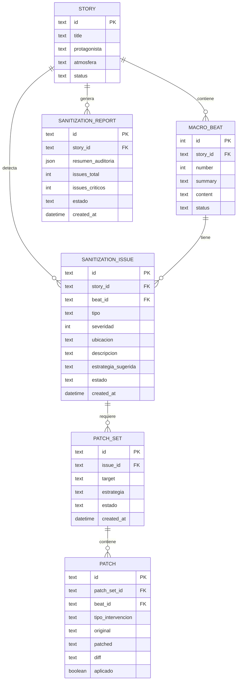
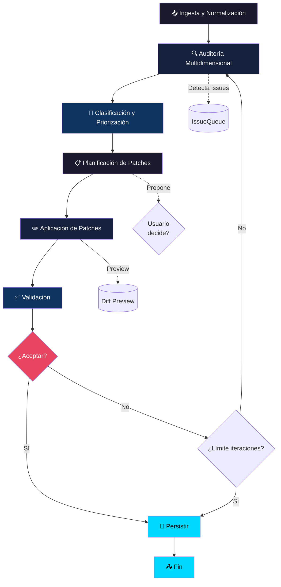
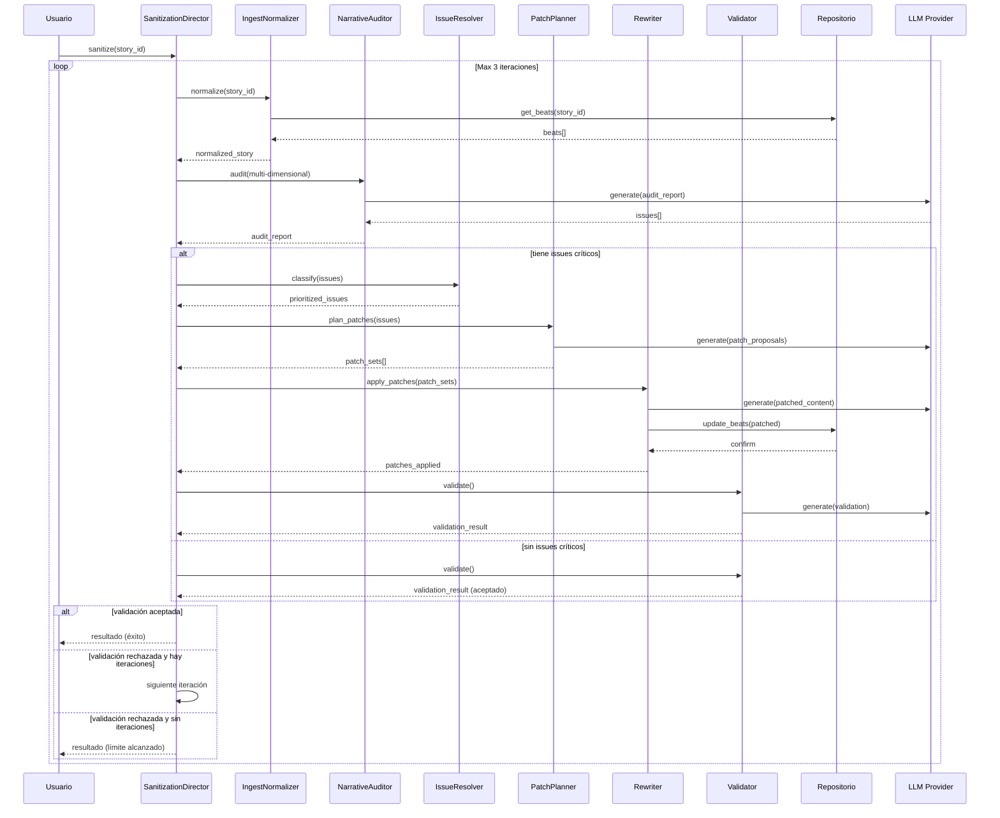

# Fase de Saneamiento del Relato

## Propósito

Sistema crítico-correctivo para mejorar relatos generados (beat-by-beat). **No genera contenido nuevo** — evalúa, corrige y optimiza narrativa existente.

## Pipeline

```
Ingesta →【Auditoría】→【Clasificación】→【Plan】→【Patch】→【Validación】→【Loop】
```

### Fases

| Fase | Actor | Descripción |
|------|-------|-------------|
| 0 | Normalizer | Segmenta por beats/párrafos, limpia artefactos |
| 1 | Auditor | Audit multdimensional → lista de issues |
| 2 | IssueResolver | Prioriza issues, agrupa en PatchSets |
| 3 | PatchPlanner | Propone estrategia (micro_edit, paragraph_rewrite, beat_rewrite, style_overlay) |
| 4 | Rewriter | Aplica patches, preserva eventos y anchors |
| 5 | Validator | Re-auditoría, decide aceptar/retry |
| 6 | Director | Controla iteraciones (max 3), thresholds |

## Modelo de Datos (ERD)

### Entidades del Dominio de Saneamiento



### Decisiones Clave

| Área | Decisión |
|------|----------|
| Modo | Híbrido (auto + intervención humana en críticos) |
| Granularidad | Mixto (párrafo + beat) |
| Iteraciones | Máximo 3 |
| Dimensiones v1 | Coherencia, Voz, Densidad sensorial |
| Criterio Calidad | Sin issues críticos |

## Riesgos

- Drift narrativo / Sobre-edición / Latencia

## Roadmap

- **MVP:** Auditoría 3 dimensiones + patch párrafo + 1 iteración
- **v1:** Loop completo (3 iteraciones) + granularidad mixta
- **v2:** SSE + UI interactiva

---

## Diagrama de Flujo



## Diagrama de Secuencia



## Notas de Diseño