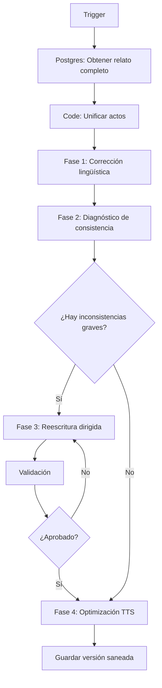

# Blueprint – Flujo n8n: saneador_relato_gpt

## Objetivo General

Crear un pipeline secuencial por fases con iteración condicional limitada para:

1. Corregir ortografía y gramática.
2. Detectar inconsistencias narrativas.
3. Reescribir solo si es necesario.
4. Optimizar el texto para narración en YouTube (TTS y ritmo oral).
5. Garantizar estabilidad antes del flujo de guión técnico.

---

# DIAGRAMA LÓGICO DEL FLUJO

Iteración máxima recomendada: 2 ciclos.

---

# IMPLEMENTACIÓN EN n8n – PASO A PASO

## 1️⃣ Nodo: Trigger

Tipo: Manual Trigger o Webhook
Función: Iniciar el flujo con un story_id.
Salida esperada:
{
"story_id": "terror_123456"
}

---

## 2️⃣ Nodo: Obtener relato

Tipo: Postgres (Execute Query)
Nombre sugerido: get_full_story
Query:
SELECT acto_numero, contenido
FROM relatos_vivos
WHERE id_story = '{{ $json.story_id }}'
ORDER BY acto_numero ASC;

Función: Trae todos los actos ordenados.

---

## 3️⃣ Nodo: Unificar texto

Tipo: Code
Nombre sugerido: merge_story
Función: Unir actos en un solo string.

Código:

const items = $input.all();
let texto = "";
items.forEach(i => {
texto += i.json.contenido + "\n\n";
});

return [{ json: { texto_original: texto } }];

---

# FASE 1 – CORRECCIÓN LINGÜÍSTICA

## 4️⃣ Nodo: LLM Corrección Técnica

Tipo: Ollama Chat Model
Modelo recomendado: llama3.1:8b
Temperatura: 0.2
Nombre sugerido: fase1_correccion

Prompt técnico:

INSTRUCCIÓN:
Corrige exclusivamente ortografía, puntuación, concordancia gramatical y tiempos verbales.

REGLAS:

* No cambies estilo.
* No alteres estructura narrativa.
* No agregues ni elimines contenido.
* No embellezcas el texto.
* Mantén exactamente la misma historia.

TEXTO:
{{ $json.texto_original }}

Salida: texto_corregido

---

# FASE 2 – DIAGNÓSTICO DE CONSISTENCIA

## 5️⃣ Nodo: LLM Diagnóstico

Tipo: Ollama Chat Model
Modelo: llama3.1:8b
Temperatura: 0.3
Nombre: fase2_diagnostico

Prompt técnico:

Analiza el siguiente relato y genera un reporte estructurado.

Evalúa exclusivamente:

* Inconsistencias temporales.
* Cambios de punto de vista.
* Objetos que aparecen/desaparecen.
* Personajes que cambian rasgos.
* Problemas espaciales.
* Contradicciones lógicas.

Formato obligatorio:

INCONSISTENCIAS_GRAVES:

* ...

INCONSISTENCIAS_MENORES:

* ...

CAMBIOS_DE_POV:

* ...

PROBLEMAS_DE_CONTINUIDAD:

* ...

Si no hay problemas en una categoría, escribir: NINGUNA.

TEXTO:
{{ $json.text }}

---

## 6️⃣ Nodo: Evaluar gravedad

Tipo: IF
Nombre: if_problemas_graves
Condición:
Si INCONSISTENCIAS_GRAVES contiene algo distinto de "NINGUNA"

---

# FASE 3 – REESCRITURA DIRIGIDA (solo si necesario)

## 7️⃣ Nodo: LLM Reescritura Correctiva

Tipo: Ollama Chat Model
Modelo: llama3.1:8b
Temperatura: 0.4
Nombre: fase3_reescritura

Prompt técnico:

Corrige el relato usando exclusivamente el siguiente reporte de inconsistencias.

REGLAS:

* Corrige solo lo indicado.
* No cambies estilo general.
* No agregues escenas nuevas.
* No elimines escenas completas.
* Mantén coherencia interna.

REPORTE:
{{ $node["fase2_diagnostico"].json.text }}

RELATO:
{{ $node["fase1_correccion"].json.text }}

---

# VALIDACIÓN POST-REESCRITURA

## 8️⃣ Nodo: LLM Validación

Tipo: Ollama Chat Model
Temperatura: 0.2
Nombre: fase3_validacion

Prompt:

Evalúa si el siguiente relato contiene inconsistencias graves.
Responde únicamente:
APROBADO

O

REQUIERE_CORRECCION

TEXTO:
{{ $json.text }}

---

## 9️⃣ Nodo: IF Validación

Tipo: IF
Nombre: if_validacion
Condición:
Si respuesta == REQUIERE_CORRECCION
→ volver a fase3_reescritura (máximo 1 iteración adicional)

---

# FASE 4 – OPTIMIZACIÓN PARA YOUTUBE / TTS

## 🔟 Nodo: LLM Optimización Oral

Tipo: Ollama Chat Model
Modelo: llama3.1:8b
Temperatura: 0.5
Nombre: fase4_tts

Prompt técnico:

Optimiza el siguiente relato para narración en YouTube.

Objetivos:

* Mejorar ritmo oral.
* Ajustar longitud de frases.
* Favorecer pausas naturales.
* Evitar redundancias auditivas.
* Mantener tensión progresiva.

Restricciones:

* No cambiar hechos.
* No alterar estructura narrativa.
* No agregar contenido nuevo.

TEXTO:
{{ $json.text }}

---

# GUARDADO FINAL

## 1️⃣1️⃣ Nodo: Postgres Insert

Nombre: save_sanitized_version
Tabla sugerida: relatos_saneados

Campos:

* id_story
* version
* contenido_saneado
* fecha

---

# ESTRATEGIA DE ITERACIÓN LIMITADA

* Máximo 2 ciclos de reescritura.
* Nunca reinyectar optimización TTS en corrección técnica.
* Separar claramente fases para evitar degradación estilística.

---

# POR QUÉ ESTA ESTRUCTURA ES ÓPTIMA PARA TU CASO

1. Reduce alucinaciones.
2. Minimiza drift creativo.
3. Mantiene control narrativo.
4. Estabiliza el texto antes de generar guión técnico.
5. Optimiza para narración futura (YouTube + diseño sonoro).

---

Si deseas iterar este blueprint, podemos:

* Añadir scoring automático.
* Integrar métricas de legibilidad.
* Incorporar análisis de densidad emocional.
* Dividir por bloques largos para mayor precisión.
