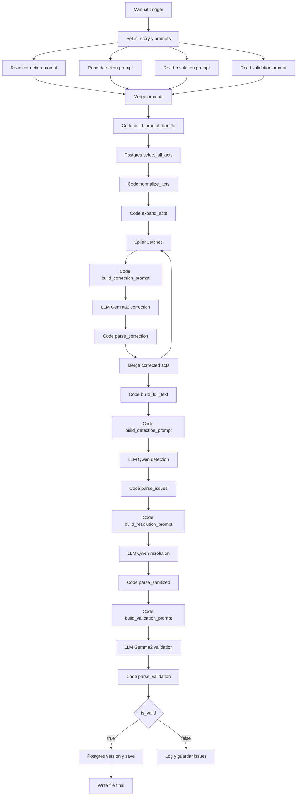

# 🧹 Flujo n8n: Sanitización de Relatos

## 1. Objetivo

Diseñar un flujo independiente que procese un relato ya generado (desde PostgreSQL o archivo .md) para:

* Corregir ortografía y gramática
* Detectar inconsistencias narrativas
* Resolver incoherencias de continuidad
* Mejorar claridad sin alterar estilo
* Mantener memoria narrativa consistente

---

## 2. Estrategia General

El flujo será un **post-procesador** del pipeline actual:

```
Generación → Persistencia → Sanitización → Export final limpio
```

Se puede ejecutar:

* Automáticamente al terminar el flujo principal
* Manualmente sobre un `id_story`

---

## 3. Fuentes de Entrada

### Opción A — Base de datos (recomendada)

Tabla: `story_acts`

* chapter
* summary
* memory

Ventajas:

* Permite coherencia global
* Acceso estructurado por actos

### Opción B — Markdown

Archivo completo generado

Desventaja:

* Pierde estructura semántica (memoria / summary)

👉 Recomendación: usar PostgreSQL como fuente primaria.

---

## 4. Arquitectura del Flujo

### 4.1 Entrada

* Manual Trigger o Webhook
* Input: `id_story`

---

### 4.2 Recuperación de Datos

Nodo: PostgreSQL

Query:

```sql
SELECT act_number, chapter, summary, memory
FROM story_acts
WHERE id_story = {{$json.id_story}}
ORDER BY act_number ASC;
```

---

### 4.3 Normalización

Nodo: Code

Objetivo:

* Ordenar actos
* Unificar estructura
* Preparar contexto global

Salida esperada:

```json
{
  "acts": [...],
  "full_text": "...",
  "global_memory": "..."
}
```

---

### 4.4 Fase 1 — Corrección Lingüística

Nodo: LLM (modelo liviano, ej. gemma2)

Prompt:

* Corregir ortografía
* Mejorar puntuación
* Mantener estilo
* NO cambiar contenido narrativo

Salida:

```json
{
  "corrected_text": "..."
}
```

---

### 4.5 Fase 2 — Detección de Inconsistencias

Nodo: LLM (análisis)

Debe detectar:

* Cambios de nombre de personajes
* Incoherencias temporales
* Contradicciones de hechos
* Problemas de POV

Salida estructurada:

```json
{
  "issues": [
    {
      "type": "continuidad",
      "description": "...",
      "location": "acto 3"
    }
  ]
}
```

---

### 4.6 Fase 3 — Resolución

Nodo: LLM

Input:

* Texto corregido
* Lista de issues

Instrucciones:

* Resolver inconsistencias
* No introducir nuevas
* Mantener tono original

Salida:

```json
{
  "sanitized_text": "..."
}
```

---

### 4.7 Fase 4 — Validación Final

Nodo: LLM (opcional pero recomendado)

Checklist:

* Coherencia global
* Consistencia de personajes
* Fluidez narrativa

Salida:

```json
{
  "is_valid": true,
  "notes": "..."
}
```

---

### 4.8 Persistencia

Opciones:

#### A — Nueva tabla

`story_sanitized`

#### B — Sobrescribir

Actualizar `story_acts`

#### C — Archivo

Guardar:

```
relato_<id>_sanitized.md
```

👉 Recomendación: A + archivo

---

## 5. Diseño de Prompts (clave)

### Prompt Corrección

* Rol: editor lingüístico
* Restricción fuerte: no alterar contenido

---

### Prompt Detección

* Rol: auditor narrativo
* Salida estructurada JSON

---

### Prompt Resolución

* Rol: editor narrativo senior
* Input dual: texto + issues

---

## 6. Decisiones Críticas

### 6.1 Granularidad

**Opción 1:** Procesar relato completo

* * Mejor coherencia
* * Mayor consumo VRAM

**Opción 2:** Por acto

* * Más eficiente
* * Riesgo de incoherencias cruzadas

👉 Recomendado: híbrido

* Corrección → por acto
* Coherencia → global

---

### 6.2 Modelos

* Corrección: modelo chico (gemma2)
* Coherencia: modelo grande (qwen2.5)

---

### 6.3 Idempotencia

El flujo debe poder ejecutarse múltiples veces sin degradar el texto.

---

## 7. Prompts del Sistema (listos para .md)

A continuación se definen los tres prompts principales para incorporar como archivos en `archivos/prompts_generacion/`.

---

### 🧾 7.1 `sanitize_correction_prompt.md`

**Rol:** Corrector lingüístico profesional

```
Sos un editor lingüístico experto en narrativa de terror.

Tu tarea es corregir el texto respetando estrictamente el contenido original.

OBJETIVOS:
- Corregir ortografía
- Corregir gramática
- Mejorar puntuación
- Mejorar fluidez de frases

REGLAS CRÍTICAS:
- NO cambiar hechos de la historia
- NO agregar contenido nuevo
- NO eliminar información relevante
- NO modificar nombres propios
- NO alterar el estilo narrativo

ENTRADA:
{{text}}

SALIDA (JSON):
{
  "corrected_text": "texto corregido"
}
```

---

### 🔍 7.2 `sanitize_detection_prompt.md`

**Rol:** Auditor narrativo

```
Sos un auditor narrativo especializado en consistencia de historias de terror.

Analizá el siguiente relato completo y detectá inconsistencias.

TIPOS DE PROBLEMAS A DETECTAR:
- Continuidad (eventos que se contradicen)
- Personajes (nombres, rasgos, roles inconsistentes)
- Temporalidad (saltos o incoherencias de tiempo)
- Espacio (lugares contradictorios)
- POV (cambios incorrectos de punto de vista)
- Clichés de terror (lugares comunes previsibles)

REGLAS:
- No inventes problemas
- Sé específico y preciso
- Referenciá por acto o fragmento

ENTRADA:
{{text}}

SALIDA (JSON):
{
  "issues": [
    {
      "type": "continuidad",
      "description": "descripción clara del problema",
      "location": "acto X",
      "severity": "media"
    }
  ]
}
```

---

### 🛠️ 7.3 `sanitize_resolution_prompt.md`

**Rol:** Editor narrativo senior

```
Sos un editor narrativo senior especializado en historias de terror.

Tu tarea es mejorar el texto resolviendo los problemas detectados.

INPUT:

TEXTO:
{{text}}

PROBLEMAS:
{{issues}}

OBJETIVOS:
- Resolver inconsistencias
- Mantener coherencia global
- Mejorar claridad narrativa
- Eliminar clichés de terror reemplazándolos por recursos más originales

REGLAS CRÍTICAS:
- No introducir nuevas contradicciones
- Mantener tono y estilo original
- No reducir significativamente la longitud
- No simplificar excesivamente la narrativa

SALIDA (JSON):
{
  "sanitized_text": "texto final corregido y coherente"
}
```

---

### ✅ 7.4 `sanitize_validation_prompt.md` (opcional pero recomendado)

**Rol:** Revisor final

```
Sos un revisor final de calidad narrativa.

Evaluá el siguiente texto:

{{text}}

CHECKLIST:
- Coherencia global
- Consistencia de personajes
- Fluidez narrativa
- Ausencia de contradicciones

SALIDA (JSON):
{
  "is_valid": true,
  "notes": "comentarios breves"
}
```

---

## 8. Ajustes derivados de tus decisiones

Se integran los siguientes criterios:

* ✔ Versionado: generar `relato_<id>_v2_sanitized.md`
* ✔ Post-proceso: flujo independiente
* ✔ Nivel: moderado
* ✔ Eliminación de clichés incluida en resolución
* ✔ Estrategia híbrida (acto + global)

---

## 9. Diagrama del Flujo (Mermaid) — Versión Simplificada y Correcta

Este diagrama está reorganizado para evitar pérdida de contexto de prompts.
La clave es: **todos los prompts se leen una sola vez al inicio** y luego se distribuyen.


```mermaid
flowchart TD

A[Manual Trigger] --> B[Set id_story y prompts]

B --> C1[Read correction prompt]
B --> C2[Read detection prompt]
B --> C3[Read resolution prompt]
B --> C4[Read validation prompt]

C1 --> D[Merge prompts]
C2 --> D
C3 --> D
C4 --> D

D --> E[Code build_prompt_bundle]

E --> F[Postgres select_all_acts]
F --> G[Code normalize_acts]
G --> H[Code expand_acts]

H --> I[SplitInBatches]

I --> J[Code build_correction_prompt]
J --> K[LLM Gemma2 correction]
K --> L[Code parse_correction]

L --> M[Merge corrected acts]
M --> I

M --> N[Code build_full_text]

N --> O[Code build_detection_prompt]
O --> P[LLM Qwen detection]
P --> Q[Code parse_issues]

Q --> R[Code build_resolution_prompt]
R --> S[LLM Qwen resolution]
S --> T[Code parse_sanitized]

T --> U[Code build_validation_prompt]
U --> V[LLM Gemma2 validation]
V --> W[Code parse_validation]

W --> X{is_valid}

X -->|true| Y[Postgres version y save]
Y --> Z[Write file final]

X -->|false| ERR[Log y guardar issues]
```

---

## 🔑 Idea central del rediseño

Antes (incorrecto):

* Cada fase leía su prompt → ❌ pérdida de contexto + caos de merges

Ahora (correcto):

* Todos los prompts se leen UNA vez
* Se construye un objeto:

```json
{
  "correction_prompt": "...",
  "detection_prompt": "...",
  "resolution_prompt": "...",
  "validation_prompt": "..."
}
```

👉 Ese objeto viaja por todo el flujo

---

## 🧠 Ventajas de este enfoque

* No se pierden prompts
* Menos nodos `read file`
* Menos `merge` frágiles
* Más parecido a tu nodo `build_data_items`
* Flujo determinístico

---

## ⚠️ Regla operativa clave

Todos los nodos `build_*_prompt` deben usar:

```js
$json.correction_prompt
$json.detection_prompt
$json.resolution_prompt
$json.validation_prompt
```

Nunca volver a leer archivos en medio del flujo.

---

## 10. Próximo paso recomendado

Ahora sí, con este diseño estable:

➡️ Implementar `build_prompt_bundle` (crítico)

Ese nodo reemplaza todo el caos de merges de prompts.

Si querés, en el siguiente paso te lo doy listo para copiar.

````mermaid
flowchart TD

%% =====================
%% INPUT
%% =====================
A[Manual Trigger] --> B[Set: id_story]

%% =====================
%% FETCH DATA
%% =====================
B --> C[Postgres: select_all_acts
SELECT act_number, chapter]
C --> D[Code: normalize_acts
- ordenar
- asegurar estructura]

%% =====================
%% CORRECCIÓN POR ACTO
%% =====================
D --> E[SplitInBatches: 1 acto]

E --> F[Code: build_correction_prompt
- inject {{text}}]
F --> G[LLM Gemma2
(sanitize_correction_prompt)]
G --> H[Code: parse_json
corrected_text]

H --> I[Merge: collect_corrected]
I --> E

%% =====================
%% BUILD TEXTO GLOBAL
%% =====================
I --> J[Code: build_full_text
- concat actos corregidos]

%% =====================
%% DETECCIÓN GLOBAL
%% =====================
J --> K[Code: build_detection_prompt]
K --> L[LLM Qwen2.5
(sanitize_detection_prompt)]
L --> M[Code: parse_issues_json]

%% =====================
%% RESOLUCIÓN GLOBAL
%% =====================
M --> N[Code: build_resolution_prompt
- inject text + issues]
N --> O[LLM Qwen2.5
(sanitize_resolution_prompt)]
O --> P[Code: parse_sanitized_text]

%% =====================
%% VALIDACIÓN
%% =====================
P --> Q[Code: build_validation_prompt]
Q --> R[LLM Gemma2
(sanitize_validation_prompt)]
R --> S[Code: parse_validation]

%% =====================
%% DECISIÓN
%% =====================
S --> T{is_valid?}

%% =====================
%% VERSIONADO
%% =====================
T -->|true| U[Postgres: get_next_version
SELECT MAX(version)+1]
U --> V[Postgres: insert story_sanitized
(text + issues + version)]

%% =====================
%% EXPORT
%% =====================
V --> W[Code: build_md_file]
W --> X[Write File
relato_<id>_v<version>.md]

%% =====================
%% ERROR PATH
%% =====================
T -->|false| Y[Code: log_error
+ persist issues]

```mermaid
flowchart TD

A[Manual Trigger
(id_story)] --> B[Postgres: select_all_acts]
B --> C[Code: normalize_acts]

C --> D[Split In Batches
(acto por acto)]
D --> E[LLM Gemma2
Corrección]
E --> F[Merge corrected acts]

F --> G[Code: build_full_text]
G --> H[LLM Qwen
Detección de issues]
H --> I[LLM Qwen
Resolución]
I --> J[LLM Gemma
Validación]

J --> K{is_valid?}
K -->|true| L[Postgres: save story_sanitized]
K -->|true| M[Write File
relato_v2]

K -->|false| N[Log / revisión manual]
````

---

## 10. Estructura de Base de Datos

### Tabla: `story_sanitized`

```sql
CREATE TABLE story_sanitized (
  id SERIAL PRIMARY KEY,
  id_story TEXT,
  version INTEGER,
  sanitized_text TEXT,
  issues JSONB,
  is_valid BOOLEAN,
  created_at TIMESTAMP DEFAULT now()
);
```
---

## 12. Cambios clave respecto al flujo original

* ❌ Eliminado uso de Markdown como entrada
* ✔ Fuente única: PostgreSQL (`story_acts`)
* ✔ Corrección por acto (batch)
* ✔ Coherencia global posterior
* ✔ Nueva tabla `story_sanitized`
* ✔ Persistencia de `issues`
* ✔ Versionado explícito
* ✔ Prompts en `/prompts_saneadores`

---

## 13. Siguiente iteración recomendada

Afinar implementación real:

1. Nodo de lectura de prompts desde `/prompts_saneadores`
2. Code nodes para:

   * armar `{{text}}`
   * parsear JSON de LLM
3. Manejo de errores (JSON inválido)
4. Estrategia de versionado automático (v2, v3, etc.)

---

Cuando quieras, en la próxima iteración:
➡️ Te construyo el JSON completo listo para importar con todos los nodos cableados exactamente como tu flujo actual.
