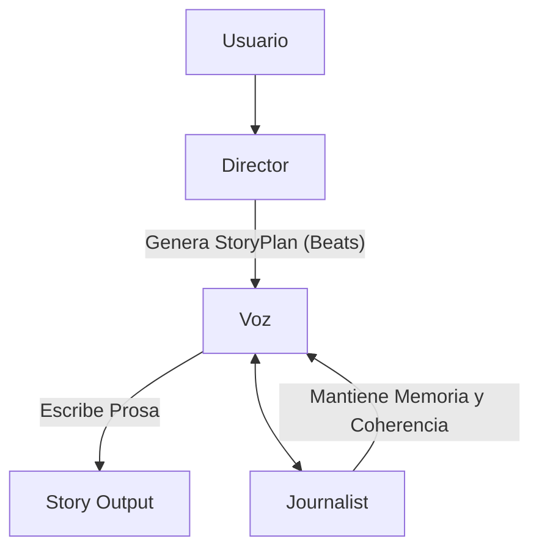
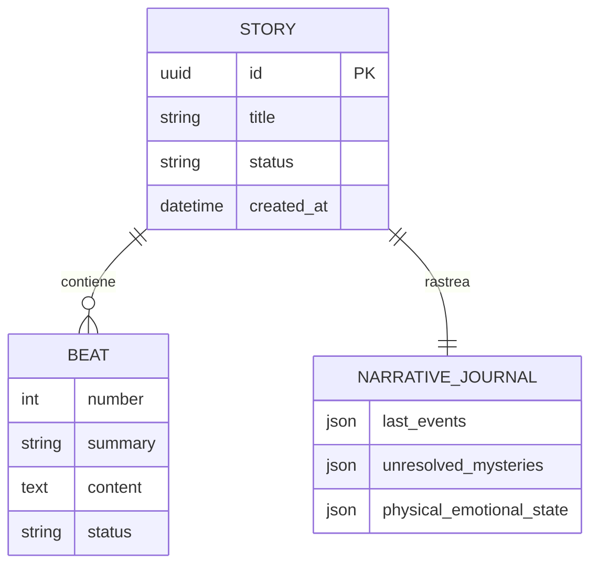

# Marco SDD - Source-Driven Development

Este documento define el estándar de desarrollo para el proyecto **NarrativeForge**. Todas las especificaciones técnicas deben seguir esta estructura para garantizar coherencia entre el diseño y el código fuente.

## 1. Arquitectura de Roles LLM

El sistema se basa en una tríada de agentes especializados que colaboran para mantener la coherencia narrativa a largo plazo.

| Rol | Responsabilidad | Clase/Componente |
|---|---|---|
| **Director** | Planificación estructural. Divide la historia en beats lógicos. | `DirectorUseCase` |
| **Voz** | Ejecución narrativa. Transforma el beat en prosa rica y atmosférica. | `VozUseCase` |
| **Journalist** | Continuidad. Rastrea eventos, estados emocionales y misterios. | `MemoryJournalist` |

## 2. Comandos de Desarrollo

| Acción | Comando |
|---|---|
| **Ejecutar CLI** | `uv run python -m src generate --title "Titulo" --real` |
| **Test Unitarios** | `uv run pytest tests/unit` |
| **Linting** | `uv run ruff check .` |
| **Type Checking** | `uv run mypy src` |
| **Init DB** | `bash scripts/bash/init_db.sh` |

## 3. Estándar de Spec SDD

Cada nueva funcionalidad debe definirse bajo estos puntos:

1.  **Objective**: Qué construimos y por qué.
2.  **Project Structure**: Ubicación de archivos y nuevas carpetas.
3.  **Tech Stack**: Versiones y herramientas (Python 3.12, SQLite, Ollama).
4.  **Data Models**: Definición de Beat, Story, NarrativeJournal.
5.  **Success Criteria**: Métricas testables (Coverage > 80%, Word count > 2500).
6.  **Boundaries**:
    *   **Always Do**: Usar tipos explícitos, logging por módulo.
    *   **Ask First**: Cambios en el esquema de la DB.
    *   **Never Do**: Hardcodear credenciales o paths.

## 4. Modelos de Referencia (Ollama)

El sistema está optimizado para los siguientes modelos locales:
- **Principal (Voz/Director):** `Tohur/natsumura-storytelling-rp-llama-3.1:8b` (storytelling) o `llama3.1:8b` (más rápido)
- **Alternativo/Ligero:** `mistral:latest`
- **Codificación:** `qwen2.5-coder:7b-instruct`

## 5. Modelo de Datos (ERD)

## 7. Principios de Ingeniería (Mentalidad de Arquitecto)

El desarrollo en **NarrativeForge** debe seguir estos principios irrenunciables:

- **SOLID & Clean Architecture:** El dominio no depende de la infraestructura. Cada clase tiene una única responsabilidad.
- **Hispanización Nativa:** Toda interacción con el usuario (logs, errores, mensajes de consola) **DEBE** ser en español. El código fuente (nombres de variables, clases) se mantiene en inglés/spanglish según convención, pero el *output* es 100% español.
- **Fail Fast & Friendly:** Validar inputs inmediatamente (Pydantic + CLI flags). Los errores deben ser claros y sugerir una solución.
- **Source-Driven Development:** El código debe ser el reflejo exacto de estas specs. Si la spec cambia, el código cambia; si el código descubre una mejora, la spec se actualiza primero.
- **Uso de Skills:** Activar y seguir los checklists de `.opencode/skills/` (performance, security, testing) en cada hito.

## 8. Hitos de Evolución (Unificado)

| Hito | Área | Descripción | Estado |
|---|---|---|---|
| **GEN-1** | Core | Implementación de Director, Voz y Journalist | ✅ |
| **GEN-2** | Infra | Persistencia en SQLite y Repositorios | ✅ |
| **CLI-1** | Interfaz | CLI funcional con comandos generate/plan/export | ✅ |
| **CLI-2** | Interfaz | **File-Driven Generation:** Refactor del core para permitir input desde archivos `.md` en `input_stories/`. | ✅ |
| **API-1** | Red | Implementación de API REST funcional | 🔄 Pendiente |
| **UI-1** | Frontend | Interfaz visual en Express/EJS | 🔄 Pendiente |

## 9. Manejo de Errores y Logs

- **Idioma:** Español.
- **Formato Logs:** `[FECHA] [NIVEL] [Módulo] Mensaje descriptivo`.
- **Excepciones:** Deben ser tipadas (`NarrativeError`) y capturadas en el punto más alto para mostrar un mensaje amigable.
