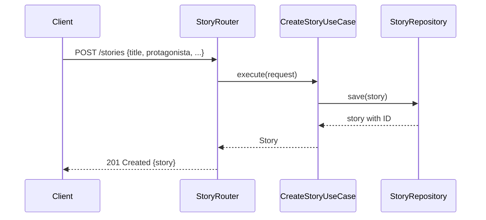
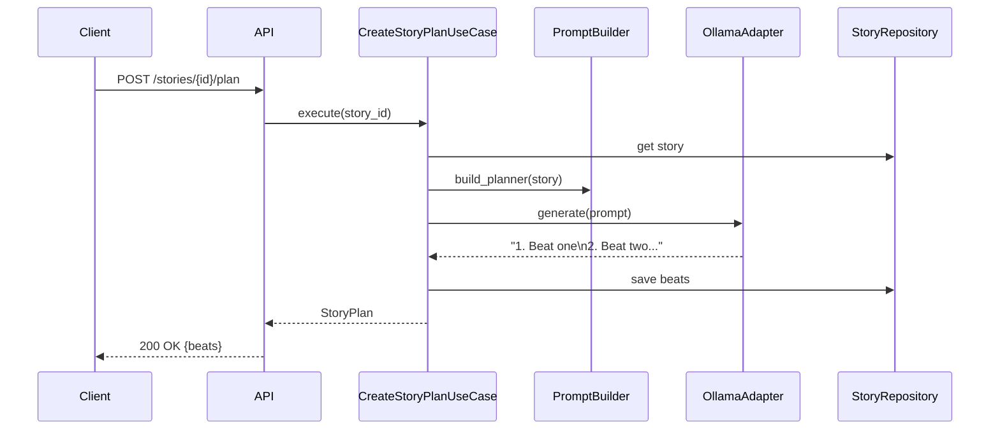
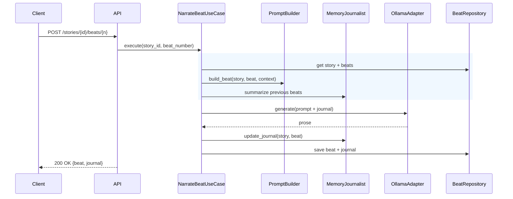
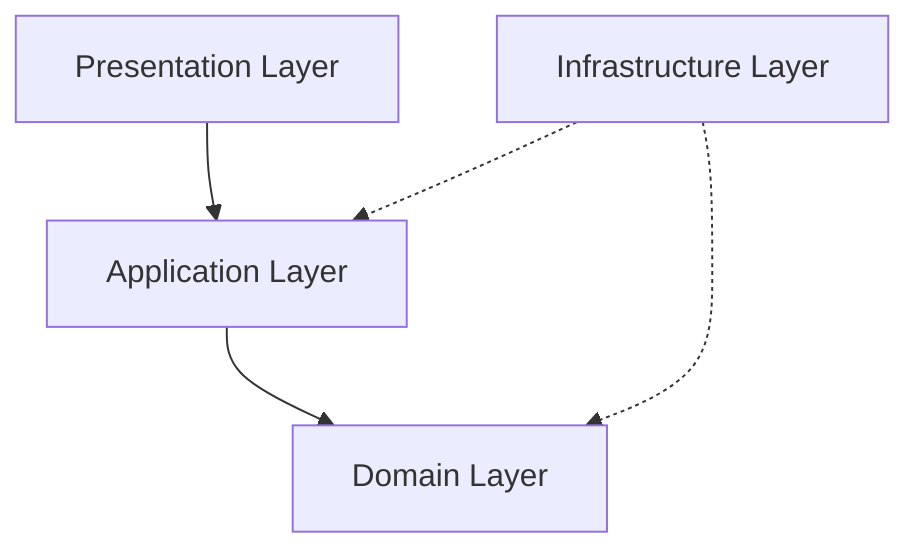
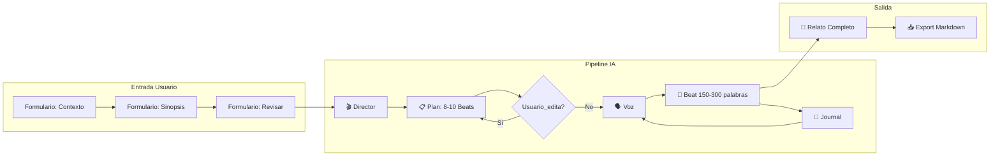
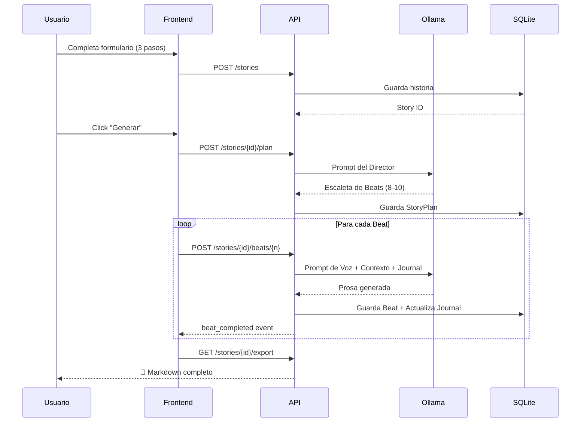

# 🏗️ NarrativeForge - Sistema de Generación Granular de Relatos de Terror (Backend)

> **Versión:** 2.0 (Unificado)  
> **Fecha:** 2026-04-15  
> **Estado:** Specification (Spec-Driven Development)  
> **Arquitectura:** Clean Architecture con expansión granular por beats

---

## 📋 SDD REFERENCE (Marco de Desarrollo)

> Estas definiciones son obligatorias para todo desarrollo. Referencia: [Marco SDD](./marco_sdd.md)

### Núcleos Requeridos

| # | Área | En Spec | Descripción |
|---|-----|--------|-------------|
| 1 | **Objective** | §1-3 | User stories + propósito |
| 2 | **Commands** | §Commands | make install/dev/test/lint |
| 3 | **Project Structure** | §Project Structure | Estructura Clean Architecture |
| 4 | **Code Style** | §Code Style | Python naming, type hints |
| 5 | **Testing Strategy** | §Testing Strategy | pytest, coverage >80% |
| 6 | **Boundaries** | §Boundaries | Always/Ask/Never |
| 7 | **Success Criteria** | §Success Criteria | Métricas verificables |
| 8 | **Open Questions** | §Open Questions | Por resolver |
| 9 | **Assumptions** | §Assumptions | Por verificar |

### Definiciones Críticas

| Definición | Valor |
|-----------|-------|
| **Arquitectura** | Clean Architecture (Domain → Application → Infrastructure → Presentation) |
| **Naming Python** | `PascalCase` clases, `snake_case` funciones |
| **Naming DB** | singular, snake_case (`story`, `beat`) |
| **Testing** | pytest + pytest-asyncio, coverage >80% |
| **Linting** | ruff, ignora E501, ARG002, B008, B904 |
| **API** | REST + WebSocket en puerto 8010 |

---

## 📌 ASSUMPTIONS (Referencia SSoT: [Marco SDD](./001_marco_sdd.md))

1. **Backend:** Python 3.12 con FastAPI (Puerto 8010)
2. **LLM:** Ollama con modelos locales (`qwen3.5:9b`, `gemma4:e4b`)
3. **DB:** SQLite con aiosqlite (`stories.db`)
4. **Frontend:** Node.js + Express separado en puerto 3010
5. **Roles:** Director (Planificación), Voz (Narración), Journalist (Coherencia)

---

## 🎯 OBJECTIVE

### Propósito del Sistema

Sistema de generación automatizada de relatos de terror en español usando IA local (Ollama) mediante arquitectura de **expansión granular por beats**. El sistema descompone la generación en unidades pequeñas (150-300 palabras) para:

- ✅ Maximizar coherencia narrativa (memoria entre beats)
- ✅ Reducir VRAM (modelos locales pequeños)
- ✅ Permitir intervención humana (editar beats antes de narrar)
- ✅ Exportar a Markdown

### User Stories

| # | Como | Quiero | Para |
|---|------|--------|------|
| 1 | Usuario | Crear una historia con contexto, protagonistas y sinopsis | Que el sistema genere un relato coherente |
| 2 | Usuario | Ver y editar la escaleta de beats antes de generar | Mantener control sobre la dirección de la historia |
| 3 | Usuario | Observar el progreso de generación en tiempo real | Saber qué beat se está generando |
| 4 | Usuario | Descargar el relato completo en Markdown | Tener el resultado para leer o compartir |
| 5 | Usuario | Reiniciar el proceso desde un beat específico | Recuperar sin perder todo el trabajo |

---

## ⚙️ TECH STACK

### Componentes del Backend

| Componente | Tecnología | Versión | Justificación |
|-----------|-------------|--------|---------------|
| **Lenguaje** | Python | >=3.12 | Async nativo, typing completo |
| **Framework** | FastAPI | >=0.115.0 | Rendimiento, REST API |
| **Server** | uvicorn[standard] | >=0.32.0 | ASGI server |
| **LLM** | Ollama | - | `qwen3.5:9b` (Director/Voz), `gemma4:e4b` (Journalist) |

### Componentes de Desarrollo

| Componente | Tecnología | Justificación |
|-----------|-------------|---------------|
| **Testing** | pytest + pytest-asyncio | Tests async |
| **Coverage** | pytest-cov | Métricas |
| **E2E Testing** | pytest-playwright | Browser tests |
| **Linter** | ruff | Velocidad |
| **Type Check** | mypy | Tipado estático |

### Modelo LLM

| Variable | Valor | Descripción |
|----------|-------|-----------|
| `llm_model` | `qwen3.5:9b` | Modelo principal |
| `llm_model_temperature` | `0.6` | Temperatura creativa |
| `state_extractor_model` | `gemma4:e4b` | Para extracción de estado |
| `ollama_host` | `http://localhost:11434` | Endpoint Ollama |

---

## ⚙️ ENVIRONMENT CONFIGURATION

### Estrategia de Variables de Entorno

```
./
├── .env                    # Variables locales (NUNCA commitear)
├── .env.example           # Template para desarrolladores
└── src/
    └── config.py          # Carga con pydantic-settings
```

### .env.example (Template de Referencia)

```bash
# ============================================
# NarrativeForge - Environment Variables
# ============================================
# Copiar a .env y completar valores

# ---- Entorno ----
ENV=dev

# ---- API Server ----
API_HOST=0.0.0.0:8010

# ---- Ollama (LLM Local) ----
OLLAMA_HOST=http://localhost:11434

# ---- Database ----
DATABASE_URL=sqlite+aiosqlite:///stories.db

# ---- Modelos LLM ----
LLM_MODEL=qwen3.5:9b
LLM_MODEL_TEMPERATURE=0.6
STATE_EXTRACTOR_MODEL=gemma4:e4b

# ---- Rutas ----
OUTPUT_DIR=output_stories
TEMPLATE_DIR=templates
PROMPTS_DIR=config/prompts
LLM_RESPONSE_FILTERS_PATH=config/llm_response_filters.yaml

# ---- Email (SMTP) - Opcional ----
SMTP_HOST=
SMTP_PORT=587
SMTP_USER=
SMTP_PASSWORD=
SMTP_FROM_EMAIL=
SMTP_FROM_NAME=NarrativeForge
NOTIFICATION_EMAIL=
```

### src/config.py (Implementación)

```python
from pathlib import Path
from typing import Any, Dict, List, Tuple

import yaml
from pydantic import BaseModel, Field
from pydantic_settings import BaseSettings, SettingsConfigDict


class ResponseFilters(BaseModel):
    """Filtros para limpiar output del LLM."""
    thinking_tags: List[str] = ["think", "thought"]
    noise_patterns: List[str] = []
    markdown_extraction_enabled: bool = Field(
        default=True, alias="markdown_extraction.enabled"
    )
    model_overrides: Dict[str, Dict[str, Any]] = {}


class Settings(BaseSettings):
    """Configuración global - carga desde .env"""
    model_config = SettingsConfigDict(env_file=".env", extra="ignore")

    # Entorno
    env: str = "dev"
    api_host: str = "0.0.0.0:8010"
    ollama_host: str = "http://localhost:11434"
    database_url: str = "sqlite+aiosqlite:///stories.db"

    # Modelos LLM
    llm_model: str = "qwen3.5:9b"
    llm_model_temperature: float = 0.6
    state_extractor_model: str = "gemma4:e4b"

    # Rutas
    llm_response_filters_path: str = "config/llm_response_filters.yaml"
    output_dir: str = "output_stories"
    template_dir: str = "templates"
    prompts_dir: str = "config/prompts"

    # Email (SMTP)
    smtp_host: str = ""
    smtp_port: int = 587
    smtp_user: str = ""
    smtp_password: str = ""
    smtp_from_email: str = ""
    smtp_from_name: str = "NarrativeForge"
    notification_email: str = ""

    @property
    def api_host_port(self) -> Tuple[str, int]:
        """Parsea host:puerto."""
        host, port_str = self.api_host.rsplit(":", 1)
        return host, int(port_str)

    @property
    def response_filters(self) -> ResponseFilters:
        """Carga filtros desde YAML."""
        config_path = Path(self.llm_response_filters_path)
        if not config_path.exists():
            return ResponseFilters()

        with open(config_path, "r", encoding="utf-8") as f:
            raw_yaml = yaml.safe_load(f)
            san_data = raw_yaml.get("llm_response_filters", {})
            return ResponseFilters(
                thinking_tags=san_data.get("thinking_tags", []),
                noise_patterns=san_data.get("noise_patterns", []),
                model_overrides=san_data.get("model_overrides", {}),
            )


settings = Settings()
```

### Uso en Código

```python
from src.config import settings


# ✅ Acceso correcto
async def generate_story():
    model = settings.llm_model
    temp = settings.llm_model_temperature
    host = settings.ollama_host

    # ✅ Con默认值 si no está en .env
    output_dir = settings.output_dir

    # ✅ Con @property
    api_host, api_port = settings.api_host_port
```

### Reglas

| Regla | Descripción |
|-------|------------|
| **.env** | NUNCA hacer git add .env |
| **.env.example** | SIEMPRE committing con valores por defecto |
| **Defaults** | En config.py, nunca en código |
| **Alias** | Usar `alias=` en Field para renaming |
| **Extra ignore** | `extra="ignore"` para vars desconocidas |
| **Documentación** | Documentar en .env.example cada variable |

---

## 📂 PROJECT STRUCTURE

```
narrative-forge/
├── src/
│   ├── __init__.py
│   ├── main.py                   # FastAPI app (entrypoint)
│   ├── config.py                # Settings (pydantic-settings)
│   │
│   ├── domain/                 # Entidades y reglas de negocio
│   │   ├── __init__.py
│   │   ├── models.py           # Story, Beat, StoryPlan, NarrativeJournal
│   │   ├── interfaces.py       # Protocolos/contratos
│   │   └── exceptions.py      # Excepciones del dominio
│   │
│   ├── application/            # Casos de uso
│   │   ├── __init__.py
│   │   ├── exceptions.py      # Excepciones de aplicación
│   │   ├── dto/
│   │   │   ├── __init__.py
│   │   │   ├── story_dto.py   # DTOs para transporte
│   │   │   └── beat_dto.py
│   │   ├── use_cases/
│   │   │   ├── __init__.py
│   │   │   ├── create_story.py         # Crear historia
│   │   │   ├── create_story_plan.py    # Generar escaleta (Director)
│   │   │   ├── narrate_beat.py     # Generar prosa (Voz)
│   │   │   ├── narrate_batch.py   # Generar todos beats
│   │   │   └── export_story.py    # Exportar a MD
│   │   └── services/
│   │       ├── __init__.py
│   │       ├── prompt_builder.py    # Construir prompts
│   │       └── memory_journalist.py  # Actualizar journal
│   │
│   ├── infrastructure/          # Implementaciones externas
│   │   ├── __init__.py
│   │   ├── exceptions.py       # Excepciones de infra
│   │   ├── adapters/
│   │   │   ├── __init__.py
│   │   │   ├── ollama_adapter.py  # LLM con Ollama
│   │   │   └── mock_llm_adapter.py # Para tests
│   │   ├── database/
│   │   │   ├── __init__.py
│   │   │   ├── connection.py   # Conexión DB
│   │   │   └── repositories/
│   │   │       ├── __init__.py
│   │   │       ├── story_repository.py
│   │   │       └── beat_repository.py
│   │   ├── normalizers/
│   │   │   ├── __init__.py
│   │   │   └── response_normalizer.py
│   │   └── renderers/
│   │       ├── __init__.py
│   │       └── markdown_renderer.py
│   │
│   └── presentation/          # API y routers
│       ├── __init__.py
│       ├── dependencies.py  # FastAPI dependencies
│       ├── exceptions.py  # API exceptions
│       ├── routers/
│       │   ├── __init__.py
│       │   ├── story_router.py  # /stories
│       │   ├── beat_router.py  # /stories/{id}/beats
│       │   └── export_router.py # /stories/{id}/export
│       └── schemas/
│           ├── __init__.py
│           ├── request.py    # Request models
│           └── response.py  # Response models
│
├── tests/
│   ├── __init__.py
│   ├── fixtures/
│   │   ├── __init__.py
│   │   ├── story_fixtures.py
│   │   └── beat_fixtures.py
│   ├── unit/
│   │   ├── __init__.py
│   │   ├── domain/
│   │   │   ├── __init__.py
│   │   │   └── test_models.py
│   │   ├── application/
│   │   │   ├── __init__.py
│   │   │   ├── use_cases/
│   │   │   │   ├── __init__.py
│   │   │   │   └── test_narrate_beat.py
│   │   │   └── services/
│   │   │       ├── __init__.py
│   │   │       └── test_memory_journalist.py
│   │   └── infrastructure/
│   │       ├── __init__.py
│   │       └── adapters/
│   │           └── __init__.py
│   └── integration/
│       ├── __init__.py
│       └── test_endpoints.py
│
├── config/
│   ├─�� prompts/              # Plantillas de prompts
│   │   ├── system.md
│   │   ├── planner.md
│   │   └── beat.md
│   └── settings.yaml         # Config general
│
├── scripts/
│   └── init_db.py          # Inicializar DB
│
├── .env                    # Locales (NO commitear)
├── .env.example           # Template
├── pyproject.toml
├── Makefile
└── README.md
```

---

## 🏗️ CLASS DIAGRAM

### Architecture Overview (Clean Architecture)

```mermaid
classDiagram
    %% ============================================
    %% PRESENTATION LAYER
    %% ============================================
    class FastAPI {
        +app: FastAPI
    }
    
    class StoryRouter {
        +router: APIRouter
    }
    
    class BeatRouter {
        +router: APIRouter
    }
    
    class ExportRouter {
        +router: APIRouter
    }
    
    class StoryRequest {
        +title: str
        +protagonista: str
        +relator: str
        +escenarios: str
        +sinopsis: str
        +atmosfera: str
        +reglas: List[str]
    }
    
    class StoryResponse {
        +id: UUID
        +title: str
        +status: StoryStatus
        +beats: List[Beat]
        +journal: NarrativeJournal
    }
    
    class BeatResponse {
        +number: int
        +summary: str
        +content: str
        +status: str
    }
    
    %% Dependencies
    FastAPI --> StoryRouter : includes
    FastAPI --> BeatRouter : includes
    FastAPI --> ExportRouter : includes
    StoryRouter ..> StoryRequest : validates
    StoryRouter ..> StoryResponse : returns
    BeatRouter ..> BeatResponse : returns
    
    %% ============================================
    %% APPLICATION LAYER (Use Cases)
    %% ============================================
    
    class CreateStoryUseCase {
        +execute(input: StoryRequest): Story
    }
    
    class CreateStoryPlanUseCase {
        +execute(story_id): StoryPlan
    }
    
    class NarrateBeatUseCase {
        +execute(story, beat): tuple[Beat, Journal]
    }
    
    class NarrateBatchUseCase {
        +execute(story, beats): List[Beat]
    }
    
    class ExportStoryUseCase {
        +execute(story_id): str (Markdown)
    }
    
    class PromptBuilder {
        +build_system(story): str
        +build_planner(story): str
        +build_beat(story, beat, context?): str
    }
    
    class MemoryJournalist {
        +update_journal(story, beat, prev): NarrativeJournal
        +summarize_beats(beats): str
    }
    
    %% Use Cases -> Services
    CreateStoryPlanUseCase ..> PromptBuilder : uses
    NarrateBeatUseCase ..> PromptBuilder : uses
    NarrateBeatUseCase ..> MemoryJournalist : uses
    NarrateBatchUseCase ..> NarrateBeatUseCase : delegates
    
    %% ============================================
    %% DOMAIN LAYER (Entities)
    %% ============================================
    
    class Story {
        +id: UUID4
        +title: str
        +protagonista: str
        +relator: str
        +escenarios: str
        +sinopsis: str
        +atmosfera: str
        +reglas: List[str]
        +status: StoryStatus
        +created_at: datetime
    }
    
    class Beat {
        +number: int
        +summary: str
        +content: str
        +status: str
        +technical_context: List[int]?
        +created_at: datetime
    }
    
    class StoryPlan {
        +story_id: UUID4
        +title: str
        +beats: List[Beat]
        +created_at: datetime
    }
    
    class NarrativeJournal {
        +last_events: str
        +unresolved_mysteries: str
        +physical_emotional_state: str
    }
    
    class StoryStatus {
        <<enumeration>>
        +PENDING
        +PROCESSING
        +COMPLETED
        +FAILED
    }
    
    class StoryNotFoundError {
        +story_id: str
    }
    
    class BeatNotFoundError {
        +story_id: str
        +beat_number: int
    }
    
    class PlanGenerationError {
        +reason: str
    }
    
    class InvalidInputError {
        +field: str
        +message: str
    }
    
    %% Relations
    Story *-- StoryStatus : has
    Story *-- "0..*" Beat : contains
    Story *-- NarrativeJournal : has
    StoryPlan *-- "1..*" Beat : has
    
    Use Cases --> Story : manages
    Use Cases --> Beat : generates
    Use Cases --> StoryPlan : produces
    
    %% ============================================
    %% INFRASTRUCTURE LAYER
    %% ============================================
    
    class LLMProvider {
        <<interface>>
        +generate(prompt, system?, model?, temp?): LLMResponse
    }
    
    class OllamaAdapter {
        -host: str
        -timeout: float
        +generate(): LLMResponse
    }
    
    class MockLLMAdapter {
        +generate(): LLMResponse
    }
    
    class StoryRepository {
        <<interface>>
        +save(story): Story
        +get_by_id(id): Story
        +update(story): Story
        +delete(id): None
        +list_all(): List[Story]
    }
    
    class BeatRepository {
        <<interface>>
        +save(beat): Beat
        +get_by_story(story_id): List[Beat]
        +update(beat): Beat
        +save_batch(beats): List[Beat]
    }
    
    class SQLRepository {
        -connection: aiosqlite.Connection
        +save(story): Story
        +get_by_id(id): Story
    }
    
    class ResponseNormalizer {
        +normalize(text): str
    }
    
    class MarkdownRenderer {
        +render(story): str
    }
    
    class LLMResponse {
        +text: str
        +context: List[int]?
        +word_count: int
    }
    
    %% Adapters implement interfaces
    OllamaAdapter ..|> LLMProvider
    MockLLMAdapter ..|> LLMProvider
    SQLRepository ..|> StoryRepository
    SQLRepository ..|> BeatRepository
    
    %% Use Cases -> Adapters
    NarrateBeatUseCase --> LLMProvider : calls
    CreateStoryPlanUseCase --> LLMProvider : calls
    CreateStoryUseCase --> StoryRepository : uses
    NarrateBeatUseCase --> StoryRepository : saves
    NarrateBeatUseCase --> BeatRepository : saves
    ExportStoryUseCase --> MarkdownRenderer : uses
```



### Sequence Diagrams

#### Create Story Flow



#### Generate Plan Flow (Director)



#### Narrate Beat Flow (Voz + Journal)



### Responsibilities by Layer

| Capa | Componente | Responsabilidad |
|------|-----------|----------------|
| **Presentation** | `StoryRouter` | Validar request, retornar response, HTTP |
| **Presentation** | `BeatRouter` | Delegar a use case, maneja errores |
| **Application** | `CreateStoryUseCase` | Crear entidad Story, persistir |
| **Application** | `CreateStoryPlanUseCase` | Generar escaleta con LLM |
| **Application** | `NarrateBeatUseCase` | Generar prosa, actualizar journal |
| **Application** | `PromptBuilder` | Construir prompts (system, planner, beat) |
| **Application** | `MemoryJournalist` | Mantener coherencia narrativa |
| **Domain** | `Story` | Entidad con reglas de negocio |
| **Domain** | `Beat` | Unidad de narración |
| **Domain** | `NarrativeJournal` | Memoria narrativa |
| **Infrastructure** | `OllamaAdapter` | Comunicar con Ollama |
| **Infrastructure** | `SQLRepository` | Persistir en SQLite |
| **Infrastructure** | `ResponseNormalizer` | Limpiar output LLM |
| **Infrastructure** | `MarkdownRenderer` | Renderizar a Markdown |

### Dependency Rule



### Ports and Adapters Pattern

```python
# PUERTO (Domain)
# src/domain/interfaces.py

from abc import ABC, abstractmethod
from typing import Protocol


class LLMProvider(Protocol):
    """Puerto para providers de LLM."""
    
    async def generate(
        self,
        prompt: str,
        *,
        system_prompt: str | None = None,
        model: str = "qwen3.5:9b",
        temperature: float = 0.6,
    ) -> "LLMResponse":
        """Genera texto con el LLM."""
        ...


class StoryRepository(Protocol):
    """Puerto para repositorio de Stories."""
    
    async def save(self, story: Story) -> Story:
        """Guarda una historia."""
        ...
    
    async def get_by_id(self, story_id: UUID4) -> Story | None:
        """Obtiene por ID."""
        ...


# ADAPTER (Infrastructure)
# src/infrastructure/adapters/ollama_adapter.py

class OllamaAdapter:
    """Adapter para Ollama."""
    
    def __init__(self, host: str, timeout: float = 120.0):
        self.host = host
        self.timeout = timeout
    
    async def generate(
        self,
        prompt: str,
        *,
        system_prompt: str | None = None,
        model: str = "qwen3.5:9b",
        temperature: float = 0.6,
    ) -> LLMResponse:
        # Implementation
        ...


# INYECCIÓN (Application)
# src/application/use_cases/narrate_beat.py

class NarrateBeatUseCase:
    def __init__(
        self,
        llm: LLMProvider,           # Inyectar порт
        story_repo: StoryRepository,
        beat_repo: BeatRepository,
    ):
        self.llm = llm
        self.story_repo = story_repo
        self.beat_repo = beat_repo
```

### Factory Pattern

```python
# src/main.py

from src.infrastructure.adapters import OllamaAdapter
from src.infrastructure.database.repositories import SQLStoryRepository, SQLBeatRepository
from src.application.use_cases import (
    CreateStoryUseCase,
    CreateStoryPlanUseCase,
    NarrateBeatUseCase,
)


def create_application() -> dict:
    """Factory que crea los use cases con sus dependencias."""
    
    # Adaptadores
    llm = OllamaAdapter(host=settings.ollama_host)
    story_repo = SQLStoryRepository()
    beat_repo = SQLBeatRepository()
    
    # Use Cases
    return {
        "create_story": CreateStoryUseCase(story_repo),
        "create_plan": CreateStoryPlanUseCase(llm),
        "narrate_beat": NarrateBeatUseCase(llm, story_repo, beat_repo),
        "export": ExportStoryUseCase(story_repo),
    }


app = FastAPI()

@app.post("/stories/{story_id}/beats/{beat_number}")
async def generate_beat(story_id: UUID4, beat_number: int):
    cases = create_application()
    return await cases["narrate_beat"].execute(story_id, beat_number)
```

### Singleton Pattern

```python
# src/config.py

from pydantic_settings import BaseSettings, SettingsConfigDict


class Settings(BaseSettings):
    """Configuración global - singleton implícito."""
    
    model_config = SettingsConfigDict(env_file=".env", extra="ignore")
    
    # Variables...
    api_host: str = "0.0.0.0:8010"
    ollama_host: str = "http://localhost:11434"
    # ...

# Instancia única global
settings = Settings()  # → Singleton: una sola instancia en toda la app
```

### Dependency Injection (FastAPI)

```python
# Inyección con FastAPI Depends

def get_llm_adapter():
    """Factory para obtener adapter. Llama cada request."""
    return OllamaAdapter(host=settings.ollama_host)


def get_story_repository():
    """Factory para obtener repositorio. Llama cada request."""
    return SQLStoryRepository()


@router.post("/stories")
async def create_story(
    request: StoryCreateRequest,
    repo: SQLStoryRepository = Depends(get_story_repository),
):
    """Inyección por dependencia."""
    use_case = CreateStoryUseCase(repo)
    return await use_case.execute(request)
```

### Service Locator Pattern

```python
# src/presentation/dependencies.py

from functools import lru_cache


class ServiceLocator:
    """Service locator para use cases."""
    
    @lru_cache
    def get_llm(self) -> OllamaAdapter:
        return OllamaAdapter()
    
    @lru_cache
    def get_story_repo(self) -> SQLStoryRepository:
        return SQLStoryRepository()
    
    @lru_cache
    def get_beat_repo(self) -> SQLBeatRepository:
        return SQLBeatRepository()


# Uso
locator = ServiceLocator()
llm = locator.get_llm()  # Cacheado, misma instancia
```

### Resumen de Patrones por Capa

| Capa | Patrón | Cuándo Usar |
|------|--------|--------------|
| **Config** | Singleton | `settings` - una sola configuración |
| **Domain** | Ports/Adapters | Interfaces `LLMProvider`, `StoryRepository` |
| **Application** | Factory | `CreateStoryUseCase` con dependencias |
| **Infrastructure** | Factory | Adaptadores y repositorios |
| **Presentation** | DI (Depends) | Routers de FastAPI |
└── README.md               # README
```

---

## 💻 COMMANDS

### Comandos de Desarrollo

```bash
# Instalación de dependencias
make install          # uv sync

# Desarrollo - levanta API con hot-reload
make dev            # uvicorn --reload 0.0.0.0:8010
# Variable: API_HOST=0.0.0.0:8010

# Testing - todos los tests con coverage
make test           # pytest -v --cov=src

# Linting - ruff check + format
make lint          # ruff check . && ruff format .

# Inicializar DB
make db            # scripts/init_db.sh

# Limpiar cache
make clean         # remove __pycache__, .pytest_cache, .ruff_cache
```

### Scripts Auxiliares

```bash
# Lista todas las historias
scripts/list.sh

# Ver estado de una historia
scripts/status.sh <story_id>

# Generar historia completa (plan + beats)
scripts/generate.sh <story_id>

# Exportar a Markdown
scripts/export.sh <story_id> [output.md]
```

### Make Targets Extendidos

```bash
make list              # = scripts/list.sh
make status ARG=<id> # = scripts/status.sh <id>
make export ARG=<id>  # = scripts/export.sh <id>
make generate ARG=<id> # = scripts/generate.sh <id>
make db               # = scripts/init_db.sh
make init             # = make db
```

# Limpieza - remove cache
make clean         # rm -rf __pycache__ .pytest_cache .ruff_cache

# Reset DB
rm stories.db       # Eliminar para reset completo
```

### Comandos de Testing Específico

```bash
#Test unitario específico
pytest tests/unit/test_x.py -v

# Tests con coverage
pytest tests -v --cov=src --cov-report=html

# Tests en watch mode
pytest tests -v --watch
```

---

## 🧠 ARQUITECTURA CONCEPTUAL

### Flujo Principal



### Roles del LLM

| Rol | Función | Input | Output | Temperatura |
|-----|--------|-------|-------|-----------|
| **Director** | Planificar estructura | Contexto + Sinopsis | 8-10 Beats (escaleta) | 0.4 |
| **Voz** | Generar prosa | Beat + Contexto anterior + Journal | 150-300 palabras | 0.6 |
| **Journalist** | Mantener coherencia | Beat generado | NarrativeJournal | 0.3 |

### Diagrama de Secuencia



---

## 📊 MODELO DE DATOS

### Entidades Principales

#### Beat

```python
class Beat(BaseModel):
    """Unidad mínima de narración."""
    number: int                                        # 1, 2, 3...
    summary: str                                       # Lo que el Director planeó
    content: str = ""                                  # Prosa generada (150-300 palabras)
    status: str = "pending"                           # pending | completed | failed
    technical_context: Optional[List[int]] = None       # Memoria interna Ollama
    created_at: datetime = Field(default_factory=datetime.now)
```

#### StoryPlan

```python
class StoryPlan(BaseModel):
    """Plan maestro de la historia."""
    story_id: UUID4
    title: str
    beats: List[Beat] = []
    created_at: datetime = Field(default_factory=datetime.now)
```

#### NarrativeJournal

```python
class NarrativeJournal(BaseModel):
    """Memoria en lenguaje natural para coherencia."""
    last_events: str = ""           # Resumen de lo ocurrido (1-2 oraciones)
    unresolved_mysteries: str = ""  # Pistas abiertas o preguntas sin responder
    physical_emotional_state: str = ""  # Estado físico/emocional del protagonista
```

#### Story

```python
class StoryStatus(str, Enum):
    PENDING = "pending"
    PROCESSING = "processing"
    COMPLETED = "completed"
    FAILED = "failed"


class Story(BaseModel):
    """Historia base."""
    id: UUID4 = Field(default_factory=uuid.uuid4)
    title: str
    protagonista: str                       # Qui��n narra
    relator: str                          # Tercera persona, primera persona, etc.
    escenarios: str                       # Dónde ocurre
    sinopsis: str                         # De qué va la historia
    atmosfera: str                       # Tono del relato
    reglas: List[str] = []               # Reglas narrativas
    
    beats: List[Beat] = []
    journal: NarrativeJournal = Field(default_factory=NarrativeJournal)
    
    status: StoryStatus = StoryStatus.PENDING
    created_at: datetime = Field(default_factory=datetime.now)
```

### Tablas de Base de Datos

```sql
-- Historias
CREATE TABLE stories (
    id TEXT PRIMARY KEY,
    title TEXT,
    protagonista TEXT,
    relator TEXT,
    escenarios TEXT,
    sinopsis TEXT,
    atmosfera TEXT,
    status TEXT,
    created_at TIMESTAMP
);

-- Reglas narrativas
CREATE TABLE reglas (
    id INTEGER PRIMARY KEY,
    story_id TEXT,
    content TEXT
);

-- Beats
CREATE TABLE beats (
    id INTEGER PRIMARY KEY,
    story_id TEXT,
    number INTEGER,
    summary TEXT,
    content TEXT,
    status TEXT DEFAULT 'pending',
    technical_context TEXT,
    created_at TIMESTAMP
);

-- Plan de la historia
CREATE TABLE story_plans (
    id INTEGER PRIMARY KEY,
    story_id TEXT UNIQUE,
    title TEXT,
    beats_json TEXT,
    created_at TIMESTAMP
);

-- Memoria narrativa
CREATE TABLE narrative_journal (
    id INTEGER PRIMARY KEY,
    story_id TEXT UNIQUE,
    last_events TEXT,
    unresolved_mysteries TEXT,
    physical_emotional_state TEXT
);
```

---

## 📡 API ENDPOINTS

### REST API

| Método | Ruta | Descripción | Request Body |
|--------|------|-------------|-------------|
| `GET` | `/api/v1/stories` | Listar historias | - |
| `POST` | `/api/v1/stories` | Crear historia | Story |
| `GET` | `/api/v1/stories/{id}` | Ver historia | - |
| `PUT` | `/api/v1/stories/{id}` | Actualizar historia | Story |
| `DELETE` | `/api/v1/stories/{id}` | Eliminar historia | - |
| `POST` | `/api/v1/stories/{id}/plan` | Generar escaleta | `{}` |
| `GET` | `/api/v1/stories/{id}/beats` | Listar beats | - |
| `PUT` | `/api/v1/stories/{id}/beats` | Actualizar beats | Beats[] |
| `POST` | `/api/v1/stories/{id}/beats/{n}` | Generar beat específico | `{}` |
| `POST` | `/api/v1/stories/{id}/generate` | Generar todos los beats | `{}` |
| `GET` | `/api/v1/stories/{id}/export` | Exportar markdown | - |

### WebSocket Events

| Evento | Dirección | Datos |
|--------|----------|-------|
| `plan_generated` | Server→Client | `{beats: [], story_id, title}` |
| `beat_started` | Server→Client | `{beat_number, summary, total}` |
| `beat_completed` | Server→Client | `{beat_number, content, word_count}` |
| `job_completed` | Server→Client | `{story_id, beats_count, total_words}` |
| `job_failed` | Server→Client | `{error, beat_number, message}` |

```javascript
// Endpoint WebSocket
WS /api/v1/ws/jobs/{story_id}
```

### Modelo de Respuesta

```json
// GET /api/v1/stories/{id}
{
  "id": "uuid",
  "title": "El Pueblo Olvidado",
  "status": "completed",
  "beats": [
    {
      "number": 1,
      "summary": "Los hermanos llegan al pueblo",
      "content": "El jeep se detuvo en el cruce...",
      "status": "completed"
    }
  ],
  "journal": {
    "last_events": "Han llegado al pueblo abandonado...",
    "unresolved_mysteries": "Why was the town abandoned?",
    "physical_emotional_state": "Carlos feels anxious, Maria is skeptical"
  }
}
```

---

## 👤 CODE STYLE

### Python Naming Conventions

| Tipo | Naming | Ejemplo |
|------|--------|--------|
| **Clases** | `PascalCase` | `class NarrateBeatUseCase:` |
| **Funciones** | `snake_case` | `def execute(self, ...):` |
| **Variables** | `snake_case` | `story = Story(...)` |
| **Constantes** | `UPPER_SNAKE` | `MAX_BEATS = 10` |
| **Módulos** | `snake_case` | `ollama_adapter.py` |
| **Paquetes** | `snake_case` | `domain/`, `application/` |
| **Type Aliases** | `PascalCase` | `StoryId = UUID4` |
| **Enums** | `PascalCase` | `class StoryStatus(str, Enum):` |
| **Properties** | `snake_case` | `@property def api_host_port(self):` |
| **Private** | `_underscore_prefix` | `def _internal_method(self):` |
| **Dunder** | `__dunder__` | `def __init__(self):` |

### Type Hints

```python
# ✅ Correcto
async def execute(
    self,
    story: Story,
    beat: Beat,
    previous_beats: Optional[List[Beat]] = None,
    journal: Optional[NarrativeJournal] = None,
) -> tuple[Beat, NarrativeJournal]:
    """Genera prosa para un beat."""

# ✅ Correcto con alias de tipo
type StoryInput = dict[str, Any]

# ✅ Correcto - usar | para Union (Python 3.10+)
def process(value: str | None) -> str:
    return value or ""
```

### Database Naming Conventions

| Tipo | Naming | Ejemplo |
|------|--------|--------|
| **Tablas** | `snake_case` singular | `story`, `beat`, `rule` |
| **Columnas** | `snake_case` | `created_at`, `story_id` |
| **Índices** | `idx_<tabla>_<columna>` | `idx_stories_id` |
| **FK Constraints** | `fk_<tabla>_<ref>` | `fk_beats_story_id` |
| **PK** | `id` (auto-increment) | `INTEGER PRIMARY KEY` |
| **Unique** | `uq_<tabla>_<col>` | `uq_stories_title` |

### SQL Schema

```sql
-- Tablas en singular, snake_case
CREATE TABLE story (
    id TEXT PRIMARY KEY,
    title TEXT NOT NULL,
    protagonista TEXT,
    relator TEXT,
    escenarios TEXT,
    sinopsis TEXT,
    atmosfera TEXT,
    status TEXT DEFAULT 'pending',
    created_at TIMESTAMP DEFAULT CURRENT_TIMESTAMP
);

CREATE TABLE beat (
    id INTEGER PRIMARY KEY,
    story_id TEXT NOT NULL,
    number INTEGER NOT NULL,
    summary TEXT NOT NULL,
    content TEXT DEFAULT '',
    status TEXT DEFAULT 'pending',
    technical_context TEXT,
    created_at TIMESTAMP DEFAULT CURRENT_TIMESTAMP,
    FOREIGN KEY (story_id) REFERENCES story(id)
);

-- Índices descriptivos
CREATE INDEX idx_beats_story_id ON beat(story_id);
CREATE INDEX idx_beats_number ON beat(story_id, number);
CREATE UNIQUE INDEX uq_beats_story_number ON beat(story_id, number);
```

### JSON API Response

```json
{
  "id": "550e8400-e29b-41d4-a716-446655440000",
  "title": "El Pueblo Olvidado",
  "beats": [
    {
      "number": 1,
      "summary": "Los hermanos llegan al pueblo",
      "content": "El jeep se detuvo...",
      "status": "completed"
    }
  ]
}
```

### Linting Rules

- **Linter:** `ruff`
- **Formato:** `ruff format`
- **Ignorados:** E501, ARG002, B008, B904
- **Type hints:** Obligatorios en funciones públicas
- **Docstrings:** Simple, una línea para clases privadas

### Ejemplo de Estilo

```python
class NarrateBeatUseCase:
    """Caso de uso que genera prosa para un beat específico."""
    
    def __init__(
        self,
        llm: LLMProvider,
        normalizer: LLMResponseNormalizer,
        memory_journalist: Optional[MemoryJournalist] = None,
    ) -> None:
        self.llm = llm
        self.normalizer = normalizer
        self.memory_journalist = memory_journalist or MemoryJournalist(llm, normalizer)
        self.prompt_builder = PromptBuilder()

    async def execute(
        self,
        story: Story,
        beat: Beat,
        previous_beats: Optional[List[Beat]] = None,
        journal: Optional[NarrativeJournal] = None,
    ) -> tuple[Beat, NarrativeJournal]:
        """Genera prosa para un beat."""
        # Implementation...
        pass
```

### Contratos LLM

#### Narrator Input

```json
{
  "beat": {
    "number": 1,
    "summary": "Los hermanos llegan al pueblo"
  },
  "journal": {
    "last_events": "",
    "unresolved_mysteries": "",
    "physical_emotional_state": ""
  },
  "story": {
    "protagonista": "Carlos y Maria",
    "relator": "primera_persona",
    "escenarios": "pueblo abandonado",
    "atmosfera": "terror_psicologico"
  }
}
```

#### Narrator Output

```json
{
  "content": "El jeep se detuvo en el cruce de caminos..."
}
```

---

## 🧪 TESTING STRATEGY

### Framework

- **pytest** con `pytest-asyncio`
- **pytest-cov** para coverage
- **pytest-playwright** para E2E

### Estructura de Tests

```
tests/
├── unit/
│   ├── application/
│   │   ├── test_planner.py        # Tests Director
│   │   └── test_narrate_beat.py  # Tests Voz
│   └── domain/
│       └── test_models.py        # Tests modelos
└── integration/
    └── api/
        └── test_api.py          # Tests API
```

### Cobertura Esperada

- Mínimo **80%** en código de aplicación
- Tests unitarios para cada Use Case
- Tests de integración para Repository
- Tests E2E para flujos críticos

### Tests Críticos

| Test | Descripción |
|------|-------------|
| `test_journal_bounded` | El journal no excede el límite de tokens |
| `test_multi_beat_coherence` | Coherencia narrativa entre beats |
| `test_context_overflow_prevention` | No hay overflow de contexto |
| `test_beat_generation` | Generación de prosa correcta |

---

## 🎯 MILESTONES (Referencia: [Marco SDD](./001_marco_sdd.md))

Los hitos de implementación se gestionan de forma centralizada en el Marco SDD para evitar duplicidad. Los roles del sistema son:

1. **Director** (`CreateStoryPlanUseCase`): Genera la escaleta de beats.
2. **Voz** (`NarrateBeatUseCase`): Transforma beats en prosa.
3. **Journalist** (`MemoryJournalist`): Mantiene la coherencia narrativa.

---

## 🚫 BOUNDARIES

### Always Do (always_cumplir)

- [ ] Correr `make lint` antes de commit
- [ ] Correr `make test` antes de commit
- [ ] Validar inputs con Pydantic
- [ ] Usar type hints en funciones públicas
- [ ] Nombre de archivo en snake_case
- [ ] Clases en PascalCase

### Ask First (consultar_antes)

- [ ] Cambiar schema de base de datos
- [ ] Añadir nuevas dependencias
- [ ] Modificar configuración de Ollama
- [ ] Cambiar estructura de directorios
- [ ] Modificar endpoints API

### Never Do (nunca_hacer)

- [ ] Committear secrets o API keys
- [ ] Editar directorios de vendor
- [ ] Eliminar tests que fallan sin aprobación
- [ ] Hacer cambios irreversibles en DB
- [ ] Ignorar warnings de lint

---

## ⚠️ CRITICAL CONSTRAINTS

### Control de Contexto

| Límite | Valor | Justificación |
|--------|-------|---------------|
| `max_tokens_input` | 4096 | Context window de modelos pequeños |
| `max_journal_size` | 500 tokens | Evitar overflow |
| `max_beats_context` | 3 | Últimos 3 beats solo |

### Estrategia de Memoria

- **NO** poner toda la narrativa en contexto
- Memoria episódica limitada (últimos 2-3 beats)
- El journal es obligatorio en cada generación
- El estado se "recarga" cada N beats

### Consistencia

- Estado obligatorio en cada generación de beat
- Prompts deterministas (formato reutilizable)
- Journal con estructura fixed

---

## 📏 SUCCESS CRITERIA

### Métricas Objetivo

| Métrica | Objetivo | Justificación |
|---------|---------|--------------|
| **Longitud del relato** | 2500+ palabras | Relato corto completo |
| **VRAM** | < 4GB | Modelos locales pequeños |
| **Tiempo por beat** | < 30 segundos | vs 3-5 min por acto |
| **Coherencia** | Narrativa fluida | Journal funciona |
| **Intervención humana** | Editar antes de narrar | Control del usuario |
| **Export** | Markdown funcional | Output usable |
| **Tests coverage** | > 80% | Código mantenido |

### Condiciones de Éxito

- [ ] Sistema genera relatos de 2500+ palabras
- [ ] VRAM < 4GB para todo el pipeline
- [ ] Tiempo promedio por beat < 30 segundos
- [ ] Coherencia narrativa entre beats (journal)
- [ ] UI permite editar beats antes de narrar
- [ ] Exportación a Markdown funcional
- [ ] Tests passing con coverage > 80%

---

## 🛡️ ANTI-FAILURE RULES

### Journal

- **MUST** ser bounded (límite hard)
- **MUST** ser estructurado (JSON)

### Prompts

- Formato determinista
- Reutilizables entre modelos

### Estado

- Recompresión cada N beats

---

## 💥 ERROR HANDLING STRATEGY

### Philosophy

| Principio | Descripción |
|----------|-------------|
| **Fail Fast** | Detectar errores lo antes posible con validación |
| **Fail Gracefully** | Nunca exponer errores internos al cliente |
| **Recoverable** | Siempre que sea posible, permitir retry o fallback |
| **Logged** | Errores significativos deben loguearse con contexto |
| **Tested** | Cada excepción debe tener test de manejo |

### Jerarquía de Excepciones

```
Exception (Python base)
    │
    ├── NarrativeError (Domain base)
    │   ├── StoryNotFoundError
    │   ├── BeatNotFoundError
    │   ├── InvalidStoryStateError
    │   └── PlanGenerationError
    │
    ├── LLMError (Infrastructure base)
    │   ├── OllamaConnectionError
    │   ├── LLMResponseError
    │   └── LLMTimeoutError
    │
    ├── ValidationError (Application base)
    │   ├── InvalidInputError
    │   └── MissingFieldError
    │
    └── APIError (Presentation base)
        ├── HTTPError (status_code)
        └── WebSocketError
```

### Definexión de Excepciones

```python
# src/domain/exceptions.py

class NarrativeError(Exception):
    """Base exception para el dominio narrativo."""

    def __init__(self, message: str, details: dict | None = None):
        super().__init__(message)
        self.message = message
        self.details = details or {}


class StoryNotFoundError(NarrativeError):
    """Historia no encontrada."""

    def __init__(self, story_id: str):
        super().__init__(
            f"Historia no encontrada: {story_id}",
            details={"story_id": story_id}
        )
        self.story_id = story_id


class BeatNotFoundError(NarrativeError):
    """Beat no encontrado."""

    def __init__(self, story_id: str, beat_number: int):
        super().__init__(
            f"Beat {beat_number} no encontrado en historia {story_id}",
            details={"story_id": story_id, "beat_number": beat_number}
        )
        self.story_id = story_id
        self.beat_number = beat_number


class PlanGenerationError(NarrativeError):
    """Error al generar el plan de beats."""

    def __init__(self, reason: str):
        super().__init__(
            f"Error generando plan: {reason}",
            details={"reason": reason}
        )
        self.reason = reason


# src/infrastructure/exceptions.py

class OllamaConnectionError(NarrativeError):
    """No se puede conectar a Ollama."""

    def __init__(self, host: str, reason: str | None = None):
        super().__init__(
            f"No se puede conectar a Ollama en {host}",
            details={"host": host, "reason": reason}
        )
        self.host = host


class LLMResponseError(NarrativeError):
    """Error en la respuesta del LLM."""

    def __init__(self, model: str, reason: str):
        super().__init__(
            f"Error de LLM ({model}): {reason}",
            details={"model": model, "reason": reason}
        )
        self.model = model


# src/application/exceptions.py

class ValidationError(NarrativeError):
    """Error de validación de input."""

    def __init__(self, field: str, message: str):
        super().__init__(
            f"Validación fallida en {field}: {message}",
            details={"field": field}
        )
        self.field = field


# src/presentation/exceptions.py

class APIError(Exception):
    """Error de API REST."""

    def __init__(self, status_code: int, message: str, details: dict | None = None):
        super().__init__(message)
        self.status_code = status_code
        self.message = message
        self.details = details or {}
```

### Manejo en Use Cases

```python
# src/application/use_cases/narrate_beat.py

from src.domain.exceptions import (
    NarrativeError,
    StoryNotFoundError,
    PlanGenerationError,
)
from src.infrastructure.exceptions import (
    OllamaConnectionError,
    LLMResponseError,
)


class NarrateBeatUseCase:
    """Caso de uso que genera prosa para un beat."""

    async def execute(
        self,
        story: Story,
        beat: Beat,
    ) -> tuple[Beat, NarrativeJournal]:
        # 1. Validar input
        if not beat.summary:
            raise ValidationError("beat.summary", "No puede estar vacío")

        # 2. Validar estado
        if story.status == StoryStatus.FAILED:
            raise InvalidStoryStateError(
                f"La historia está en estado fallido: {story.id}"
            )

        try:
            # 3. Ejecutar con logging
            print(f"DEBUG: Generando beat #{beat.number}...")

            llm_response = await self.llm.generate(
                prompt=beat_prompt,
                system_prompt=system_prompt,
                model=model_name,
                temperature=temp,
            )

            # 4. Normalizar respuesta
            clean_content = self.normalizer.normalize(llm_response.text)

            # 5. Actualizar beat
            beat.content = clean_content
            beat.status = "completed"

            return beat, updated_journal

        except OllamaConnectionError as e:
            # Error de conexión - marcar beat como pending para retry
            beat.status = "pending"
            print(f"ERROR de conexión: {e}")
            raise  # Re-raise para que el caller maneje

        except LLMResponseError as e:
            # Error de respuesta - marcar beat como failed
            beat.status = "failed"
            print(f"ERROR de LLM: {e}")
            raise

        except Exception as e:
            # Error inesperado - loguear y propagar
            beat.status = "failed"
            print(f"ERROR inesperado: {type(e).__name__}: {e}")
            raise PlanGenerationError(str(e)) from e
```

### Manejo en API Endpoints

```python
# src/presentation/api/v2_router.py

from fastapi import FastAPI, HTTPException, Request
from fastapi.responses import JSONResponse
from src.domain.exceptions import (
    NarrativeError,
    StoryNotFoundError,
    BeatNotFoundError,
)
from src.infrastructure.exceptions import OllamaConnectionError
from src.application.exceptions import ValidationError


@app.exception_handler(NarrativeError)
async def narrative_error_handler(request: Request, exc: NarrativeError):
    """Maneja errores del dominio."""
    return JSONResponse(
        status_code=400,
        content={
            "error": "narrative_error",
            "message": exc.message,
            "details": exc.details,
        }
    )


@app.exception_handler(StoryNotFoundError)
async def story_not_found_handler(request: Request, exc: StoryNotFoundError):
    """Maneja errores de historia no encontrada."""
    return JSONResponse(
        status_code=404,
        content={
            "error": "story_not_found",
            "message": exc.message,
            "story_id": exc.story_id,
        }
    )


@app.exception_handler(OllamaConnectionError)
async def ollama_error_handler(request: Request, exc: OllamaConnectionError):
    """Maneja errores de conexión a Ollama."""
    return JSONResponse(
        status_code=503,
        content={
            "error": "service_unavailable",
            "message": "Servicio de IA temporalmente no disponible",
            "details": {"host": exc.host},
        }
    )


@app.exception_handler(Exception)
async def generic_error_handler(request: Request, exc: Exception):
    """Maneja errores genéricos - NO exponer detalles."""
    # Loguear el error real para debugging
    print(f"ERROR no manejado: {type(exc).__name__}: {exc}")

    return JSONResponse(
        status_code=500,
        content={
            "error": "internal_error",
            "message": "Error interno del servidor",
        }
    )


# Endpoints contry-explicit
@router.post("/stories/{story_id}/beats/{beat_number}")
async def generate_beat(
    story_id: UUID4,
    beat_number: int,
) -> BeatResponse:
    try:
        # Business logic
        beat = await narrate_beat_use_case.execute(story, beat)
        return BeatResponse.from_beat(beat)

    except StoryNotFoundError as e:
        raise HTTPException(status_code=404, detail=str(e))

    except ValidationError as e:
        raise HTTPException(status_code=422, detail=str(e))

    except OllamaConnectionError as e:
        raise HTTPException(
            status_code=503,
            detail="Servicio de IA no disponible"
        )
```

###Logging y Monitoreo

```python
import logging
import traceback
from typing import Any

logger = logging.getLogger(__name__)


def log_error(
    error: Exception,
    context: dict[str, Any],
    level: str = "error",
) -> None:
    """Logea error con contexto."""
    log_func = getattr(logger, level, logger.error)

    log_func(
        f"{type(error).__name__}: {error}",
        extra={
            "context": context,
            "traceback": traceback.format_exc(),
        }
    )


# Uso
try:
    await generate_beat(story, beat)
except Exception as e:
    log_error(
        e,
        context={
            "story_id": str(story.id),
            "beat_number": beat.number,
            "user_action": "generate_beat",
        }
    )
    raise
```

### Safe Fallback Patterns

```python
# Fallback con默认值
def get_llm_model() -> str:
    return settings.llm_model or "qwen3.5:9b"


# Fallback con retry
async def generate_with_retry(
    prompt: str,
    max_retries: int = 3,
) -> str:
    for attempt in range(max_retries):
        try:
            return await llm.generate(prompt)
        except OllamaConnectionError as e:
            if attempt == max_retries - 1:
                raise
            print(f"Retry {attempt + 1}/{max_retries}: {e}")
            await asyncio.sleep(2 ** attempt)  # Exponential backoff


# Fallback graceful degradation
def render_story(story: Story) -> str:
    try:
        return render_beats(story.beats)
    except Exception as e:
        logger.error(f"Render failed: {e}")
        return render_fallback(story)  # Returns basic text
```

### Testing de Excepciones

```python
# tests/unit/test_narrate_beat.py

import pytest
from src.domain.exceptions import StoryNotFoundError


async def test_beat_not_found_raises():
    """Debe lanzar BeatNotFoundError cuando no existe."""
    with pytest.raises(BeatNotFoundError) as exc_info:
        await use_case.execute(story_id="invalid", beat_number=99)

    assert exc_info.value.story_id == "invalid"
    assert exc_info.value.beat_number == 99


async def test_connection_error_marks_beat_pending():
    """Error de conexión debe marcar beat como pending."""
    mock_llm.side_effect = OllamaConnectionError("http://localhost:11434")

    with pytest.raises(OllamaConnectionError):
        await use_case.execute(story, beat)

    assert beat.status == "pending"  # Permite retry


async def test_validation_error_returns_422():
    """Error de validación debe retornar 422."""
    response = await client.post(
        "/api/v1/stories/invalid/beats/1"
    )

    assert response.status_code == 422
    assert "validation" in response.json()["error"]
```

### Checklist de Implementación

| Componente | Requerido |
|-----------|-----------|
| Excepciones específicas por capa | ✅ |
| Exception handler en FastAPI | ✅ |
| Logging con contexto | ✅ |
| No exponer errores internos | ✅ |
| Fallback patterns | ✅ |
| Tests de excepción | ✅ |
| retry logic para LLM | ✅ |

---

## ❓ OPEN QUESTIONS

1. ¿Qué modelo de Ollama usar para producción? (qwen3.5:9b vs gemma4:e4b)
2. ¿Cantidad fija de beats (8) o variable (8-10)?
3. ¿Eliminar frontend legacy o mantener paralelo?
4. ¿Sistema de email para notificaciones?
5. ¿Autenticación de usuarios?

---

## 🧱 BOILERPLATE CODE

### pyproject.toml

```toml
[project]
name = "narrative-forge"
version = "1.0.0"
description = "Sistema de generación granular de relatos de terror"
requires-python = ">=3.12"
dependencies = [
    "fastapi>=0.115.0",
    "uvicorn[standard]>=0.32.0",
    "pydantic>=2.10.0",
    "pydantic-settings>=2.7.0",
    "pyyaml>=6.0.2",
    "jinja2>=3.1.4",
    "aiosqlite>=0.20.0",
    "httpx>=0.28.0",
    "python-multipart>=0.0.12",
]

[dependency-groups]
dev = [
    "pytest>=8.3.0",
    "pytest-asyncio>=0.24.0",
    "pytest-cov>=6.0",
    "ruff>=0.9.0",
    "mypy>=1.14.0",
]

[tool.pytest.ini_options]
asyncio_mode = "auto"
testpaths = ["tests"]
pythonpath = ["src"]

[tool.ruff]
line-length = 100
ignore = ["E501", "ARG002", "B008", "B904"]
target-version = "py312"

[tool.my-py]
pythonversion = "312"
```

### .env.example

```bash
# NarrativeForge - Environment Variables
ENV=dev
API_HOST=0.0.0.0:8010
OLLAMA_HOST=http://localhost:11434
DATABASE_URL=sqlite+aiosqlite:///stories.db
LLM_MODEL=qwen3.5:9b
LLM_MODEL_TEMPERATURE=0.6
OUTPUT_DIR=output_stories
PROMPTS_DIR=config/prompts
```

### Makefile

```makefile
.PHONY: install dev test lint clean help

help:
	@echo "NarrativeForge Commands:"
	@echo "  make install   - Install dependencies"
	@echo "  make dev     - Run development server"
	@echo "  make test    - Run tests with coverage"
	@echo "  make lint   - Lint and format"
	@echo "  make clean  - Clean cache"

install:
	uv sync

dev:
	uv run uvicorn src.main:app --reload --host ${API_HOST%:*} --port ${API_HOST#*:}

test:
	PYTHONPATH=. pytest tests -v --cov=src

lint:
	ruff check . && ruff format .

clean:
	find . -type d -name "__pycache__" -exec rm -rf {} +
	find . -type d -name ".pytest_cache" -exec rm -rf {} +
	find . -type d -name ".ruff_cache" -exec rm -rf {} +
```

### Domain Layer (src/domain/)

```python
# src/domain/__init__.py
"""Domain layer - Entities and business rules."""

from src.domain.models import (
    Story,
    Beat,
    StoryPlan,
    NarrativeJournal,
    StoryStatus,
)
from src.domain.interfaces import (
    LLMProvider,
    StoryRepository,
    BeatRepository,
)

__all__ = [
    "Story",
    "Beat",
    "StoryPlan",
    "NarrativeJournal",
    "StoryStatus",
    "LLMProvider",
    "StoryRepository",
    "BeatRepository",
]
```

```python
# src/domain/models.py
"""Domain entities."""

from datetime import datetime
from enum import Enum
from typing import Optional

from pydantic import UUID4, BaseModel, Field
import uuid


class StoryStatus(str, Enum):
    """Estado de una historia."""
    PENDING = "pending"
    PROCESSING = "processing"
    COMPLETED = "completed"
    FAILED = "failed"


class Beat(BaseModel):
    """Unidad mínima de narración."""
    number: int
    summary: str
    content: str = ""
    status: str = "pending"
    technical_context: Optional[list[int]] = None
    created_at: datetime = Field(default_factory=datetime.now)


class NarrativeJournal(BaseModel):
    """Memoria narrativa para coherencia."""
    last_events: str = ""
    unresolved_mysteries: str = ""
    physical_emotional_state: str = ""


class Story(BaseModel):
    """Historia base."""
    id: UUID4 = Field(default_factory=uuid.uuid4)
    title: str
    protagonista: str
    relator: str
    escenarios: str
    sinopsis: str
    atmosfera: str
    reglas: list[str] = []
    beats: list[Beat] = []
    journal: NarrativeJournal = Field(default_factory=NarrativeJournal)
    status: StoryStatus = StoryStatus.PENDING
    created_at: datetime = Field(default_factory=datetime.now)
```

```python
# src/domain/interfaces.py
"""Ports (interfaces) for the domain."""

from abc import ABC, abstractmethod
from typing import Protocol, runtime_checkable
from uuid import UUID4

from src.domain.models import Story, Beat


class LLMResponse:
    """Response from LLM."""
    
    def __init__(self, text: str, context: list[int] | None = None):
        self.text = text
        self.context = context
        self.word_count = len(text.split())


@runtime_checkable
class LLMProvider(Protocol):
    """Protocol for LLM providers."""
    
    async def generate(
        self,
        prompt: str,
        *,
        system_prompt: str | None = None,
        model: str = "qwen3.5:9b",
        temperature: float = 0.6,
    ) -> LLMResponse:
        """Generate text with LLM."""
        ...


class StoryRepository(Protocol):
    """Protocol for Story repositories."""
    
    async def save(self, story: Story) -> Story:
        """Save a story."""
        ...
    
    async def get_by_id(self, story_id: UUID4) -> Story | None:
        """Get story by ID."""
        ...
    
    async def update(self, story: Story) -> Story:
        """Update a story."""
        ...


class BeatRepository(Protocol):
    """Protocol for Beat repositories."""
    
    async def save(self, beat: Beat) -> Beat:
        """Save a beat."""
        ...
    
    async def get_by_story(self, story_id: UUID4) -> list[Beat]:
        """Get all beats for a story."""
        ...
    
    async def save_batch(self, beats: list[Beat]) -> list[Beat]:
        """Save multiple beats."""
        ...
```

```python
# src/domain/exceptions.py
"""Domain exceptions."""


class NarrativeError(Exception):
    """Base exception for domain."""

    def __init__(self, message: str, details: dict | None = None):
        super().__init__(message)
        self.message = message
        self.details = details or {}


class StoryNotFoundError(NarrativeError):
    """Story not found."""
    
    def __init__(self, story_id: UUID4):
        super().__init__(
            f"Historia no encontrada: {story_id}",
            details={"story_id": str(story_id)},
        )


class BeatNotFoundError(NarrativeError):
    """Beat not found."""
    
    def __init__(self, story_id: UUID4, beat_number: int):
        super().__init__(
            f"Beat {beat_number} no encontrado",
            details={"story_id": str(story_id), "beat_number": beat_number},
        )
```

### Infrastructure Layer (src/infrastructure/)

```python
# src/infrastructure/adapters/ollama_adapter.py
"""Ollama adapter for LLM."""

import json
from typing import Optional

import httpx

from src.config import settings
from src.domain.interfaces import LLMResponse


class OllamaAdapter:
    """Adapter for Ollama API."""

    def __init__(self, host: str | None = None):
        self.base_url = (host or settings.ollama_host).rstrip("/") + "/api/generate"
        self.timeout = httpx.Timeout(1200.0, connect=10.0)

    async def generate(
        self,
        prompt: str,
        *,
        system_prompt: str | None = None,
        model: str | None = None,
        temperature: float | None = None,
    ) -> LLMResponse:
        """Generate text with Ollama."""
        model_name = model or settings.llm_model
        temp = temperature or settings.llm_model_temperature

        full_prompt = f"{system_prompt}\n\n{prompt}" if system_prompt else prompt

        options = {
            "temperature": temp,
            "top_p": 0.9,
            "repeat_penalty": 1.15,
            "num_ctx": 4096,
            "num_predict": 4000,
        }

        payload = {
            "model": model_name,
            "prompt": full_prompt,
            "stream": True,
            "options": options,
            "keep_alive": "30m",
        }

        content = ""
        final_context = None

        async with httpx.AsyncClient(timeout=self.timeout, verify=False) as client:
            async with client.stream("POST", self.base_url, json=payload) as response:
                response.raise_for_status()

                async for line in response.aiter_lines():
                    if not line:
                        continue
                    data = json.loads(line)
                    if content_part := data.get("response"):
                        content += content_part
                    if data.get("done"):
                        final_context = data.get("context")
                        break

        return LLMResponse(text=content, context=final_context)
```

### Application Layer (src/application/)

```python
# src/application/use_cases/narrate_beat.py
"""NarrateBeatUseCase - genera prosa para un beat."""

from typing import Optional

from src.config import settings
from src.domain.interfaces import LLMProvider, LLMResponse
from src.domain.models import Beat, NarrativeJournal, Story
from src.application.services import MemoryJournalist, PromptBuilder


class NarrateBeatUseCase:
    """Genera prosa para un beat."""

    def __init__(
        self,
        llm: LLMProvider,
        memory_journalist: MemoryJournalist | None = None,
        prompt_builder: PromptBuilder | None = None,
    ):
        self.llm = llm
        self.memory_journalist = memory_journalist or MemoryJournalist(llm)
        self.prompt_builder = prompt_builder or PromptBuilder()

    async def execute(
        self,
        story: Story,
        beat: Beat,
        previous_beats: list[Beat] | None = None,
        journal: NarrativeJournal | None = None,
    ) -> tuple[Beat, NarrativeJournal]:
        """Execute the use case."""
        model = settings.llm_model
        temp = settings.llm_model_temperature

        # Build context from previous beats
        previous_content = self._build_previous_context(previous_beats)

        # Build prompt
        prompt = self.prompt_builder.build_beat_prompt(
            story, beat, previous_content
        )

        # Inject journal if exists
        if journal and journal.last_events:
            prompt = self._inject_journal(prompt, journal)

        system_prompt = self.prompt_builder.build_voice_prompt(story)

        # Generate with LLM
        response = await self.llm.generate(
            prompt=prompt,
            system_prompt=system_prompt,
            model=model,
            temperature=temp,
        )

        # Update beat
        beat.content = response.text.strip()
        beat.status = "completed"

        # Update journal
        updated_journal = await self.memory_journalist.update_journal(
            story, beat, journal
        )

        return beat, updated_journal

    def _build_previous_context(
        self, previous_beats: list[Beat] | None
    ) -> str:
        """Build context from previous beats."""
        if not previous_beats:
            return ""
        
        completed = [b for b in (previous_beats or []) if b.status == "completed"]
        if not completed:
            return ""

        last_3 = completed[-3:]
        return "\n\n".join(
            f"Beat {b.number}: {b.content[:200]}..."
            for b in last_3
        )

    def _inject_journal(self, prompt: str, journal: NarrativeJournal) -> str:
        """Inject journal context into prompt."""
        return prompt + f"""

---

📔 MEMORIA:
- Lo que ha pasado: {journal.last_events}
- Misterios sin resolver: {journal.unresolved_mysteries}
- Estado: {journal.physical_emotional_state}
"""
```

### Presentation Layer (src/presentation/)

```python
# src/main.py
"""FastAPI application entrypoint."""

from fastapi import FastAPI
from fastapi.middleware.cors import CORSMiddleware

from src.presentation.routers import story_router, beat_router, export_router

app = FastAPI(
    title="NarrativeForge API",
    version="1.0.0",
    description="Sistema de generación granular de relatos de terror",
)

app.add_middleware(
    CORSMiddleware,
    allow_origins=["*"],
    allow_credentials=True,
    allow_methods=["*"],
    allow_headers=["*"],
)

app.include_router(story_router.router, prefix="/api/v1")
app.include_router(beat_router.router, prefix="/api/v1")
app.include_router(export_router.router, prefix="/api/v1")


@app.get("/")
async def root():
    return {"status": "ok", "service": "NarrativeForge"}


@app.get("/health")
async def health():
    return {"status": "healthy"}
```

```python
# src/presentation/routers/__init__.py
"""Routers package."""

from src.presentation.routers.story_router import router as story_router
from src.presentation.routers.beat_router import router as beat_router
from src.presentation.routers.export_router import router as export_router

__all__ = ["story_router", "beat_router", "export_router"]
```

```python
# src/presentation/routers/story_router.py
"""Story router."""

from uuid import UUID

from fastapi import APIRouter, HTTPException, Depends
from pydantic import BaseModel

from src.domain.models import Story, StoryStatus
from src.domain.exceptions import StoryNotFoundError
from src.application.use_cases import CreateStoryUseCase
from src.infrastructure.database.repositories import SQLStoryRepository

router = APIRouter(tags=["Stories"])


class StoryCreateRequest(BaseModel):
    title: str
    protagonista: str
    relator: str
    escenarios: str
    sinopsis: str
    atmosfera: str
    reglas: list[str] = []


class StoryResponse(BaseModel):
    id: str
    title: str
    status: str


async def get_story_repo():
    return SQLStoryRepository()


@router.post("/stories", response_model=StoryResponse, status_code=201)
async def create_story(
    request: StoryCreateRequest,
    repo: SQLStoryRepository = Depends(get_story_repo),
):
    """Create a new story."""
    use_case = CreateStoryUseCase(repo)
    story = await use_case.execute(request.model_dump())
    return StoryResponse(id=str(story.id), title=story.title, status=story.status.value)
```

### Config (src/config.py)

```python
# src/config.py
"""Configuration using pydantic-settings."""

from pathlib import Path

from pydantic import Field
from pydantic_settings import BaseSettings, SettingsConfigDict


class Settings(BaseSettings):
    """Global settings."""
    
    model_config = SettingsConfigDict(env_file=".env", extra="ignore")

    # API
    env: str = "dev"
    api_host: str = "0.0.0.0:8010"
    
    # LLM
    ollama_host: str = "http://localhost:11434"
    llm_model: str = "qwen3.5:9b"
    llm_model_temperature: float = 0.6
    
    # Database
    database_url: str = "sqlite+aiosqlite:///stories.db"
    
    # Paths
    output_dir: str = "output_stories"
    prompts_dir: str = "config/prompts"

    @property
    def api_host_port(self) -> tuple[str, int]:
        host, port = self.api_host.rsplit(":", 1)
        return host, int(port)


settings = Settings()
```

---

## 📚 REFERENCES

- [UI Granular Spec](./ui_granular_spec.md) - Especificación de UI
- [Marco SDD](./marco_sdd.md) - Marco de desarrollo
- [Beat Document Format](../docs/BEAT_DOCUMENT_FORMAT.md) - Formato de documento
- [Save the Cat](https://savethecat.com/) - Metodología de beats
- [Henrik Holmberg](https://) - Estructura horror

---

## ✅ VERIFICATION CHECKLIST

Antes de proceder a implementación:

- [ ] El spec cubre los 9 puntos del marco SDD
- [ ] Assumptions verificados por el usuario
- [ ] Success criteria son específicos y testables
- [ ] Boundaries definidos (Always/Ask First/Never)
- [ ] Tech stack completo y actualizado
- [ ] Estructura de proyecto reflejada
- [ ] Commands de desarrollo documentados
- [ ] API endpoints definidos
- [ ] Modelo de datos completo
- [ ] Hitos de implementación ordenados

---

> 🎯 **Objetivo Final:** Sistema de generación de relatos de terror más eficiente, coherente y escalable mediante la descomposición en beats manejables (8-10 beats de 200-300 palabras cada uno).