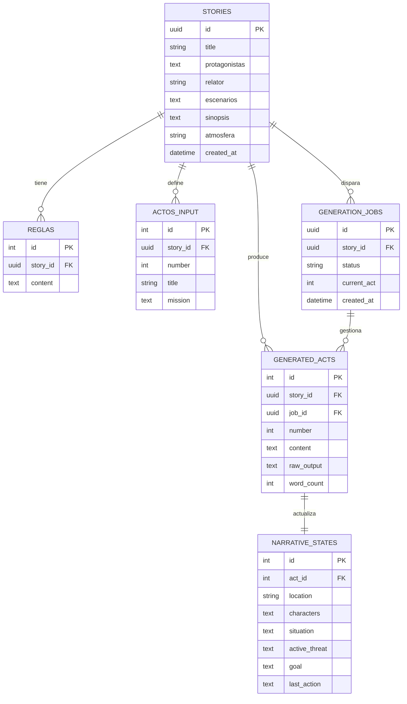
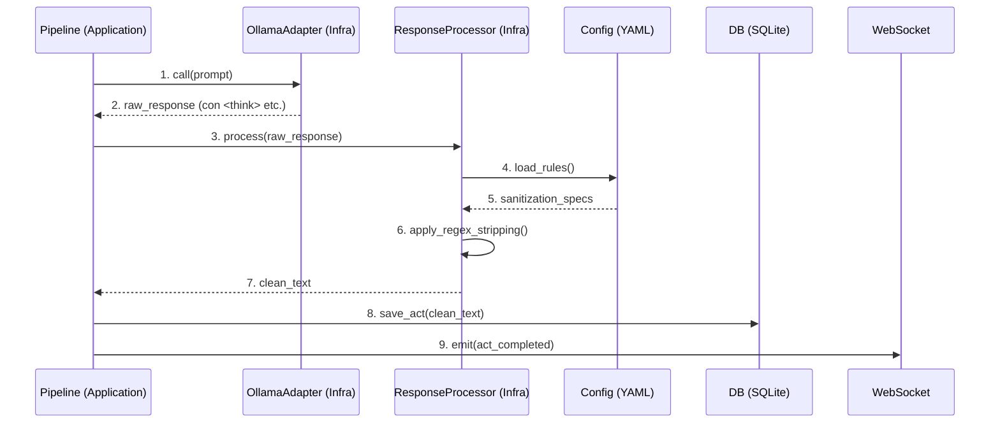
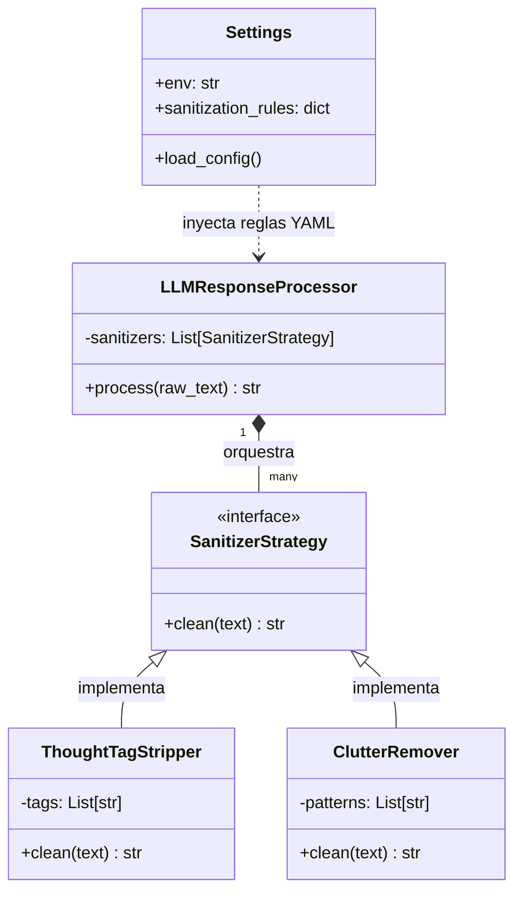

**NarrativeForge API**  
**Spec Técnico – Versión 0.1**  
**Fecha:** 10 de abril de 2026  
**Estado:** Borrador en progreso – Iteración 4  

> **Referencia de Contexto:** Este documento describe la arquitectura del **Estado Objetivo (Target State)**. Para conocer el sistema actual basado en n8n y Node.js, consulte la [Spec 000 - Legacy Context](./000_legacy_context.md).

### 1. Visión y Objetivo

**Propósito**  
Desarrollar una API REST + WebSocket en Python que reciba un archivo `.md` (o los datos de un formulario) con la estructura de un relato de terror y genere automáticamente una historia completa de aproximadamente **2500 palabras** (10–12 minutos de lectura) usando modelos de IA locales vía Ollama.

**Problema que resuelve**  
Reemplazar completamente el flujo basado en **n8n OSS**, eliminando sus limitaciones de orquestación, debugging, visibilidad de estado y control fino. Crear un sistema propio, predecible, testeable y altamente extensible.

**Salida esperada**  
Un archivo `.md` bien estructurado con el relato completo, dividido por actos, con prosa limpia en español, sin residuos de JSON, "Thinking Process" ni explicaciones del modelo.

---

### 2. Arquitectura General

**Stack Principal**

- **Backend:** Python 3.12 + **FastAPI**
- **Plantillas:** **Jinja2** (para generación de Markdown profesional)
- **Real-time:** WebSocket (nativo de FastAPI)
- **Base de datos:** **SQLite** con **aiosqlite** (archivo único compartido)
- **Validación y Configuración:** **Pydantic v2** + **pydantic-settings** (inyección robusta)
- **LLM:** Ollama local (`qwen2.5:32b` para generación creativa, `gemma4:e4b` para extracción de estado)
- **Frontend:** Node.js/Express + EJS (mantener el wizard de 4 pasos existente)
- **Orquestación:** Docker Compose
- **Gestión de entorno:** **uv** (reemplazo moderno y ultrarrápido de pip/venv)

**Clean Architecture** (principios clave)
- **Domain**: Entidades y lógica de negocio pura (sin dependencias externas)
- **Application**: Casos de uso (orquestadores)
- **Infrastructure**: Implementaciones técnicas (DB, Ollama, WebSocket)
- **Presentation**: Capas de API y WebSocket

**Diagrama de componentes**
```
UI (Node.js) ──→ FastAPI (REST + WS) ──→ Generation Pipeline
                     ↓                        ↓
               SQLite (stories.db)      ResponseAdapter (Sanitizer)
                     ↓                        ↓
               Ollama (qwen2.5 + gemma4) ←────┘
                     ↓
               output_stories/*.md
```

---

### 3. Contrato de la API (Endpoints)

**REST Endpoints**

| Método | Endpoint | Descripción |
|--------|----------|-----------|
| `POST` | `/api/v1/generate` | Inicia un nuevo job de generación. Devuelve `{ job_id }` |
| `GET` | `/api/v1/jobs/{job_id}` | Obtiene estado actual del job (para reconexión) |
| `GET` | `/api/v1/stories/{story_id}/output` | Devuelve el relato completo en Markdown + metadatos |
| `POST` | `/api/v1/stories/{story_id}/acts/{n}/retry` | Regenera un acto específico |
| `GET` | `/api/v1/prompts` | Lista prompts disponibles (system, state, etc.) |
| `DELETE` | `/api/v1/stories/{story_id}/output` | Borra solo la generación (conserva el formulario) |

**WebSocket Endpoint**
- `ws://localhost:8000/ws/jobs/{job_id}`

**Protocolo WebSocket (resumen)**

**Eventos del servidor → cliente:**
- `job_started`
- `act_started`
- `act_completed` (incluye `word_count` y `preview`)
- `act_failed`
- `job_completed` (incluye `md_path`)
- `job_failed`

**Eventos del cliente → servidor:**
- `ping` (keepalive)
- `cancel` (abortar job)

---
### 4. Esquema de Base de Datos (SQLite)

**Diagrama Entidad-Relación (DER):**



**Tablas principales:**

- **`stories`**:
    - `id` (UUID/PK)
    - `title` (Título del relato)
    - `protagonistas` (Texto descriptivo)
    - `relator` (Quién narra y en qué persona)
    - `escenarios` (Lugares clave)
    - `sinopsis` (3-4 oraciones)
    - `atmosfera` (Tono: opresivo, slasher, psicológico)
    - `created_at`
- **`reglas`**: Reglas narrativas vinculadas a la historia (1:N).
- **`actos_input`**: Misión y contenido de cada acto (capítulos 1 al 5).
- **`generation_jobs`**: Estado del job de generación.
- **`generated_acts`**: Contenido generado por el LLM (limpio + raw).
- **`narrative_states`**: Estado extraído (location, characters, situation, active_threat, goal, last_action).

---

...

### 11. Definición del Dominio (Entidades)

Para el **Hito 1**, se implementarán las siguientes DataClasses/Pydantic Models en `src/domain/models.py`:

```python
class Story(BaseModel):
    id: str
    title: str
    protagonistas: str
    relator: str
    escenarios: str
    sinopsis: str
    atmosfera: str
    reglas: List[str]
    actos: List[ActInput]

class ActInput(BaseModel):
    number: int
    title: str
    mission: str  # Lo que el usuario escribió en el .md para este acto

class GeneratedAct(BaseModel):
    story_id: str
    number: int
    content: str  # Texto limpio final
    raw_output: str # Para debugging
    word_count: int
```

---

### 12. Roadmap de Desarrollo (Hitos del Proyecto)
... (rest of the file)
- **Generación creativa:** `qwen2.5:32b`
- **Extracción de estado:** `gemma4:e4b`
**Flujo por acto (Diagrama de Secuencia):**



**Retry logic:**
...
- Máximo 3 intentos por acto
- Aumenta temperatura progresivamente (0.7 → 0.8 → 0.9)
- Si falla, marca como `failed` y continúa con el siguiente acto

---

### 6. Arquitectura de Comunicación LLM: Gateway, Adapter & Mapper

Para garantizar que el sistema sea resiliente a los cambios en los modelos (como la aparición de "Deep Thoughts" en DeepSeek-R1) y sea fácil de testear, se implementará un desacoplamiento mediante patrones de diseño clásicos.

#### 6.1. Patrón Adapter (LLM Provider Gateway)
Aísla la librería específica (Ollama SDK, OpenAI, etc.) del resto de la aplicación.
- **`BaseLLMAdapter` (ABC):** Define el contrato `generate(prompt, temperature, ...)`.
- **`OllamaAdapter`:** Implementación concreta que habla con el servidor local.
- **`MockLLMAdapter`:** Para tests unitarios sin costo de GPU.

#### 6.2. Patrón Mapper & Sanitizer (Response Processing)
Transforma la respuesta "sucia" del LLM en una entidad de dominio válida (`StoryAct`).

**Estrategia de Sanitización Data-Driven:**
El proceso de limpieza no tendrá valores "hardcoded". Utilizará un archivo de especificación (`sanitization.yaml`) para definir qué elementos eliminar:
1.  **`ThoughtTagStripper`:** Lee las etiquetas (`<think>`, `<thought>`, etc.) desde el manifiesto de configuración.
2.  **`PatternMatcher`:** Utiliza expresiones regulares externas para limpiar frases introductorias o ruido repetitivo.
3.  **`ModelContext`:** Ajusta dinámicamente la agresividad de la limpieza según el modelo en uso definido en la configuración.

#### 6.3. Estructura de Clases Sugerida



```python
class LLMResponseProcessor:
    """Orquestador que sanitiza y mapea la respuesta."""
    def __init__(self, sanitizers: list[SanitizerStrategy]):
        self.sanitizers = sanitizers

    def process(self, raw_text: str) -> str:
        clean_text = raw_text
        for s in self.sanitizers:
            clean_text = s.clean(clean_text)
        return clean_text.strip()

class StoryActMapper:
    """Transforma el texto limpio en un objeto Acto para la DB."""
    def to_domain(self, clean_text: str, metadata: dict) -> StoryAct:
        # Validación de longitud, calidad y estructura
        return StoryAct(content=clean_text, **metadata)
```

#### 6.4. Generación de Artefactos (Markdown Exporter)

Para transformar los actos dispersos en la DB en el archivo `.md` final, se aplicará el patrón **Template Method** usando **Jinja2**:

1.  **`StoryRepository` (Infra):** Recupera la entidad `Story` con todos sus `GeneratedActs` ordenados.
2.  **`MarkdownRenderer` (Infra):** Utiliza una plantilla (`templates/story_output.md.j2`) para estructurar el relato final (títulos, metadatos, actos).
3.  **`ExportStoryUseCase` (App):** Orquesta la llamada al repositorio, solicita el renderizado y guarda el archivo físico en `output_stories/`.

**Ventaja:** Si mañana quieres exportar a otros formatos o cambiar el diseño visual, solo editas la plantilla Jinja2 sin tocar la lógica de negocio.

---

### 7. Gestión del Estado Narrativo

- Se mantiene un **estado acumulado** entre actos (location, characters, situation, active_threat, goal, last_action).
- El estado del acto anterior se inyecta en el prompt del siguiente para garantizar **continuidad estricta**.
- Almacenado en tabla `narrative_states` (relacionada con `generated_acts`).
- Evita contradicciones típicas de generaciones largas.

---

### 8. Calidad y Validación

**Validaciones por acto:**
- `word_count` ≥ 300 palabras
- Capítulo no vacío
- Ausencia de residuos (JSON, "Thinking Process", bloques markdown no deseados)
- Parseo exitoso del texto narrativo limpio

**Manejo de errores:**
- Reintentos automáticos por acto
- Continuación del pipeline aunque un acto falle (modo "best effort")
- Registro de `raw_output` para debugging

**Saneamiento** (preparado para futura iteración)

---

### 9. Entorno de Desarrollo y Plataforma

**Gestión de Python:** `uv` (recomendado)
- Equivalente moderno a `nvm`
- Muy rápido y liviano

**Comandos principales (Makefile):**
- `make dev` → levanta FastAPI con hot-reload
- `make test` / `make test-cov`
- `make lint` / `make fmt` (usando **Ruff**)
- `make db-init` / `make db-reset` / `make db-seed`

**Estructura recomendada del proyecto (`narrative-api/`):**
```
.
├── config/                 # Manifiestos YAML (Data-driven Specs)
│   ├── sanitization.yaml   # Reglas de limpieza de LLM
│   ├── models.yaml         # Configuración de Ollama/Modelos
│   └── prompts.yaml        # System prompts centralizados
├── src/
│   ├── domain/             # Entidades y lógica de negocio pura
│   │   ├── models.py       # Story, Act, State
│   │   └── interfaces.py   # Protocolos/Interfaces
│   ├── application/        # Casos de uso y orquestación
│   │   ├── services/       # Lógica compartida
│   │   └── use_cases/      # GenerarHistoria, SanitizarTexto, ExportarStory
│   ├── infrastructure/     # Implementaciones técnicas
│   │   ├── adapters/       # LLM Adapters (Ollama, Mock)
│   │   ├── database/       # SQLite logic (aiosqlite)
│   │   ├── sanitizers/     # LLMResponseProcessor
│   │   └── renderers/      # MarkdownRenderer (Jinja2)
│   ├── presentation/       # API y WebSockets
│   │   ├── api/            # FastAPI routes
│   │   └── schemas/        # Pydantic models (Input/Output)
│   ├── config.py           # Pydantic Settings (Lectura de .env y YAMLs)
│   └── main.py             # Punto de entrada FastAPI
├── templates/              # Plantillas Jinja2 (.md.j2, .html.j2)
├── tests/                  # Estructura de Testing (Clean Architecture)
│   ├── unit/               # Tests de lógica pura (sin dependencias externas)
│   │   ├── domain/         # Validar reglas narrativas y estados
│   │   ├── application/    # Validar orquestación con Mocks
│   │   └── infrastructure/ # Validar sanitizadores (Regex/Logic)
│   ├── integration/        # Tests con dependencias (DB, API, Adapters)
│   │   ├── database/       # Validar queries en SQLite
│   │   └── api/            # Validar endpoints de FastAPI (TestClient)
│   ├── fixtures/           # Artefactos de prueba (Salidas raw de LLM)
│   │   ├── llm_responses/  # Ejemplos de <think>, JSON sucio, etc.
│   │   └── story_inputs/   # Ejemplos de archivos .md de entrada
│   └── conftest.py         # Configuración global de pytest (Fixtures)
├── Makefile                # Automatización (dev, lint, test)
├── pyproject.toml          # Dependencias y configuración de herramientas
└── .env                    # Secretos y variables de entorno
```

**Herramientas recomendadas para desarrollo:**
- VSCode + extensiones (Python, Ruff, SQLite Viewer, Continue)
- Continue.dev + Ollama (asistente de código local)
- Ruff (linter + formatter)
- pytest + pytest-asyncio
- SQLite Viewer (explorar DB directamente en VSCode)

---

### 10. Configuración e Inyección de Dependencias (Robustez)

El sistema utilizará una clase `Settings` (basada en `pydantic-settings`) para centralizar toda la configuración. Esto garantiza que la aplicación sea **12-factor app compliant**.

**Jerarquía de Prioridad (de mayor a menor):**
1. **Variables de Entorno del Sistema:** (Ej: `OLLAMA_HOST=...`)
2. **Archivo `.env`:** Para configuración local de desarrollo y secretos.
3. **Manifiestos YAML (`config/*.yaml`):** Para reglas de negocio dinámicas (sanitización, modelos, prompts).

**Componentes del Manifiesto:**
- **`config/sanitization.yaml`:** Define etiquetas de pensamiento (`<think>`, etc.), patrones de ruido y reglas de extracción de Markdown.
- **`config/models.yaml`:** Parámetros técnicos por modelo y flags de limpieza.
- **`config/prompts.yaml`:** Centralización de system prompts.

**Ventaja:** Validación inmediata al arrancar. Si falta una variable crítica o un YAML está mal formado, la app no inicia, evitando errores crípticos en producción.

---

### 12. Roadmap de Desarrollo (Hitos del Proyecto)

Para garantizar una migración ordenada desde n8n, el desarrollo se dividirá en cuatro grandes bloques modulares:

#### ☐ Hito 1: Motor de Generación Narrativa (The "Forge")
*Objetivo: Lograr que el sistema genere el relato completo de principio a fin, manteniendo el estado.*
- [ ] Implementación de Entidades de Dominio (`Story`, `Act`, `State`).
- [ ] Creación del `OllamaAdapter` para comunicación base.
- [ ] Desarrollo del orquestador de actos (Pipeline de Generación).
- [ ] Implementación de la persistencia inicial en SQLite.

#### ☐ Hito 2: Pipeline de Saneamiento y Calidad (The "Sanitizer")
*Objetivo: Limpiar el ruido del LLM y validar que el resultado cumpla los estándares narrativos.*
- [ ] Implementación de la estrategia *Config-driven* (lectura de `sanitization.yaml`).
- [ ] Desarrollo del `LLMResponseProcessor` y sus estrategias (`ThoughtTagStripper`, `RegexCleaners`).
- [ ] Implementación de validadores de calidad (conteo de palabras, detección de residuos JSON).
- [ ] Creación de tests unitarios para el saneamiento con casos de prueba reales (ej. outputs de DeepSeek-R1).

#### ☐ Hito 3: Capa de Presentación (The "API & Real-time")
*Objetivo: Exponer la funcionalidad mediante endpoints REST y comunicación WebSocket.*
- [ ] Definición de Pydantic Schemas para Input/Output.
- [ ] Implementación de los endpoints de FastAPI (`/generate`, `/retry`, etc.).
- [ ] Desarrollo del WebSocket para el reporte de progreso de actos en tiempo real.
- [ ] Integración de la inyección de dependencias con `pydantic-settings`.

#### ☐ Hito 4: Integración Legacy y Migración
*Objetivo: Conectar el Wizard actual con la nueva API y validar el flujo completo.*
- [ ] Modificación de `story-form` (Node.js) para que consuma la API de FastAPI en lugar de n8n.
- [ ] Pruebas de integración "End-to-End" (E2E).
- [ ] Documentación final de operación (Docker deployment).

### 13. Protocolo de Pruebas y Validación (Quality Gates)

Para garantizar la integridad en cada capa de la **Clean Architecture**, el testing seguirá esta estrategia:

#### 13.1. Niveles de Validación
1.  **Capa Domain (Unit):** Se testean las entidades (`Story`, `Act`) para asegurar que los cálculos de estado y validaciones internas sean correctos. *Cero dependencias externas.*
2.  **Capa Infrastructure (Unit):** Foco crítico en `ResponseProcessor`. Se usan las **fixtures** de respuestas raw de LLM para asegurar que el regex y los strippers funcionen en todos los casos.
3.  **Capa Application (Unit/Integration):** Se testea el orquestador usando `Mocks` de los adaptadores de LLM para simular flujos completos sin costo de GPU.
4.  **Capa Presentation (Integration):** Uso de `fastapi.testclient` para asegurar que los endpoints responden correctamente y manejan errores de Pydantic.

#### 13.2. Automatización y Reporte
- **`make test`**: Ejecuta la suite completa con `pytest`.
- **`make test-cov`**: Genera reporte de cobertura (Objetivo: >80% en Domain e Infra/Sanitizers).
- **`make lint`**: Ejecuta `ruff` para asegurar código limpio e idiomático.

#### 13.3. Flujo de Confirmación (Gate-Keeping)
1. El LLM implementa la funcionalidad + el test correspondiente.
2. El Humano o el LLM ejecuta la suite de tests.
3. No se inicia el desarrollo de un nuevo hito si existen fallos en el actual.

---

### 14. Principios y Estándares de Ingeniería

El desarrollo de la **NarrativeForge API** se regirá por los siguientes estándares para asegurar un código robusto, escalable y fácil de mantener:

- **Programación Orientada a Interfaces:** Se utilizarán `Protocols` o Clases Abstractas (`ABC`) en el Dominio para definir el comportamiento de los adaptadores y repositorios. La infraestructura **implementa**, la aplicación **usa** la interfaz.
- **SOLID & Clean Code:** Cada clase tendrá una única responsabilidad. Se evitarán las "God Classes".
- **KISS & DRY:** Se priorizará la legibilidad y la reutilización de lógica (especialmente en el pipeline de sanitización) sin caer en sobre-ingeniería.
- **Inyección de Dependencias:** Se utilizará el sistema de dependencias de FastAPI o inyección manual en los constructores para facilitar el testing con Mocks.
- **Tipado Estricto:** Uso mandatorio de *Type Hints* de Python 3.12 en todas las firmas de funciones y métodos.

---

### Próximos Pasos (para iterar)

1. Definir el formato exacto del `.md` de entrada (sección 4 pendiente)
2. Detallar las entidades del **Domain** (dataclasses)
3. Escribir los contratos de interfaces del repositorio
4. Definir los Pydantic schemas de la API
5. Crear el primer Use Case (`GenerateStoryUseCase`)

---

¿Quieres que ahora:
- **A)** Expanda alguna sección específica (por ejemplo, el formato del `.md` de entrada, las entidades del Domain, o los Pydantic models)?
- **B)** Genere el boilerplate inicial de carpetas + archivos base según Clean Architecture?
- **C)** Escriba el `pyproject.toml` y el `Makefile` completos?

Decime por dónde querés continuar y lo hacemos paso a paso. Este spec ya está mucho más limpio, ordenado y listo para usar como referencia diaria. 

¿Seguimos? 🚀