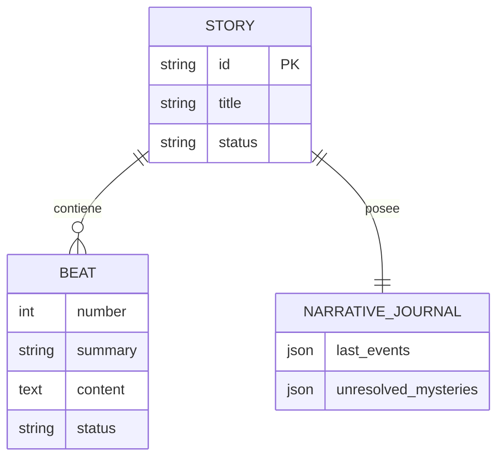

# CLI Robusto Spec - NarrativeForge

## 1. Objective

Construir un CLI robusto para ejecutar el núcleo del sistema de generación de relatos de terror desde terminal, sin necesidad de API REST. El usuario especifica los parámetros de la historia y el sistema genera el relato completo con beats, prosa, diálogos y narrativa cohesiva.

## 2. Project Structure

```
src/
├── __main__.py                   # Entry point: python -m src
├── cli/
│   ├── __init__.py
│   ├── runner.py                # CLI principal (argparse)
│   ├── commands.py             # Comandos: generate, plan, narrate, export
│   ├── logger.py              # Logging robusto
│   └── exceptions.py          # Excepciones CLI
├── core/
│   ├── orchestrator.py        # Orquestador del flujo
├── domain/
│   └── models.py              # Modelos de datos (Story, Beat, Journal)
└── infrastructure/
    ├── factories.py           # Inyección de dependencias
    └── database/              # Repositorios SQL
```

## 3. CLI Commands

### generate
Genera historia completa: plan + todos los beats narrados.
```bash
uv run python -m src generate --title "La Casa Abandonada" --protagonist "María" --atmosfera terror --real
```

### plan
Genera solo el plan (beats) sin narrar.
```bash
uv run python -m src plan --title "Historia" --beats 8 --real
```

### narrate
Narra beats específicos de una historia existente.
```bash
uv run python -m src narrate --story-id <UUID> --beats 1,2,3 --real
```

## 4. Entity Relationship Diagram (ERD)



## 5. Hitos de Implementación y Refactorización

| Hito | Descripción | Estado |
|------|-------------|--------|
| **CLI-1** | Entry Point + Logger | ✅ |
| **CLI-2** | Comandos base (generate, plan, narrate, export) | ✅ |
| **CLI-3** | Orchestrator funcional | ✅ |
| **CLI-4** | Scripts Bash de apoyo | ✅ |
| **CLI-5** | Refactorización del PromptBuilder (SRP) | ✅ |
| **CLI-6** | Inyección de Dependencias (Factories) | ✅ |
| **CLI-7** | Tipado de Dominio (StrEnum para Status) | ✅ |
| **CLI-8** | Integración de Checklists de Calidad | ✅ (usa opencode skills) |
| **CLI-9** | **Refactor de Nomenclatura de Roles** | ✅ |
| **CLI-10** | **Hispanización Total (Logs y Errores)** | ✅ |
| **CLI-11** | **File-Driven Generation (Input Strategy)** | ✅ |

### Detalle Hito CLI-11: File-Driven Generation
Refactorizar el flujo de entrada para desacoplar la captura de datos (CLI flags) de la lógica de creación de la historia.

- **Patrón Strategy:** Implementar un `StoryInputStrategy` para manejar múltiples fuentes de entrada (Command Line vs. Markdown File).
- **Patrón Factory:** Crear un `StoryDTOFactory` que transforme el contenido parseado (YAML/Markdown) en un `StoryCreateDTO` válido.
- **Formato de Archivo:** Markdown con Frontmatter (YAML) para metadatos y secciones de contenido.
- **Ubicación:** Los archivos deben residir en `input_stories/`.
- **Nuevo Comando:** `python -m src generate --file nombre_archivo.md`.

### Detalle Hito CLI-9: Refactor de Nomenclatura de Roles
Alinear el código fuente con la terminología del Marco SDD:
- Renombrar `CreateStoryPlanUseCase` a `DirectorUseCase`.
- Renombrar `NarrateBeatUseCase` a `VozUseCase`.
- Asegurar que `MemoryJournalist` sea inyectado consistentemente como el rol **Journalist**.
- Actualizar logs para reflejar estos roles (ej: `[Director] Generando plan...`).

## 6. Boundaries

- **Always Do**: Usar `uv run python -m src` como entry point.
- **Always Do**: Validar que el `story-id` existe antes de intentar narrar.
- **Never Do**: Hardcodear configuraciones (usar `src/config.py`).
- **Never Do**: Mezclar lógica de negocio en `commands.py`.
