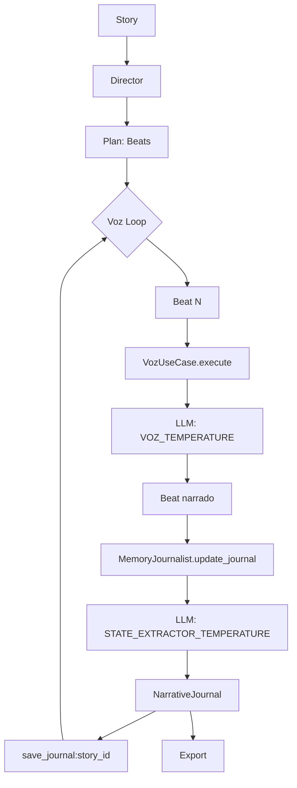

# SPEC 013: Refactor Quirúrgico del Orchestrator

## Estado

> Implementación en progreso

## Resumen del Problema

El sistema no persistía el `NarrativeJournal` en DB, causando pérdida de coherencia narrativa entre ejecuciones. Además, las temperaturas estaban hardcodeadas y no coincidían con el spec.

## Clase Orquestadora

`StoryRunner` en `src/core/orchestrator.py:18` - ES la clase correcta.

---

## Fases de Implementación

### Fase 1: Completar Configuration

**`.env` - Agregar variables:**

```bash
# Modelos LLM
LLM_MODEL=Tohur/natsumura-storytelling-rp-llama-3.1:8b
LLM_MODEL_TEMPERATURE=0.6
STATE_EXTRACTOR_MODEL=mistral:latest
STATE_EXTRACTOR_TEMPERATURE=0.3
DIRECTOR_TEMPERATURE=0.4
VOZ_TEMPERATURE=0.6
```

**`src/config.py` - Agregar campos:**

```python
# LLM
state_extractor_model: str = "mistral:latest"
state_extractor_temperature: float = 0.3
director_temperature: float = 0.4
voz_temperature: float = 0.6
```

### Fase 2: Eliminar Hardcoded Temperatures

| Archivo | Cambio |
|---------|--------|
| `director_use_case.py:34` | `temperature=0.4` → `temperature=settings.director_temperature` |
| `memory_journalist.py:45` | `temperature=0.3` → `temperature=settings.state_extractor_temperature` |
| `voz_use_case.py:36` | `settings.llm_model_temperature` → `settings.voz_temperature` |

### Fase 3: Persistir Journal (CRÍTICO)

**`SQLStoryRepository` - Agregar métodos:**

```python
async def save_journal(self, story_id: UUID, journal: NarrativeJournal) -> None:
    """Guarda el journal narrativo."""

async def get_journal(self, story_id: UUID) -> NarrativeJournal | None:
    """Recupera el journal narrativo."""
```

**`StoryRunner._run_narrate_all()` - Modificar:**

```python
# Antes del loop: cargar journal desde DB
journal: NarrativeJournal | None = await self.story_repo.get_journal(story.id)

for beat in pending_beats:
    generated_beat, journal = await narrate_beat.execute(...)
    await self.beat_repo.save(generated_beat, story.id)
    await self.story_repo.save_journal(story.id, journal)  # ← NUEVO
```

### Fase 4: Actualizar Spec

- Actualizar diagrama de flujo en `002_granular_beat_spec.md`
- Tabla de roles con temperaturas
- Nota sobre persistencia del journal

---

## Diagrama Flujo Resultante



---

## Criterios de Éxito

- [ ] Journal se persiste en DB después de cada beat
- [ ] Journal se carga desde DB al reanudar
- [ ] No hay temperaturas hardcodeadas
- [ ] Spec coincide con código
- [ ] Tests pasan